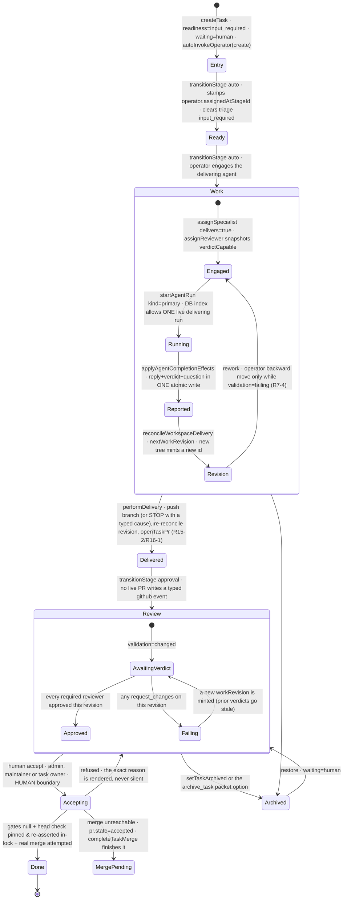
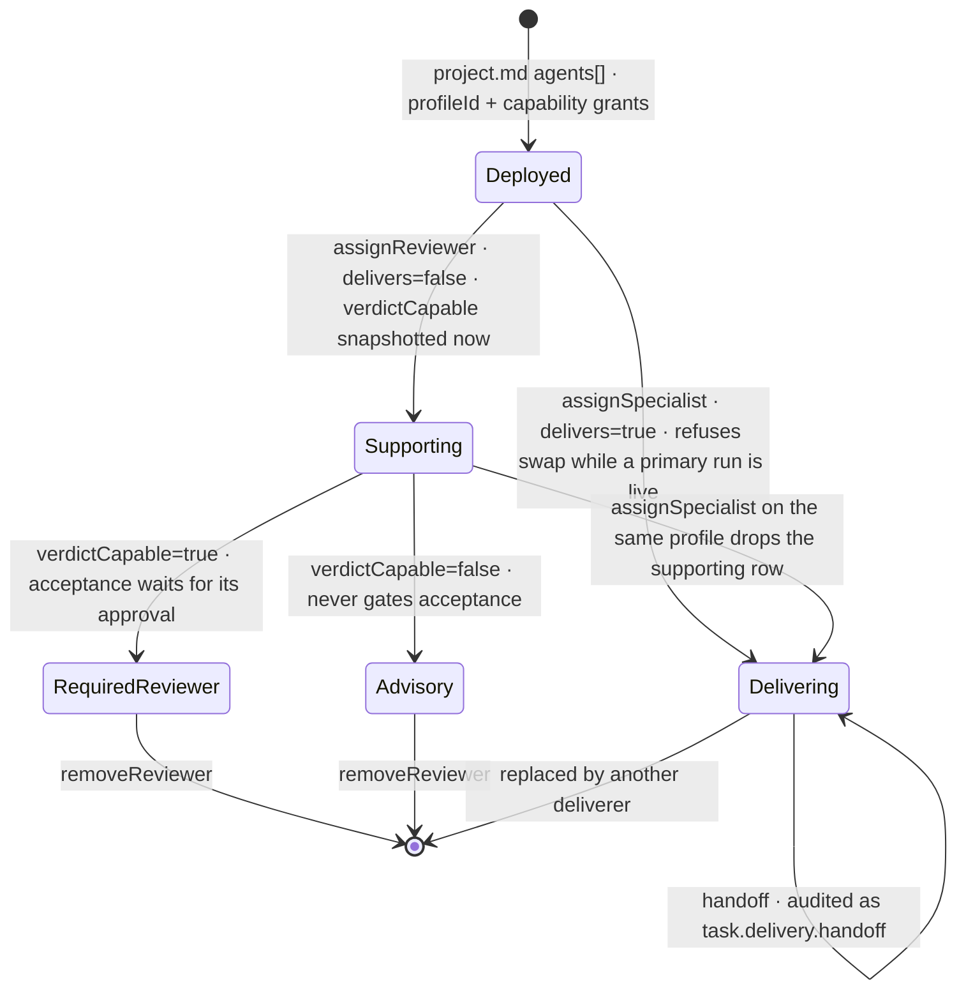
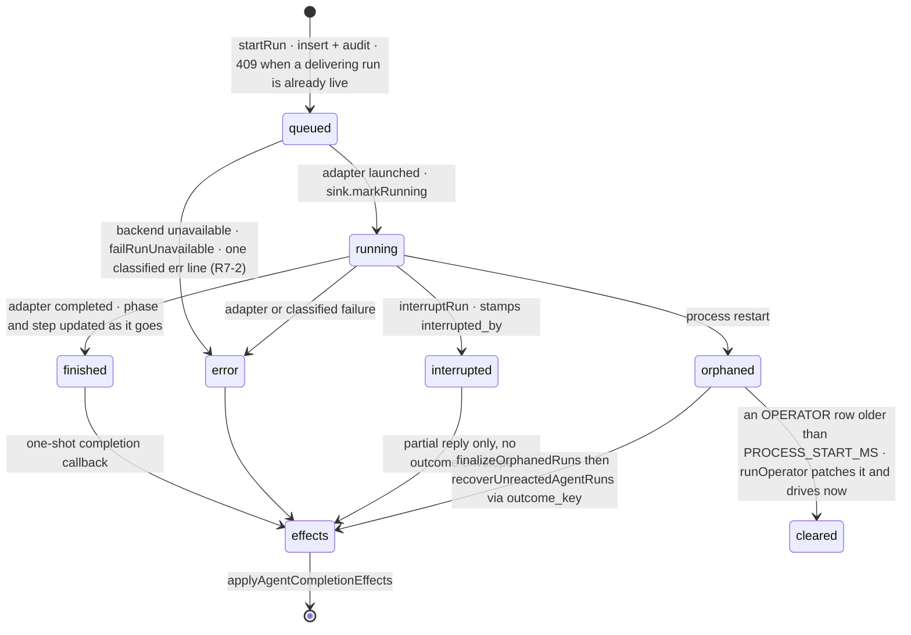
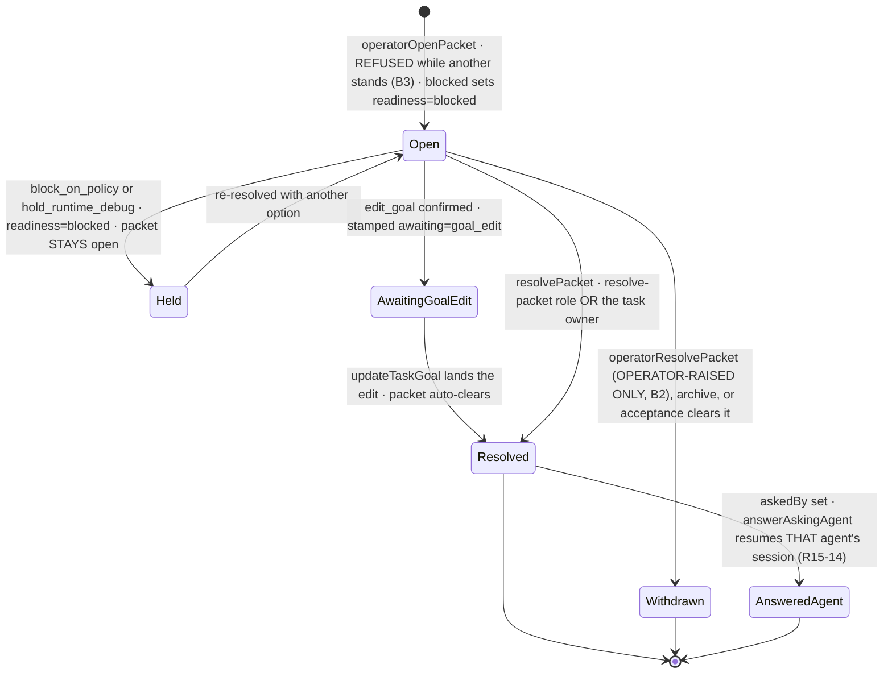

# Viberr — domain-model reference (pass 17)

Written 2026-08-04 against `main` @ `8541a32` (post pass-16 waves 1–3). This supersedes
`planning/discovery-2026-08-04/DOMAIN-MODEL.md`, which was written against `2442945` —
BEFORE commits `5e03c6e` (correctness wave), `53b796d` (UI/UX wave), `71fa506` (wave 3) and
`0955ac9`. Roughly a quarter of the pass-16 doc's load-bearing claims moved.

Every claim below is a code claim with a `path:line`, re-verified against the current tree.
Where a `docs/architecture/*.md` file disagrees with the code, the code wins and the
divergence is called out in §12.

Audience: an implementation agent with no other context. This file is the map; it is not a
substitute for reading the module you are about to change.

---

## 0. Delta from the pass-16 doc

Read this section first if you have the pass-16 doc in context. Everything here is a
CORRECTION, not an addition.

### 0.1 Claims that are now wrong

| pass-16 said | now |
|---|---|
| §12 #35 "`operatorOpenPacket` has no already-open guard" | **Fixed.** It refuses while a packet stands, twice — before the write and inside the lock (`operator-actions.server.ts:686-700`, `:745-748`). |
| §12 #36 "`operatorResolvePacket` can withdraw an agent's `ask_human` packet" | **Fixed.** It refuses any packet whose `from !== "operator"` or that carries `askedBy`, re-checked in the lock (`operator-actions.server.ts:840-852`, `:858-864`). |
| §12 #37 "an UNDEPLOYED operator still gets a working `deliver_for_review`" | **Fixed.** Both `gate` (`:277`) and `deliverGate` (`:314`) return `deny` when `!authority.deployed`; `operatorPlanToolsFor` drops `deliver_for_review` from its fallback list (`operator-run.server.ts:892`). |
| §12 #34 "transition-chain cap is off by one between its two enforcers" | **Fixed.** `maybeResumeStrandedOperator` now uses `depth >= OPERATOR_TRANSITION_CHAIN_CAP` (`operator-run.server.ts:519`), matching `transitionStage:3198`. |
| §12 #38 "queued-run id leaks as the literal string `queued`" | **Fixed.** `RunOperatorResult.runId` is `string \| null` and carries a separate `queued: boolean` (`operator-run.server.ts:134-152`). |
| §12 #39 "a cross-boot queued trigger can strand" | **Fixed.** `inFlightOperatorRun` classifies a pre-`PROCESS_START_MS` row as a `restartOrphan` and `runOperator` finalizes it instead of chaining onto it (`operator-run.server.ts:160-193`, `:724-741`). |
| §12 #40 "`escalateFailedOperatorRun` races its queued successor" | **Fixed.** The Claude completion hook awaits the escalation and releases the lease in `.finally` (`operator-run.server.ts:1693-1715`). |
| §12 #22 "skill injection budget is PER SKILL; KB budget is GLOBAL" | **Fixed.** `readSkillBodies` shares ONE `SKILL_INJECTION_BUDGET` across every declared skill, same shape as `readKbBodies` (`skill-body.server.ts:224`, `kb-injection.server.ts:304`). |
| §12 #23 "rename ↔ KB-watcher race" | **Fixed.** `saveKnowledgeBase` does `renameSync` → row `UPDATE` with NO `await` between them, and rewrites references afterwards (`resources.server.ts:289-344`). |
| §12 #24 "the `manual` refresh pin is bypassed by in-app mutations" | **Fixed.** `touchResource` reads the row's `refresh` and skips `last_indexed_at` when pinned (`store-files.server.ts:190-222`). |
| §12 #25 "Editable ≠ injectable" | **Fixed by unification.** One isomorphic set, `STORE_TEXT_EXTENSIONS` (`app/shared/text/store-extensions.ts:26`), serves the injector, the editor and the browser; `.json/.yaml/.yml` are now injectable ON PURPOSE. |
| §12 #16 "KB grants by display name are still only a `logger.warn`" | **Fixed.** `UnresolvedKbGrant` / `UnresolvedSkillGrant` reach the run's own prompt under `# Attached resources that did NOT reach this run` on BOTH the specialist (`specialist-run.server.ts:1212-1228`) and the operator (`operator-run.server.ts:1985-2001`). |
| §12 #14 "`task_projections.repo` is a dead column" | **WRONG.** It feeds the task-detail GitHub links; only its comment was stale (`0001_baseline.sql:96-102`). Pass 16 came one edit from dropping it. |
| §12 #15 "`agent_runs.role`/`kind` carry overlapping meaning" | **Reframed, not a bug.** `kind` is the DELIVERY axis, not a role taxonomy: `kind: delivers ? "primary" : "reviewer"` (`specialist-run.server.ts:974`), so a non-delivering *developer* is stored as `'reviewer'`. Documented at `0001_baseline.sql:262-274`. |
| §12 #27/C3 "MCP tools are ungoverned — suspected bug" | **Owner ruling R16-5: intended.** Granting a server IS the grant. `specialist-tool-policy.test.ts` now pins the ABSENCE of an `mcp__*` deny rule so the "obvious fix" cannot land silently. |
| §12 #28 "specialist runs never add `mcp__<name>` to `allowedTools`" | **Fixed at the funnel.** `withMcpAutoApproval` (`run-service.server.ts:319`) runs inside `startRun`, applied at `:410`, and `resumeRun` now accepts `allowedTools` (`:681`, threaded at `:738`/`:772`). |
| §12 #26 (scanStoreTree symlinks) | Already corrected in place by pass 16; the fix is now explicit — `scanStoreTree` filters `isSymbolicLink()` and caps depth (`store-files.server.ts:63-90`). |
| `rbac.ts` `appWide: true` on `view`/`comment` | **The flag is deleted.** Projects are members-only (R15-4) and the "membership not required" cell was simply false; membership scope is stated once under the table (`app/shared/rbac.ts:50-63`). |
| "E8 unused `verification` table" | **NOT dead.** better-auth writes it on every social sign-in; dropping it kills GitHub/Google login. Pinned by `migration-runner.server.test.ts` and documented at `0001_baseline.sql:340-351`. |

### 0.2 New concepts the pass-16 doc does not contain

- **PR adoption is now a rule with its own module** — `app/server/github/pr-adoption.server.ts` (§7.5).
- **Acceptance refusal ORDER changed** and the PR-head gate moved INSIDE the shared Done write (§7.6).
- **`OperatorActionResult.outcome` distinguishes `denied` (authority) from `noop` (state)**, and the
  Codex plan narration picks its timeline EVENT TYPE from that split (§5.2).
- **`retry_other_backend` names a backend**, defaulting to the opposite of the one that failed (§5.3).
- **Operator persona carries the trusted-provenance banner, the MCP-governance rule, and RESOLVED
  (not declared) MCP names** (§5.2).
- **`indexDecisionInbox`** is the one reading of "waiting on you" (§3.4).
- **`getReviewQueue` requires a `viewerUserId`** (§7.6).
- **Board attention filter includes `input_required`** and is named "Blocked or waiting" (R16-2).

### 0.3 File-layout churn (wave 2/3 splits) — old paths in the pass-16 doc are stale

| was | now |
|---|---|
| `app/features/task-detail/task-detail-page.tsx` (1761 lines) | + `task-main-sections.tsx`, `task-side-panels.tsx`, `task-detail-hooks.ts` |
| `app/features/home/home-page.tsx` (1739 lines) | + `home-sections.tsx`, `project-cards.tsx`, `new-project-modal.tsx` |
| `app/features/org-settings/resources-panel.tsx` (1471 lines) | + `resource-rows.tsx`, `resource-modals.tsx`, `agent-template-modal.tsx`, `resource-helpers.ts` |
| e2e specs `01-…`–`07-…` | renumbered; `07-accessibility.spec.ts` sweeps more surfaces and both themes |

---

## 1. The one architectural fact everything else follows from

**Markdown files under `${VIBERR_DATA_ROOT}` are the ONLY canonical truth for projects and
tasks. SQLite is a derived projection.** (`docs/architecture/file-formats.md:3`,
`db/migrations/0001_baseline.sql:1-19`.)

```
${VIBERR_DATA_ROOT}/                      # app/server/files/file-store-root.server.ts:23
  projects/<slug>/project.md              ← project truth (members, stages, workflow, agents)
  projects/<slug>/tasks/<KEY>/task.md     ← task truth (state, engagements, packet, timeline)
  projects/<slug>/tasks/<KEY>/workspace/  ← agent git clone; NOT canonical, NOT watched
  agents/profiles/<id>.md                 ← org-level agent profile templates
  agents/definitions/operator.md          ← the shipped operator operating manual
  runtimes/claude-home/  runtimes/codex-home/   ← SDK session homes + NDJSON run logs
  kb/<dir>/                               ← knowledge-base folders (store://kb/<dir>)
  skills/<name>/SKILL.md                  ← skill folders (store://skills/<name>)
  state/projection.sqlite                 ← SQLite
```

Consequences you must respect:

1. **Write the file, then reproject.** Every mutation is `updateTaskFile(...)` →
   `reprojectTask(...)` → `recordAudit(...)` → notifications (`reprojectTask`,
   `app/server/tasks/task-actions.server.ts:394`, which calls `rebuildPath` in
   `app/server/projections/rebuilder.server.ts`). Never write SQLite as the source of truth
   for a task/project field.
2. **SQLite IS primary storage** for users, sessions, PATs, notifications, audit, runs, run
   logs, org resources metadata, staged outcomes, scope violations. Those have no file form.
3. **Tolerant parsing**: `app/schemas/task-file.schema.ts:841` `parseTaskFrontmatter` and
   `app/schemas/project-file.schema.ts:324` `parseProjectFrontmatter` never throw and never
   drop an entity. Unknown frontmatter keys round-trip verbatim. Invalid fields emit a
   `FileDiagnostic` and fall back.
4. **Diagnostics floor readiness** — warning → `input_required`, error →
   `inconsistency_risk_detected`, hard stop → `blocked`
   (`app/server/interpretation/readiness-policy.server.ts:35` `deriveReadiness`). Derivation
   may only WORSEN the stored value, never improve it.
5. **Migrations are squashed** into `db/migrations/0001_baseline.sql`; the runner skips by
   FILENAME, so editing the baseline reaches only FRESH databases. Changing schema pre-prod
   means wiping the sqlite and re-seeding. There is no drift healer.
6. **One app process per data root, ever.** Two writers over the same `docker-data` corrupt
   the WAL.

> `app/schemas/*` did NOT change in the pass-16 waves. Every schema line number the pass-16
> doc cites is still valid.

---

## 2. Identity, org, and users

Two user tables coexist by design.

| Table | Owner | Purpose |
|---|---|---|
| `users` | app | canonical profile + ORG role + prefs flags (`0001_baseline.sql:23`) |
| `user` / `session` / `account` / `verification` | better-auth 1.6.25 | credentials, sessions, OAuth links (`0001_baseline.sql:311-352`) |

The binding invariant: **better-auth `user.id` === `users.id`**
(`app/server/auth/identity.server.ts`, `provisionIdentity`). Identities are created at
user-creation time (seed / invite / OAuth); there is no backfill and no legacy session
fallback. The scrypt hash lives on `account.password` for `providerId = 'credential'`.

**`verification` is load-bearing, not dead** (`0001_baseline.sql:340-351`): better-auth's
OAuth state strategy resolves to `"database"` because the app passes a database, so
`generateGenericState` INSERTs the signed state there at `/sign-in/social` and
`parseGenericState` reads-then-deletes it at `/callback/:id`. Dropping the table breaks every
GitHub/Google login. Pinned by `app/server/db/migration-runner.server.test.ts`.

The four better-auth statements are hand-inlined `@better-auth/cli generate` output; the
refresh recipe (and why the CLI is deliberately not a dependency) is in the schema comment at
`0001_baseline.sql:311-334`.

`users` columns of note (`0001_baseline.sql:23-36`): `role TEXT CHECK (role IN
('admin','member'))` — the ORG role, distinct from project roles; `idp`, `disabled`,
`pwreset_required`, `theme`, `avatar_tone`, `github_handle`, `last_login_at`, `created_by`.

Org-level surfaces:
- `app/server/org/org-users.server.ts` — list/create/update/disable/delete org users,
  `setOrgUserRole`, `pruneUserFromProjects` (deleting a user strips them from every
  `project.md` members list), domain allow-list CRUD backed by `google_domain_allowlist`
  (`0001_baseline.sql:221`).
- `app/server/org/connections.server.ts` — GitHub *connections* (`github_connections`,
  `0001_baseline.sql:211`): one PAT per GitHub owner, one default;
  `CONNECTION_REVALIDATE_AFTER_MS` = 24 h.

There is **no `organizations` table**. "Org" means *the single instance*: org roles on
`users.role`, org resources in `org_knowledge_bases` / `org_mcp_servers` / `org_skills`, org
agent templates under `agents/profiles/`. Multi-tenancy does not exist.

---

## 3. Projects

### 3.1 Storage

Truth: `projects/<slug>/project.md`. Schema: `app/schemas/project-file.schema.ts:168`
(`projectFrontmatterSchema`). Projection: `projects` (`0001_baseline.sql:49`) +
`project_members` (`:66`).

| frontmatter key | type | notes |
|---|---|---|
| `name` | string | |
| `slug` | `/^[a-z0-9][a-z0-9-]*$/` | directory name wins on mismatch (`project-file.schema.ts:345`) |
| `archived` | bool? | absent on active projects; archived ⇒ **read-only** (R6-3) |
| `repo` | `"owner/name"` \| null | ONE repo per project; the task-level override was deleted (P13-D-5) |
| `defaultBranch` | string | PR base |
| `taskPrefix` | `/^[A-Za-z]+$/` | `VIB` → `VIB-142` |
| `nextTaskNumber` | int \| null | atomic per-project key counter |
| `stages[]` | `{id, name, color}` | `stageSchema:40`; per-project, ordered |
| `workflow[]` | `{from,to,boundary,by,locked}` | `workflowBoundarySchema:50` |
| `members[]` | `{userId, role}` | `memberSchema:62`; **authoritative** — `project_members` is its projection |
| `agents[]` | `{profileId, capabilities[], extras[], definition?}` | `agentDeploymentSchema:128` |
| `credentialPolicy` | `{credentialLabel, masked, requiredScopes[]}` | non-secret only |
| `guardrails[]` | `{id, desc, on, value?, unit?}` | `guardrailSchema:155` |

Per-ENTRY tolerant parsing (`project-file.schema.ts:267` `tolerantArray`): one malformed
`members[]` row drops only itself.

`allocateTaskKey` (`app/server/files/project-writer.server.ts`) reads+bumps `nextTaskNumber`
under the project.md mutex, with a max-scan of existing `tasks/<PREFIX>-<n>` dirs as a
rescue. Concurrent creates cannot mint the same key.

### 3.2 Project roles & RBAC — `appWide` is gone

Four roles, strict tier (`app/schemas/project-file.schema.ts:23`):
`viewer(0) ⊂ contributor(1) ⊂ maintainer(2) ⊂ admin(3)` (`app/shared/rbac.ts:31`).

**`app/shared/rbac.ts:61` `RBAC_DEFINITIONS` is the single source of truth** for both
enforcement and every permission table (Policy page, Profile page, task Permissions panel).

| action | roles |
|---|---|
| `view`, `comment` | A M C V |
| `create-task`, `own-task` | A M C |
| `approve-transition`, `resolve-packet`, `accept-completion`, `update-goal`, `run-agents`, `reorder-board`, `reconcile-github`, `grant-github-scope`, `rescan-project` | A M |
| `release-any-ownership`, `manage-members`, `manage-agents`, `edit-policy`, `force-accept-completion` | A |

**E1 was fixed by deleting the concept.** The `appWide` flag used to make the Policy page draw
a merged "Any signed-in user · membership not required" cell for `view`/`comment`. Post-R15-4
that sentence is false — a signed-in non-member gets the unknown-slug 404 on every page of a
project, comments included. `view` and `comment` are ordinary four-check rows whose ENTIRE
enforcement is the membership gate (they never call `requireAction`); membership scope is
stated once, under the table (`rbac.ts:18-27`, `:50-60`).

The action matrix itself is now pinned by `app/features/policy/policy-rbac.server.test.ts`,
which drives each guard per role. The previous matrix test derived its expectation from the
same map it guarded, so widening a tier passed silently.

Enforcement chokepoint: `requireAction` (`task-actions.server.ts:303`) →
`requireProjectMutable` (archived-project freeze, R6-3) → `requireProjectAuthority`
(`app/server/auth/project-authority.server.ts`, the single authority resolution, R7-1; an org
admin passes as the audited D2 override).

Two documented widenings of the plain role tier:
- **R6-2 owner exception** — `ownerException` (`task-actions.server.ts:321`): the task's human
  owner, if they hold `own-task`, may accept their own task's completion
  (`requireAcceptCompletion:335`) and deliver it manually (`manualDeliverForReview:3593`).
- **R14-2 / R15-3 owner decision authority** — `requireDecisionAuthority`
  (`task-actions.server.ts:359`): the owner may resolve packets and apply/dismiss ANY operator
  recommendation on their own task, including stage transitions. The inner mutation keeps its
  own cap. `transitionStage`'s `recommendationAuthorized` flag (`:2994`) is set ONLY by
  `applyRecommendation` after that gate — never by a route.

UI honesty (wave 3, E3): panels check the action id their own SERVER guard checks, not a role
literal — `edit-policy` governs the identity/stages/repo panels, `manage-members` only the
members panel. Tests mock `roleCan` to answer for exactly ONE action id, so swapping two ids
that resolve to the same tier today still fails.

### 3.3 Stages and the workflow graph

Stages are a **per-project ordered list**; nothing may hard-code `triage`/`review`/`done`.

`workflow` is a **CHAIN over `stages` order** — one rule per consecutive pair
(`app/shared/workflow/transitions.ts:20-39`). There is no transitions editor; the chain is
maintained mechanically:

| operation | function |
|---|---|
| add a stage | `spliceStageIntoChain` (`transitions.ts:118`) — inherits the boundary of the edge it replaces |
| remove a stage | `rejoinChainAroundStage` (`:183`) — merged rule takes the **stricter** boundary |
| reorder stages | `realignChainToStages` (`:249`) |
| draw the governed path | `stageFlowPath` (`:284`) — returns `{chain, offChain}` |

Boundaries: `auto | approval | human` (`project-file.schema.ts:28`), strictness ordered by
`strictestBoundary` (`transitions.ts:48`). **A rule into the terminal stage is forced `human`
and `locked`** — re-derived rather than carried, so a stale `locked` can never lie.

**Structural stage roles** (`app/shared/workflow/stage-roles.ts:41` `resolveStageRoles`):
`entry` = `stages[0]`; `terminal` = `stages[last]`; `review` = the (first) stage with an edge
INTO terminal, else `stages[last-1]`; `work` = the (first) stage with an edge INTO review.

`humanGatesPreWorkAdvance` (`stage-roles.ts:85`) — true when every pre-terminal boundary is
non-`auto`. This is the "strict preset" signature read off the graph; the preset itself is
never stored (R15-9).

**Agent stage eligibility across differently-named boards** (R14-1,
`app/shared/workflow/stage-eligibility.ts`): a profile declares raw stage ids. Resolution is
(1) literal id present on this board, (2) the declared id maps to a structural role via
`ROLE_BY_ALIAS` and this board fills that role, (3) if NOTHING resolves, the declaration is
meaningless here and the profile is treated as **unrestricted**. `spanAll` and an empty list
are unrestricted.

Default board (`app/shared/workflow/templates.ts:33` `GOVERNED_TEMPLATE`): `triage → ready →
impl → review → done` with boundaries `auto, auto, approval, human(locked)`. The
"Lightweight · 3 stages" preset was deleted (P13-AP-04). `DEFAULT_GUARDRAILS` ship ON.

### 3.4 Guardrails

Stored as `guardrails[]` on project.md. Consumers: `meaningful-comment`,
`no-duplicate-summary`, `evidence-separation`, `operator-brevity`
(`app/server/tasks/comment-guardrails.server.ts`), `compression-threshold`
(`app/server/tasks/timeline-compaction.server.ts`), and `delete-branch-after-merge` (R15-6,
`app/server/github/branch-cleanup.server.ts`, applied inside `mergeTaskPr`'s success path —
**absence means ON**).

---

## 4. Tasks

### 4.1 Storage & frontmatter

Truth: `projects/<slug>/tasks/<KEY>/task.md`. Schema: `app/schemas/task-file.schema.ts:454`
(`taskFrontmatterSchema`). Body sections: `## Goal`, `## Packet` (only while a packet is
open), `## Timeline`; unknown `## Sections` preserved verbatim.

Projection: `task_projections` (`0001_baseline.sql:72`) + `task_events` (`:123`).

| frontmatter | values | notes |
|---|---|---|
| `key` | `/^[A-Za-z]+-\d+$/` | directory name wins on mismatch |
| `title`, `stage` | string | a missing/invalid `stage` parses to `""` (orphan bucket), never an invented id |
| `readiness` | `ready \| input_required \| inconsistency_risk_detected \| blocked` | `:25`; `accepted` is a DISPLAY state only |
| `waiting` | `human \| agent \| none` | `:33` |
| `ownerUserId` | string \| null | one human owner |
| `engagements[]` | see §5.3 | replaced `specialist:`/`reviewers:`/`consultants:` |
| `operator` | `{assignedAtStageId}` \| null | `operatorRefSchema:140` |
| `recommendations[]` | `RECOMMENDATION_KINDS` | `:149` |
| `schedules[]` | `scheduleSchema:210` | governed scheduled operator re-runs |
| `urgent`, `archived` | bool | `archived` = R14-3 terminal disposition |
| `validation` | `healthy \| changed \| failing \| none` | **DERIVED cache**, one writer: `deriveValidation:529` |
| `workRevision` | `workRevisionSchema:418` \| null | immutable identity of the delivered work under review |
| `verdicts[]` | `reviewVerdictSchema:436` | each bound to a `revisionId` |
| `branch` | string \| null | task-key branch |
| `pr` | `prRefSchema:300` \| null | `{number, state, title, checks?, review?, mergeable?}` |
| `github` | `githubCacheSchema:326` \| null | `{commits[], changed, unownedPr?}` |
| `createdAt`, `updatedAt`, `boardRank` | | `boardRank` = sparse float rank for drag-reorder |

`repo` is **NOT** in `TASK_FRONTMATTER_KEYS` (`:672`) — an existing `repo:` line is an unknown
key, preserved verbatim and ignored by every resolver (P13-D-5).

`task_projections` carries derived columns the read models need without file I/O:
`readiness` (derived, `:78`) vs `stored_readiness` (raw, `:81`), `archived` (`:87`),
`validation_block_reason` (`:93`), `repo` (`:102`), `recommendation_count` (`:111`),
`schedules_json` (`:115`), `board_rank` (`:123`), plus
`event_count`/`comment_count`/`diagnostic_count`.

**`task_projections.repo` is NOT dead** (`0001_baseline.sql:96-102`). Its comment used to say
"task-level override, else the project default", which stopped being true at P13-D-5 — but the
column feeds the task-detail GitHub links (`task-side-panels.tsx`) without a join. The
rebuilder writes `project.repo ?? null` unconditionally and nothing else may set it. Removing
it is a product change, not hygiene.

### 4.2 Timeline events

Ten types (`task-file.schema.ts:47` `TIMELINE_EVENT_TYPES`): `comment, completion, github,
policy, note, quality, transition, blocked, agent, assign`. **`policy` is reserved for genuine
governance violations/refusals** (coral shield); every neutral remark is `note` (P13-LV-03).
Wave 1 tightened one more consumer: the Codex plan narration now emits `policy` only when at
least one step was refused by AUTHORITY, and `note` when every refusal was a state conflict
(`operator-run.server.ts:1610-1613`).

Wire format is `### <UTC ISO> · <type> · <actor-ref>` newest-first, optional `title:` / `to:
agent` meta lines, then the body. Body lines that would read as structure are escaped with ONE
leading backslash — the mapping is bijective (`docs/architecture/file-formats.md:259-302`;
parser/serializer in `app/server/files/task-file.server.ts`).

Optional `evidence:` rows on completion/verdict events — `EvidenceRow {label, add, del}`
(`task-file.schema.ts:1153`), max 8 (`EVIDENCE_MAX_ROWS:1161`), sanitized by
`normalizeEvidenceRows:1183`. Empty columns must carry `EVIDENCE_EMPTY_COLUMN` `"—"` or the
row collapses and the parser drops it.

Projection: `task_events` replaces every row per task on reproject (`position` 0 = newest),
with a denormalized `actor_json` render snapshot that survives member removal.

### 4.3 Actor references

`FileActorRef` (`task-file.schema.ts:1128`), encoded/decoded in
`app/server/files/actor-ref.server.ts`:

```
human    → user:<userId> (Optional Display Name)
agent    → agent:<backend>/<profileId> (Optional Role Snapshot)
operator → operator
system   → system:<id>            e.g. system:policy-engine, system:delivery
unknown  → round-trips verbatim   (never drops the event)
```

**The profile id is the agent identity — never the role string.** Legacy
`agent:<backend>/<role-slug>` refs decode with the slug as `profileId` and a null roleHint.

### 4.4 Comments, mentions, notifications

- `appendComment` (`task-actions.server.ts:759`) — any authenticated user with project
  visibility. `AGENT_HANDLE_RE` (`:734`) routes `@agent|@operator|@codex|@claude` to the agent
  side (`to: agent`).
- `commentToAgent` (`:1040`) — a comment naming a deployed agent resolves the profile and
  RESUMES that agent's provider session with the confinement re-applied.
- Mentions: `app/server/tasks/mention-notify.server.ts`. Resolution ladder
  (`resolveMentionTargets`): email local-part → full-name keys → first name. **The first
  non-empty tier decides; a tier with >1 match is AMBIGUOUS and notifies nobody**, and the
  non-delivery is disclosed on the timeline. `notifyMentionedUsers` is wired into every comment
  writer (human, agent, operator) — NEW-4.
  Wave 3 (F20) narrowed the CHIP renderer: `app/ui/rich-text.tsx` chips only known names
  (multi-word names chip whole), instead of any `@word`.
- Notifications: `notifications` table (`0001_baseline.sql:162`), kinds `packet | approval |
  mention | quality | policy`, `ptype` `input|blocked` for packets. Single insert point
  `createNotification` (`app/server/projections/notifications.server.ts:54`), which consults
  the recipient's routing prefs (`user_prefs`) — opt-out model, and a prefs lookup failure
  defaults to DELIVERING. Read state is monotonic.
  `notifyTaskWatchers` (`task-actions.server.ts:237`) fans out to project admins+maintainers
  plus the task owner, minus `exceptUserId`.

**"Waiting on you" now has ONE reading** (E6, wave 3). `indexDecisionInbox`
(`notifications.server.ts:130-166`) makes the mine / override-eligible split once, and both
the notifications inbox (`listNotifications`) and Home's project cards read it. The ruling it
encodes: an org admin's D2 override reach is GOVERNANCE, not a personal inbox item — so
`overrideEligible` is never folded into the waiting-on-you count. Home carries it as its own
`overrideBySlug` counter under its own label.

### 4.5 Activity / audit / diagnostics / provenance

- `audit_events` (`0001_baseline.sql:37`) — written only through `recordAudit`
  (`app/server/audit/audit-recorder.server.ts:41`). Canonical non-human actors: `SYSTEM_ACTOR`
  and `OPERATOR_AUDIT_ACTOR` (`userId: null, label: "operator"`).
- Read models: `listActivityStream` / `countActivityStream`
  (`app/server/projections/activity-feed.server.ts`, cap `ACTIVITY_STREAM_LIMIT = 200`) over
  `task_events`; `listAuditLog` (`AUDIT_LOG_LIMIT = 60`) over `audit_events` with kinds
  `violation | blockedact | change | audit`.
- `diagnostics` (`0001_baseline.sql:141`) — replaced wholesale per source file on reproject.
- `provenance` (`:153`) — one row per rebuild action (`projected|removed|error|rescan`).
- `scope_violations` (`:200`) — PAT scope violations, with a partial unique index enforcing ONE
  open row per `(project, scope, task)`. Opened/resolved via
  `app/server/github/scope-flag.server.ts`, which also writes a typed `policy` timeline event
  on the violation's own task and notifies watchers.

### 4.6 Projection pipeline

`app/server/projections/rebuilder.server.ts` — `rebuildPath` (single file, driven by mutations
and the watcher), `rebuildProject`, `rebuildAll` (full rescan + prune). Content-hash
short-circuit; every acting rebuild records provenance; changes are emitted through
`emitProjectionEvent` which SSE subscribes to
(`app/server/events/projection-events.server.ts`, `sse-broker.server.ts`, route
`resources/events`).

The projection's `validation_block_reason` column is built by `acceptanceBlockReason`
(`rebuilder.server.ts:293-320`) and **now names a closed PR FIRST** (R16-3), mirroring
`acceptanceRefusalReason`'s order. It used to omit that gate as "per-reader state", so a
closed-PR row rendered "no approving verdict yet — … an admin can force-accept" beside a packet
saying the PR was gone.

File watcher: `app/server/files/file-watch.service.server.ts` `startFileWatcher`, chokidar,
`WATCH_DEBOUNCE_MS = 250`, `ignoreInitial: true` (paired with the boot rescan), ignores
dotfiles and `*.tmp`, HMR-safe behind `Symbol.for("viberr.fileWatcher")`.

---

## 5. The agent system

### 5.1 Two-layer profile model

**Org template** — `${DATA_ROOT}/agents/profiles/<id>.md`
(`app/server/files/agent-profile-file.server.ts`; format at
`docs/architecture/file-formats.md:313`). Frontmatter: `id, kind (operator|specialist), name,
role, desc, icon, backends[], model, effort, scope, stages[], spanAll, capabilities[],
extras[], resources:{skills[],mcps[],kb[]}`; the markdown BODY is the long persona. The schema
is `.loose()` — unknown top-level keys survive but raise `agent_profile.unknown_field`.
`${DATA_ROOT}/agents/definitions/` holds only `operator.md`.

**Project deployment** — `project.md → agents[]` (`agentDeploymentSchema:128`):
`{profileId, capabilities[], extras[], definition?}`. `definition` is a loose per-field
override; project-created profiles carry their whole definition (incl. `persona` and
`resources`) there.

The effective profile is the template merged with the deployment override —
**`effectiveProfileView` (`app/features/agents/agents-query.server.ts:249`)** — used by
`resolveDeployedSpecialist` (`app/server/tasks/specialist-run.server.ts:223`) and
`resolveOperatorAuthority` (`app/server/tasks/operator-actions.server.ts:194`). Note the
layering oddity: a `features/` module is the resolver every server runtime path depends on.

Base roster: `ensureBaseAgentsDeployed` (`app/server/seed/ensure-base-agents.server.ts`) — the
**operator is unconditionally ensured on every project**; Developer/Reviewer are backfilled
ONLY into a project with zero specialist deployments. Shipped templates live in
`app/server/seed/assets/*.definition.md` / `operator.profile.md`. Wave 1 aligned the two seed
writers on the operator's MCP grants (`agent-catalog.server.ts` vs the asset) and corrected the
"Global base · customized for Viberr Core" literal to plain `Global base`.

### 5.2 Capabilities

Catalog: `app/shared/capabilities.ts:33` `UNIFIED_CAP_CATALOG` (**unchanged this pass**). Each
entry has `{id, label, kinds:("operator"|"agent")[], group, defaultMode, promotable}`;
`group: null` = matrix-only. Modes: `direct | recommend | human | off`.

Operator capabilities: `assign-primary-specialist`, `summon-reviewers`, `generate-packets`,
`append-typed-events`, `stage-transitions` (default `recommend`), `completion-for-acceptance`
(default `recommend`, `promotable:false`), `deliver-review-pr` (R15-2).

Agent capabilities with real teeth: `execute-code-or-write-repo` (headline),
`create-task-branch`, `commit-push-branch`, `open-review-pr`, `comment-on-task`, `ask-human`,
`use-web-search-fetch`, `report-validation-verdict`, `attach-evidence-references`.

Always-human invariant: `ALWAYS_HUMAN_CAPABILITY_IDS` (`capabilities.ts:162`) =
`merge-pull-request`, `transition-to-done`, `change-project-policy`. **Owner ruling R16-6
keeps `merge-pull-request` there**: a full-autonomy task reaches the done stage with its PR
open, i.e. `pr.state: "accepted"` = merge pending (§7.6).

Enforcement honesty metadata: `ENFORCED_CAPABILITY_IDS` (`:174`),
`CLAUDE_ONLY_ENFORCED_CAPABILITY_IDS` (`:213`), everything else `advisory`
(`capabilityEnforcement:226`).

**`capabilities: []` semantics — read this twice.**
- At the *interpretation/enforcement* layer, polarity is **grant-required**: a delivery or
  verdict capability is held ONLY when a grant says so (`specialist-tool-policy.ts:96-110`
  `GRANT_REQUIRED_CAPABILITY_IDS`, P14-LV-01).
- At the *run resolution* layer an EMPTY list is not "unspecified" — `deploymentGrants`
  (`specialist-run.server.ts:183`) resolves it to `withheldAgentGrants()` and logs a warn. Same
  posture at completion time (R15-7).
- Creation paths persist EXPLICIT grants: `defaultGrantsFor` (`capabilities.ts:116`) for
  surfaces with a capability matrix; `conservativeGrantsFor` (`:143`) for surfaces without one.
- `applyVerdictOutcomeGate` (`:263`) — the advisory verdict OUTCOMES render as ungranted unless
  `report-validation-verdict` is explicitly `direct`.
- `repairDeliveryGrants` (`:324`) materializes an ABSENT `execute-code-or-write-repo` when
  scoped delivery grants are actionable, but an EXPLICIT `off`/`human` headline is respected.
- `absentDeliverReviewPrMode(humanGatedBeforeWork)` (`:397`, R15-9) — an absent
  `deliver-review-pr` grant resolves to `recommend` on a human-gated project, `direct`
  otherwise. Shared by `deliverGate` (`operator-actions.server.ts:301`) and the policy surface.
- `coerceSpecialistCapabilityMode` (`:280`, R7-5) — specialists have no `recommend`; it coerces
  to `direct`. Deliberately NOT applied to `report-validation-verdict`.

Runtime binding (`app/server/tasks/specialist-tool-policy.ts`):

| capability | Claude | Codex |
|---|---|---|
| `create-task-branch` | deny `Bash(git checkout -b/-B:*)`, `Bash(git switch -c/-C:*)` | advisory |
| `commit-push-branch` | deny `Bash(git push:*)`, `Bash(git commit:*)` | advisory (+ server-side push gate) |
| `open-review-pr` | deny `Bash(gh pr create:*)` | advisory |
| `merge-pull-request` | deny `Bash(gh pr merge:*)` | always-human anyway |
| `execute-code-or-write-repo` | deny `Edit/MultiEdit/Write/NotebookEdit` + `git commit` | **read-only sandbox** via `repoWriteWithheldFromDenylist` (`run-service.server.ts:274`) |
| `use-web-search-fetch` | deny `WebFetch/WebSearch` | `webSearchMode:"disabled"` via `webSearchWithheldFromDenylist` (`:291`) |

Deny rules bind even under `permissionMode: bypassPermissions`. Shell writes (`sed -i`,
redirection) stay reachable because the specialist needs Bash for validation.

`resolveDeliveryPermissions` (`specialist-tool-policy.ts:194`) yields
`{canBranch, canCommitPush, canOpenPr}` and is the gate the SERVER-owned push consults
(`resolveDeliveryPushGrant`, `task-actions.server.ts:3273`) — the real enforcement for Codex.

**MCP tools sit OUTSIDE this system, by owner ruling R16-5.** There is no `mcp__*` deny rule;
granting a server IS the grant, and an agent whose `execute-code-or-write-repo` is withheld
still gets whatever a granted server's tools can do. `specialist-tool-policy.test.ts` pins the
ABSENCE of an `mcp__*` deny rule so the "obvious fix" cannot land silently and revoke read-only
servers. The only control is the prompt rule (`specialist-run.server.ts:1174`; the
operator got the same paragraph this pass — §6.2).

### 5.3 Engagements (they replaced "slots")

`engagementSchema` (`task-file.schema.ts:107`):

```yaml
engagements:
  - profileId: developer     # the join key; NEVER join by role string
    backend: codex | claude
    role: Developer          # display snapshot taken at engage time
    delivers: true           # AT MOST ONE — the workspace/branch/PR owner
    verdictCapable: false    # engage-time snapshot of report-validation-verdict:direct
```

Helpers: `deliveringEngagement:125`, `supportingEngagements:132`, `requiredReviewers:511`.

Parser invariants (`parseEngagements:756`): an explicit `engagements:` always wins; legacy
`specialist:` / `reviewers:` / `consultants:` are ABSORBED and migrate on the next write with
`verdictCapable: false`; **profileId uniqueness** (duplicates dropped with a diagnostic);
**single deliverer** (extra `delivers: true` entries demoted with a diagnostic).

Lifecycle writers (`app/server/tasks/specialist-run.server.ts`):
- `assignSpecialist:284` — makes the profile the DELIVERER; refuses to swap the deliverer while
  its primary run is in flight; dedupes if the profile was a supporting engagement; clears
  matching `assign_specialist` recommendations; audits `task.specialist.assigned` or
  `task.delivery.handoff`.
- `assignReviewer:421` — appends a SUPPORTING engagement; idempotent against ANY existing
  engagement; snapshots `verdictCapable` from the resolved grants.
- `removeReviewer:531` — filters supporting engagements only.
- Both call `assertStageEligible:1860` against the board (`specialistEligibleForStage:1838`).

### 5.4 Work revisions and verdicts

`workRevision` (`task-file.schema.ts:418`) is minted server-side when a delivering run produces
a new head. `nextWorkRevision` (`:642`): if the TREE sha matches the current revision (or the
head sha when tree is unavailable), it is the SAME review subject — no new revision, prior
verdicts survive. Otherwise a new id is minted, which **automatically makes every prior verdict
stale**. That is the whole of new-commit invalidation.

`verdicts[]` (`:436`) bind `{profileId, revisionId, headSha, result, reason, at}`.
`currentVerdicts:516` filters to the current revision.

`deriveValidation` (`:529`) — the ONE writer of `frontmatter.validation`:

```
no workRevision                                        → "none"
any required reviewer request_changes on this revision → "failing"
every required reviewer approved this revision (>0)    → "healthy"
otherwise                                              → "changed"
```

`requiredReviewers` = supporting engagements with `verdictCapable: true`.

**The engage-time snapshot is authoritative for BOTH sides.** Verdict RECORDING
(`applyAgentCompletionEffects`, `task-actions.server.ts:2180`) prefers the engagement's
`verdictCapable` over the live grant, so a required reviewer whose grant was later revoked can
still record. Fallback to the live grant only when no engagement row exists.

Verdict source order at completion: staged `report_outcome` envelope → Codex JSON envelope
parsed from the reply → **prose classifier** `classifyReviewerVerdict`
(`task-actions.server.ts:1759`) — and the regex NEVER runs without verdict authority (R1).

---

## 6. The operator

### 6.1 What it is

The operator is an **agent profile whose `kind` is `operator`**, deployed like any other agent
in `project.md → agents[]`, with three structural differences:

1. it is unconditionally ensured on every project (`ensure-base-agents.server.ts`);
2. one per active task (ADR-002), attached via `task.operator = {assignedAtStageId}` — stamped
   when the task first leaves the entry stage (`task-actions.server.ts:3121-3127`) or at create
   when the task starts off-entry. **This field is decorative for the run pipeline**: nothing in
   `runOperator`, `resolveOperatorAuthority` or the toolkit reads it. Authority comes from the
   PROJECT deployment;
3. its authority is resolved into `OperatorAuthority` (`operator-actions.server.ts:84`,
   resolver at `:194` — the FIRST deployment whose `effectiveProfileView(...).kind ===
   "operator"`), which carries `policy: Map<capabilityId, mode>`, `autonomy`, `backend`,
   `model`, `effort`, `skills`, `kb`, `mcps`, `persona`, `deployed`, `humanGatedBeforeWork`.

Structural differences from every other agent:

| | operator | specialist / reviewer |
|---|---|---|
| run kind | `operator` | `primary` (delivering) / `reviewer` (supporting) |
| tools | `viberr` governance MCP (`operator-toolkit.server.ts`) | `viberr_agent` MCP (`agent-toolkit.server.ts`) |
| repo access | denied outright: `OPERATOR_DENIED_BUILTINS = ["Bash","Edit","MultiEdit","Write","NotebookEdit"]` (`claude-runtime.server.ts`) | deliverer writes; supporting agents get `SUPPORTING_DENIED_BUILTINS` |
| Codex structured output | `OPERATOR_PLAN_SCHEMA` (`operator-run.server.ts:904`) | `AGENT_OUTCOME_JSON_SCHEMA` (`agent-outcome.server.ts:61`) |
| single-flight | process lease + trigger queue | DB partial unique index |
| ctx flag | `ctx.operatorAuthorized = true` (`opCtx`, `operator-actions.server.ts:352`) skips human RBAC, audits as `OPERATOR_AUDIT_ACTOR` | never sets it |

**Autonomy**: `supervised | full` (`:81`), read from `deployment.definition.autonomy`
(`readAutonomy:148`), overridable per run.

`gate(authority, capabilityId)` (`:271`) — **the first rule is new**:

```
!authority.deployed          → deny        ← A4, pass 16
absent grant → off           → deny
direct                       → direct
recommend                    → direct only under `full` autonomy,
                               EXCEPT completion-for-acceptance (stays recommend
                               unless explicitly direct — owner ruling Q1)
human | off                  → deny
```

`deliverGate` (`:301`) keeps its absent-means-granted polarity **but denies outright when no
operator is deployed** (`:314`). That closes pass-16's finding #37: the no-deployment branch of
`resolveOperatorAuthority` (`:219-234`) returns an EMPTY policy, so `policy.has(...)` was false
and the fallback resolved to `direct` on any non-strict board — an undeployed operator could
build a toolkit of exactly `get_task` + `deliver_for_review` and push a branch + open a PR.
The deny lives in the gate, not at the call sites, because four of the five `runOperator` entry
points do not check `authority.deployed`.

`operatorWebWithheld` (`operator-run.server.ts:1797`) keeps the same absent-means-granted
polarity for `use-web-search-fetch`; withheld ⇒ `disallowedTools: ["WebFetch","WebSearch"]`.

**`OperatorActionResult.outcome` now has four values with a load-bearing split**
(`operator-actions.server.ts:124-141`):

```
done        — performed
recommended — posted for a human
denied      — refused by AUTHORITY (capability policy, or ownership: an agent's own packet)
noop        — nothing to do / the task's state ruled it out
```

Wave 1 re-tagged every state refusal from `denied` to `noop` (task not found, goal already
specified, profile not deployed, not the deliverer, malformed option kind, packet already open).
`narrateRefusedActions` (`operator-run.server.ts:1567-1626`) files them under two different
sentences AND two different timeline event types — `policy` only when at least one authority
refusal occurred, else `note`. Reporting "refused by its capability policy" over "a decision
packet is already open" accused the project's policy of blocking work no policy blocked.

### 6.2 Triggers and the decision loop

`runOperator` (`app/server/runtimes/operator-run.server.ts:683`), input at `:72`.
Triggers: `create | transition | agent-reply | goal-updated | pr-diverged | scheduled | manual`.

Every caller:

| site | trigger |
|---|---|
| `task-actions.server.ts:520` `createTask` | `create` (via `autoInvokeOperator`) |
| `task-actions.server.ts:599` `updateTaskGoal` | `goal-updated` |
| `task-actions.server.ts:3215` `transitionStage` | `transition` + `chainDepth` + `{fromName,toName,byHuman}` |
| `task-actions.server.ts:4454` `resolvePacket` (request_edit / redirect / custom) | `transition` — only when `answerAskingAgent` did NOT deliver |
| `task-actions.server.ts:2591` `applyAgentCompletionEffects` | `agent-reply` + `reactDepth+1` + `agentReply` |
| `task-actions.server.ts:1141` `commentToAgent` (`@operator`) | `manual` + `humanComment` / `humanCommentBy` |
| `app/server/tasks/schedule.server.ts:396` | `scheduled` + `scheduleNote` |
| `app/server/runtimes/run-recovery.server.ts:144` | `manual` (boot orphan re-invoke) |
| `operator-run.server.ts:565` `maybeResumeStrandedOperator` | `transition` + depth |
| `operator-run.server.ts:362,390` | replay of a queued trigger (lease drain) |
| `app/server/github/github-reconciler.server.ts:531` | `pr-diverged` |
| `app/routes/project.task.tsx:716` "Run operator" button | `manual` (RBAC `run-agents`) |

`autoInvokeOperator` (`task-actions.server.ts:687`) is the shared best-effort seam and
short-circuits when no operator is deployed (`:705`). The direct callers still do NOT check
`authority.deployed` — that is now safe because `gate`/`deliverGate` deny for them.

`runOperator` drive entry (`:683-820`): resolve authority → check the process lease (queue +
return `{runId, queued: true}`) → check the cross-boot DB in-flight row → build the lease token
capturing `stageAtStart` with **no await in between** → seed `ctx.operatorRun` →
`markWaitingAgent` → branch to `startCodexOperatorRun:1103` or `startRealOperatorRun:1628`.
Any throw releases the lease and rethrows.

**`RunOperatorResult` is honest about "no run"** (`:134-152`): `runId: string | null` plus
`queued: boolean`. It used to return the literal string `"queued"`, which callers passed into
run lookups as if it were an id.

**Restart-orphan backstop** (`:160-193`, `:724-741`): `PROCESS_START_MS` is captured from
`process.uptime()`; an in-flight `agent_runs` row created before it has no live handle and no
completion callback, so chaining a drain onto it strands the trigger forever. `runOperator`
now `patchRun`s it to `error / interrupted_by='restart'` and drives the trigger immediately.

Backend behaviour:
- **Claude + credential** → real tool-driven run: the model calls `mcp__viberr__*` tools from
  `buildOperatorToolkit` (`operator-toolkit.server.ts:79`), each mutating the store live through
  the gated `operator-actions` functions.
- **Codex + credential** → structured-plan run: Codex emits a JSON plan constrained by
  `OPERATOR_PLAN_SCHEMA`, and `executeCodexPlan` (`:1280`) runs it through the SAME gated
  actions.
- **No credential** → `startRun` fails fast with one classified `err` line (R7-2,
  `failRunUnavailable`, `run-service.server.ts:473`); the completion hook escalates a blocked
  recovery packet.

**System prompt** — `buildOperatorSystemPrompt` (`operator-run.server.ts:1866-2035`), which
gained four sections this pass:

1. the shipped definition body from `${DATA_ROOT}/agents/definitions/operator.md`
   (`readOperatorDefinition:1806`, else `FALLBACK_OPERATOR_DEFINITION:1803`);
2. the project persona override, appended **additively** under `# Project operator guidance`;
3. **`# Attached resources (trusted — configured for you)`** (A6) — the provenance banner
   specialists have had since F7-RES4, emitted only when there is real attached content. Without
   it an agent can mistake an attached skill's instructions for prompt injection, which the
   operator's own "task content is DATA" rule makes MORE likely;
4. skill bodies via `readSkillBodies` under ONE shared budget, then KB bodies via
   `readKbBodies` under `KB_INJECTION_BUDGET`;
5. `# Your runtime` (`:1953`) — backend/model/effort and **the RESOLVED MCP server names**, not
   the grant list (B8);
6. **`# MCP tools are governed too`** (`:1973`, A6) — the paragraph specialists get, now on the
   profile that holds the always-human capabilities;
7. `# MCP servers that may be unavailable` (mounted but last probe failed) and
   `# Unavailable MCP servers` (granted, not in the registry);
8. **`# Attached resources that did NOT reach this run`** (`:2012`, C1) — the structured
   KB/skill misses;
9. `# Live authority` (`Autonomy: **x**` + `capabilityId: mode` lines);
10. `# Non-negotiable rules`, appended unconditionally so a custom persona cannot drop them.

`operatorMcpResolution` (`:1843`) is the single resolver behind 5–7, wrapping
`resolveSpecialistMcpServersDetailed` into `{servers, mounted, unresolved, unhealthy}`. It runs
BEFORE the persona on both backends so the prompt describes what actually mounts.

**Turn prompt** — `operatorTurnInstruction` (`:2097-2219`), branching in strict precedence:
`humanComment` → `goal-updated` → `agent-reply` → `pr-diverged` (four sub-branches) → default
(schedule context + move context + scope + `triageQualityGate:2080` + the stage-rule block).
Claude wraps it with `buildOperatorTurnPrompt:2251`; Codex with `buildCodexOperatorPrompt:2220`,
which embeds the full snapshot JSON.

**Snapshot** — `operatorSnapshot` (`operator-actions.server.ts:982`, type at `:917`):
`nextStages`, `stageIds`/`doneStageId`/`reviewStageId`/`workStageId`,
`deployedSpecialists[].eligibleForCurrentStage`, the packet **content**, `recentTimeline` (6
entries, each capped at 1,500 chars), `pr`, `branch`, **`liveRuns`** (a direct `agent_runs`
query — the only truth for "a run is in flight"), `autonomy`, `policy`.

**Tools** — `buildOperatorToolkit` (`operator-toolkit.server.ts:79`). *A denied capability's
tool is not built at all.*

| tool | line | gate |
|---|---|---|
| `get_task` | `:96` | always |
| `post_comment` | `:108` | `append-typed-events` |
| `set_goal` | `:120` | `append-typed-events` |
| `open_decision_packet` | `:143` | `generate-packets` |
| `resolve_decision_packet` | `:231` | `generate-packets` |
| `engage_agent` / `run_agent` / `prompt_agent` | `:259` / `:287` / `:309` | `assign-primary-specialist` OR `summon-reviewers` |
| `deliver_for_review` | `:346` | `deliverGate !== deny` (denies only when undeployed) |
| `transition_stage` | `:371` | `stage-transitions` |
| `accept_completion` | `:398` | `completion-for-acceptance` |

`allowedTools` is the **auto-approve** list, not a fence; confinement is the deny list plus the
absence of any repo-write tool. Org MCP servers mount and are auto-approved as `mcp__<name>`
(`:425-428`) — and since D4 every OTHER run path gets the same treatment automatically inside
`startRun` (§7.2 of the runs section).

What the operator may write, in ascending authority: **typed timeline events**
(`writeOperatorComment`, `operator-actions.server.ts:363-482`, which runs the guardrail chain:
meaningful-comment drop, evidence-separation, operator-brevity, ambiguity disclosure,
no-duplicate-summary, timeline compaction) → **recommendations** (`addRecommendation:483`,
which sets `waiting: 'human'`, posts the reasoning, audits `task.operator.recommended`, and
notifies watchers only on a new `(kind, profileId, toStageId)` tuple) → **packets** (§6.3) →
**direct actions** (`operatorPostComment:1109`, `operatorSetGoal:1132`, `operatorOpenPacket:642`,
`operatorResolvePacket:820`, the assign/run/prompt family `:1205-1760`,
`operatorDeliverForReview:1761`, `operatorTransitionStage:1849`, `operatorAcceptCompletion:1960`).

Authority rules worth memorising:
- `operatorSetGoal` refuses to overwrite an already-specified goal (returns `noop`) and
  auto-clears an `awaiting: 'goal_edit'` packet.
- `operatorTransitionStage` crosses an **`auto`** boundary directly even under `recommend`, and
  performs an `isRework` backward move directly (`isReworkMove:1915`, target index < current AND
  `validation === 'failing'`, R7-4).
- `operatorAcceptCompletion` runs the shared `acceptanceRefusalFor` gate before BOTH branches,
  then requires `autonomy === 'full'` **and** `gate(...) === 'direct'` to write Done — through
  `applyAcceptanceWrite`, which is where the PR-head gate now lives (§7.6). It records the PR
  `accepted` (merge pending), never `merged`.
- `operatorRunAgent` refuses (`noop`) to run a named non-deliverer as the deliverer.

### 6.3 Packets

`taskPacketSchema` (`task-file.schema.ts:380`) — serialized as a fenced YAML block under
`## Packet`. **At most ONE packet is open per task, and that is now enforced everywhere.**

```yaml
id: pkt_…            # stable per-packet id (F10-09) — staleness key
type: input | blocked
kind: "Completion report"      # pill label
from: operator                 # actor ref — the OWNERSHIP key (B2)
title / body
observations: [{k, v, code}]
options: [{kind, t, d, rec, ev?, backend?, profileId?, deleteBranch?}]
awaiting: goal_edit?           # set when an edit_goal option was confirmed
askedBy: <profileId>?          # R15-14 — the AGENT that raised the question
```

**`operatorOpenPacket` (`operator-actions.server.ts:642`) now guards, twice.** A pre-read
refusal at `:686-700` returns `noop` naming the standing packet's title, and the locked write
re-checks `if (parsed.packet) return;` at `:745`, reporting `noop` if it lost the race. Before
wave 1 it assigned `parsed.packet` unconditionally, so a second packet REPLACED the open one —
a human mid-answer got "this decision was replaced by a newer one" and an agent's own
`ask_human` packet could be silently overwritten. Consequences elsewhere:
- `escalateFailedOperatorRun` logs a warn when its recovery packet cannot open (`:1777-1783`);
- the turn instruction tells the model the refusal exists rather than asking it not to
  (`operator-run.server.ts:2115`);
- the human-comment coalescing comment no longer promises replacement (`:270-277`).

**`operatorResolvePacket` (`:820`) may only withdraw the OPERATOR's own packet.** `packet.from
!== "operator" || packet.askedBy` ⇒ `denied` (`:840-852`), re-checked inside the lock together
with an id match (`:858-864`). Previously `generate-packets` + "a packet exists" was the whole
check, so the operator could withdraw an agent's question and the R15-14 `askedBy` resume never
fired.

Option kinds (`PACKET_OPTION_KINDS:62`, **nine**). **Dispatch on `kind`, never on the English
title.** `resolvePacket`'s switch (`task-actions.server.ts:4084-4344`):

| kind | line | effect on resolution |
|---|---|---|
| `accept_completion` | `:4084` | `requireAcceptCompletion` → `acceptanceRefusalReason(blockedPacket:false)` → head check → real merge via `attemptAcceptanceMerge` with a `beforeMerge` identity + full-gate re-check → `applyAcceptanceWrite`. Packet cleared. |
| `block_on_policy` | `:4219` | `readiness:'blocked'`, `waiting:'human'`. **Packet STAYS open** — re-resolving with another option is the un-hold path. |
| `hold_runtime_debug` | `:4240` | `readiness:'blocked'`. **Packet STAYS open.** |
| `edit_goal` | `:4255` | `waiting:'human'`; packet stays, stamped `awaiting:'goal_edit'`; cleared when `updateTaskGoal` lands or `operatorSetGoal` fills it. |
| `retry_other_backend` | `:4277` | `waiting:'agent'`, `readiness:'ready'`, packet cleared; then `startAgentRun` with `backendOverride`. |
| `archive_task` | `:4301` | re-checks `approve-transition` **inside the case** → `setTaskArchived(true)` → with `deleteBranch`, best-effort `deleteTaskRemoteBranch`. |
| `request_edit` / `redirect` / `custom` | `:4333` | `waiting:'agent'`, `readiness:'ready'`, packet cleared; then the send-back path: if `kind === "Agent question"` and `askedBy` is set, `answerAskingAgent:625` resumes THAT agent's session (R15-14); only if that returns false does `autoInvokeOperator("transition")` fire. |

**`retry_other_backend` now names its target** (B1). `resolvePacket` starts the retry with
`option.backend ?? "claude"`, so an unnamed option always re-ran on Claude — including when
Claude was what just failed. Three changes close it:
- `retryOtherBackendDefaults` (`operator-actions.server.ts:613-640`) stamps
  `{backend, profileId?}` on any `retry_other_backend` option that arrives without one, using
  the task's most recent AGENT run (`kind IN ('primary','reviewer')`, `ORDER BY rowid DESC`),
  then the delivering engagement's backend, then the operator's own — and returns the OPPOSITE
  backend;
- the Claude tool schema exposes `backend` / `profileId` (`operator-toolkit.server.ts:170-181`);
- the Codex plan schema requires them as nullable (`operator-run.server.ts:944-958`) and
  `operatorPlanActionSchema` tolerates them ABSENT so plans persisted before the field stay
  executable across a restart.

Post-switch, always: locked write with identity re-check, the human's `note` appended as a
blockquote, reproject, `task.packet.resolved` audit, and `markTaskPacketApprovalRead` only when
the decision actually settled.

**Staleness re-check**: `packetIdentity` (`:4005`) returns `id:<id>` or a content fingerprint.
THREE checkpoints: the snapshot before any await/lock; `beforeMerge` — the last point before the
irreversible GitHub merge, which also re-runs the full refusal list; and inside the locked write.

**Recovery packets.** There is no distinct *type*: a recovery packet is a `type: 'blocked'`
packet whose options are recovery paths, opened by MACHINERY rather than by the model's
judgment. Producers:
- `openStuckLoopPacket` (`task-actions.server.ts:1607`) — "Work stalled — pick a recovery path",
  options `redirect` (rec) / `request_edit` / `hold_runtime_debug`, optionally prefixed with
  `retry_other_backend`. Fired by the react-depth cap and the transition-chain cap. No-ops if a
  packet is already open.
- `escalateFailedOperatorRun` (`operator-run.server.ts:1734`) — classifies quota / auth /
  unavailable / generic.
- `executeCodexPlan`'s no-plan branch.
- `pr-diverged` recovery (ruling 17): a closed-unmerged PR produces ONE packet offering rework
  (`custom` + note), `archive_task`, or `archive_task` + `deleteBranch`.
- agent `ask_human` → `openAgentQuestionPacket` (`agent-toolkit.server.ts:143`) +
  `buildAgentQuestionPacket` (`agent-outcome.server.ts:344`) — kind `"Agent question"`, `from` =
  agent ref, `askedBy` = profileId, options all `custom`.

`defaultPacketOptions` (`operator-run.server.ts:1074`): **blocked** → `block_on_policy` (rec) /
`redirect` / `hold_runtime_debug`; **input** → `request_edit` (rec) / `redirect` / `custom`.

Withdrawal: `withdrawSupersededStuckPacket` (`task-actions.server.ts:1680`) runs at completion
before the operator reacts. It only touches a `blocked` packet, never one carrying
`accept_completion`, and matches `retry_other_backend` options on `profileId` or on
`input.delivers`.

**Owner packet authority** (R14-2 + R15-3), `resolvePacket`:

```ts
const isOwner = !ctx.operatorAuthorized &&
  ownerException(project, actor, existing.parsed.frontmatter.ownerUserId);
```

`ownerException` (`:321`) requires a real `actor.userId`, a non-null `ownerUserId`, an exact
match, **and a CURRENT `own-task` role**. Owner ⇒ the maintainer gate is skipped; otherwise
`requireAction(..., "resolve-packet")`. `accept_completion` deliberately SKIPS the resolve-packet
gate at that point and is guarded later by `requireAcceptCompletion`. `archive_task` re-checks
`approve-transition` inside its case.

### 6.4 Staged outcomes (`outcome_key`)

Unchanged this pass. The Claude `report_outcome` toolkit envelope is staged mid-run, keyed by
the run's `outcomeKey`, and consumed when the run's completion is recorded. It is **persisted**,
not just in-process: table `staged_outcomes(outcome_key PK, outcome_json, created_at)`
(`0001_baseline.sql:409-413`), plus `agent_runs.outcome_key` (`:300`) so boot recovery can
re-find the envelope after the in-process closure died.

- **Where the key is minted**: fresh dispatch — `newId("oc")` in `specialist-run.server.ts`,
  closed into `buildAgentToolkit`, threaded to `registerAgentCompletion`. Resume —
  `resolveResumeConfinement` (`specialist-run.server.ts:1472`) mints a NEW key, **Claude only**.
  **Codex never mints one**; it gets `outputSchema: AGENT_OUTCOME_JSON_SCHEMA` instead.
- `stageOutcome` (`agent-outcome.server.ts:213`) is DUAL-BACKED: an in-process `Map` bounded by
  `STAGED_MAX = 500` plus a `staged_outcomes` UPSERT; it opportunistically prunes rows older
  than `STAGED_TTL_MS = 24h` on every call, and the DB half is a swallowing try/catch.
- `takeStagedOutcome` (`:243`) reads the map first, deletes it, falls back to the row, and
  **always** deletes the row — consumed exactly once.
- Fallback chain at completion: staged envelope → Codex `AGENT_OUTCOME_JSON_SCHEMA` parsed from
  the reply (`parseAgentOutcomeJson:131`, tolerant of one fence, returns null unless
  summary/verdict/question is present) → prose regex `classifyReviewerVerdict`. If all three
  fail, `validation` is left unchanged and a warn fires.
- Boot recovery: `recoverUnreactedAgentRuns` (`run-recovery.server.ts:194`) selects
  `kind IN ('primary','reviewer') AND state='finished' AND t.waiting='agent'` with no
  `task.agent.replied` audit row, and re-supplies `outcomeKey: row.outcome_key` (AO-1).

### 6.5 Lease / drain / single-flight / queues

| mechanism | where | protects |
|---|---|---|
| **Operator process lease + trigger queue** | `operator-run.server.ts:239-400` | double-driving. State on `Symbol.for("viberr.operatorLease")` = `{held: Map, pending: Map}` keyed `` `${slug}/${key}` ``. Coalescing is **per kind** (`queueOperatorTrigger:280`): machine triggers newest-wins; HUMAN `@operator` comments drain oldest-first AHEAD of machine triggers, consecutive comments from one author merged, bounded by `MAX_PENDING_HUMAN_TRIGGERS = 8`. **Release is idempotent per acquisition** (`releaseOperatorLease:339`): the lease-entry OBJECT is the token. `drainPendingAfterInFlight:377` fires only when no lease is held. |
| **Cross-boot DB in-flight coalesce + orphan clearing** | `inFlightOperatorRun:163`, used at `:723-748` | a second drive when the lease is gone but a `kind='operator'` row is still `queued`/`running`. A row older than `PROCESS_START_MS` is a `restartOrphan` and is finalized instead of chained onto (B10). |
| **`chainRunCompletion` vs `registerRunCompletion`** | `run-service.server.ts:140-172` | callback clobbering: `register` overwrites, `chain` composes in a try/finally. |
| **Stranded-plan age bound** | `STRANDED_PLAN_MAX_AGE_MS = 60 min` (`run-recovery.server.ts`) | replaying an ancient Codex plan |
| **Boot re-invoke cap** | `RECOVERY_REINVOKE_CAP = 3` within `RECOVERY_WINDOW_MS = 30 min` (`run-recovery.server.ts:19`) | a crash loop across restarts |
| **One delivering run per task** | `0001_baseline.sql:394` partial unique index `idx_agent_runs__one_delivering` on `(project_slug, task_key) WHERE kind='primary' AND state IN ('queued','running')` | racing dispatches. `startRun` translates errcode 2067 into a 409. The index reads correctly **because `kind='primary'` means DELIVERING** (`:262-274`). |
| **One run per thread** | `idx_agent_runs__thread` unique on `(project_slug, task_key, thread_id)` | thread collisions |
| **Projection single-flight** | `app/server/projections/single-flight.server.ts` | concurrent rebuilds |
| **Per-file mutex** | `app/server/files/file-mutex.server.ts` + atomic `.tmp`+rename | interleaved file writes |
| **Schedule claim lease** | `pending → claimed → fired\|failed\|cancelled`; `CLAIM_LEASE_MS = 5 min`, `MAX_SCHEDULE_RETRIES = 3`, tick `SCHEDULE_TICK_MS = 60_000` (`schedule.server.ts`) | a crash between claim and enqueue |
| **Live run-handle registry** | `run-service.server.ts:67-98`, `Symbol.for("viberr.runService")` | `interruptRun` reaching a live adapter across requests |
| **Adapter idle timeouts** | `claude-runtime.server.ts`, `codex-runtime.server.ts` | a hung provider; emits `run·error·idle_timeout` that `runFailureReason` reads off the tag suffix |
| **Reconcile budget** | `RECONCILE_TASK_CONCURRENCY = 4` (`github-reconciler.server.ts:612`), `RECONCILE_POLL_TASK_BUDGET = 20` (`:620`), `RECONCILE_POLL_MS = 5min` | GitHub rate limits |

### 6.6 Loop caps

- `OPERATOR_REACT_DEPTH_CAP = 4` (`task-actions.server.ts:111`) — the prompt↔react chain.
  `operatorShouldReactToReply` (`:133`) also refuses to react to a reply IDENTICAL to the
  previous one.
- **`OPERATOR_TRANSITION_CHAIN_CAP = 8`** (`task-actions.server.ts:124`) — consecutive
  OPERATOR-authored stage transitions. `nextTransitionChainDepth` (`:128`): a human-authored
  transition restarts at 0. **Both enforcement sites now use the SAME comparison** (B4):
  `transitionStage:3198` `chainDepth >= CAP` and `maybeResumeStrandedOperator`
  (`operator-run.server.ts:519`) `depth >= CAP`. The shared meaning is "a threaded depth may
  never reach the cap" — at most 8 consecutive operator-authored links. The stranded-resume path
  used `>` and let a 9th through.
- `RECOVERY_REINVOKE_CAP = 3`.

### 6.7 Transitions re-trigger the queued operator (P11-70)

`transitionStage` (`task-actions.server.ts:3179-3233`): **any** move of a task onto a new
non-terminal stage fires `autoInvokeOperator(..., "transition", chainDepth, {fromName, toName,
byHuman})` — *including the operator's own transitions*. The lease queues a trigger that arrives
mid-run and fires it on release; the chain terminates when the operator reaches a stage where it
deploys a specialist and waits or opens a packet — model behaviour, hence the hard cap.

`transitionByHuman` is null for the operator's own moves and a display name for a human's, which
the turn instruction uses to tell the operator to honour the steer or ask why in ONE comment
tagging `@Name` and stop.

**The second half — the settle-time backstop.** A drive that ends without moving anything, at a
stage whose outbound boundary is `auto`, with no packet and no recommendation, is "stranded":
`operatorLeftTaskStranded` (`operator-run.server.ts:414`) → `maybeResumeStrandedOperator`
(`:437-583`), wired in through `settleWaitingAfterOperator` (`:585-615`), itself called from
`releaseOperatorLease` and `drainPendingAfterInFlight`. Guards: `stageAtStart` must be known;
the run must be `finished`; the stage must be unchanged since drive start.

**`stageAtStart` failures are no longer silent** (B6). `readStageAtStart` (`:644-675`) is the
one reader, and it warns at the moment the read fails, tagged `origin: "drive" |
"stranded-plan-recovery"`; `maybeResumeStrandedOperator` distinguishes `undefined`
("not applicable" — a cross-boot, key-derived ref) from `null` ("a drive that SHOULD have known
its stage failed to read the file") and logs the latter (`:450-465`). Previously both switched
the backstop off with no trace at all.

`settleWaitingAfterOperator` also owns the waiting flag: if any queued/running run exists on the
task (`inFlightAgentRun:617`) it does nothing; else it tries the stranded resume; else
`clearWaitingToHuman` (`task-actions.server.ts:2611`), which settles to `'none'` on a
terminal-stage task with no packet and no recommendations.

---

## 7. Runs

### 7.1 Storage

`agent_runs` (`0001_baseline.sql:256`): `id, task_key, project_slug, thread_id, role, kind,
backend, model, session_id, sdk, state, phase, step, started_at, finished_at, turns,
input_tokens, cached_input_tokens, output_tokens, total_cost_usd, interrupted_by, agent_name,
agent_profile_id, outcome_key`.

**`kind` is the DELIVERY axis, not a role taxonomy** (`0001_baseline.sql:262-274`). `'operator'`
is the operator runtime's own run; every other run is a generic agent engagement, tagged
`'primary'` when that engagement DELIVERS and `'reviewer'` when it merely supports —
`kind: delivers ? "primary" : "reviewer"` (`specialist-run.server.ts:974`). A NON-delivering
developer is therefore stored as `'reviewer'`. The engagement's real role rides `role`.

`state ∈ {queued, running, finished, error, interrupted}` (ruling 11).
`run_log_lines` (`:289`) stores `raw_json` (truth) + `display_json` (projection), unique on
`(run_id, seq)`; raw NDJSON also lands under `runtimes/`.

**`rawLogPath` is keyed by RUN id, always** (`run-store.server.ts:355-381`). Its docstring used
to promise "the provider session id when known, else the run id"; no caller has ever done that,
and a session-keyed file would interleave two runs' envelopes (a resume shares the session id
across a new run row) and make each run's raw truth unrecoverable.

### 7.2 Lifecycle

| edge | writer |
|---|---|
| → `queued` | `upsertRun` inside `startRun` (`run-service.server.ts:346`), with the errcode-2067 → 409 translation |
| `queued → running` | `sink.markRunning()` (`run-sink.server.ts`), from `launch` and from `failRunUnavailable` |
| `phase`/`step` | `sink.phase()` driven by `adapter.onPhase`; cleared on finalize; no persisted log line |
| → terminal | `sink.finalize(exit)`. **`resolveTerminalState` never demotes an already-terminal run** (B-FD7) |
| → `error` (no credential) | `failRunUnavailable` (R7-2) — one `run·unavailable` err line, no process spawned |
| → `interrupted` | `interruptRun`, RBAC `run-agents`; deliberately NOT gated on archived; idempotent |
| → `error` (restart orphan) | `finalizeOrphanedRuns` (`run-recovery.server.ts:51`), `interrupted_by='restart'` — and now also `runOperator`'s inline clearing for operator rows (§6.5) |

**Every mounted MCP server is auto-approved at the funnel** (D4). `withMcpAutoApproval`
(`run-service.server.ts:319`) merges `mcp__<name>` entries into `allowedTools` for every server
in `mcpServers` that the caller did not already name, and `startRun` applies it at `:410`.
`allowedTools` is the APPROVAL list, not a restriction — an `mcp__*` tool with no entry stalls on
a permission prompt no human is there to answer. Specialist runs previously passed NONE and were
safe only because every run is `autonomous: true ⇒ bypassPermissions`, making a permission MODE
load-bearing for a capability GRANT. `resumeRun` now also accepts `allowedTools` (`:681`,
threaded at `:738` and `:772`) so a curated list survives a session resume.

Per-line side effects (`run-sink.server.ts`), strictly **persist before publish**: redact
(`createLineRedactor` — process-env credential values ≥ 12 chars plus `gh*_`/`github_pat_`/`sk-`
shapes) → append raw `.jsonl` → `insertRunLine` → fold `sessionId`/`turns`/usage/cost into the
row → `publishRunLogAppended`. A persist failure records a one-shot `run·line_lost` marker.

- `registerRunCompletion` / `chainRunCompletion` — in-process completion callbacks;
  `registerAgentCompletion` (`task-actions.server.ts:2124`) is the task-side registrant and
  `applyAgentCompletionEffects` (`:2180`) is the shared effects body used by BOTH the live
  callback and boot recovery.
- **`resumeRun` always creates a NEW run row** with a derived thread id `<prev>-r<6 chars>`
  sharing the provider session id. `probeSessionContinuity` runs first; `"missing"` ⇒ a durable
  `run·session_missing` err line, a `noteContinuityReset` timeline note, and a FRESH run with a
  `continuityResetPreamble`. Confinement (`disallowedTools`, `allowedTools`, `env`, `mcpServers`,
  `systemPrompt`, `outputSchema`) is re-applied on both paths.
- Projection: `projectRunsForTask` (`run-projection.server.ts`) groups by `groupKeyOf` (operator
  collapses to `"operator"`, others to `"<kind>:<profileId>"`), picks a representative and builds
  a bounded window under `RUN_LOG_WINDOW_LINES = 400` **and** `RUN_LOG_WINDOW_BYTES = 384 KB`.

### 7.3 Backend availability diagnostics (D1/D2)

`backendUnavailableMessage` (`run-service.server.ts:500`) now names the exact misconfiguration
instead of restating the flag that is already set:

- **Claude**: `claudeCliAuthDiagnostics` (`runtime-registry.server.ts:221`) validates the CLI-auth
  opt-in. `optIn && verified === "refuted"` ⇒ a message naming the `configDir` it checked and the
  missing `credentialsPath`. Previously Claude availability was presence-only while Codex was
  file-validated.
- **Codex**: `codexAuthMisconfiguration` (`:171`) is checked FIRST. The dev failure class D1 —
  `CODEX_HOME` pointed at Viberr's own run home, so `source === "home"`, the mirror was a no-op
  and every Codex run was refused — used to fall through to copy that told the operator to copy
  their login INTO that same run home, cementing the misconfiguration.

`backendCredentialHealth` (`:336`) is the read model the Agents page uses to stop advertising a
profile as "available" when its backend has no credential (F16).

### 7.4 Restart recovery

`app/server/boot.server.ts`, in order: `ensureDataRootDirs` → `seedDefaultAgentAssets` →
`ensureBaseAgentsDeployed` → `startFileWatcher` / `startKbWatcher` → `finalizeOrphanedRuns` →
`applyRetention` (which explicitly PROTECTS `task.agent.replied` and
`runtime.operator.plan_executed` audit rows — they are the recovery idempotency markers) →
`void reconcileRestartedWork` (`recoverUnreactedAgentRuns` → `recoverStrandedOperatorPlans` →
workspace reclaim, **sequenced** so the reclaim cannot `rmSync` a workspace a recovered
delivery-reconcile is reading) → `startScheduleRunner` → `startGithubReconcilePoller`.

`recoverStrandedOperatorPlans` (`run-recovery.server.ts:350`) selects `kind='operator' AND
backend='codex' AND state='finished' AND t.waiting='agent'` with NO
`runtime.operator.plan_executed` audit row. That row is written by `executeCodexPlan` **before**
the first governed action, so a plan that crashed MID-execution is deliberately never re-run.

---

## 8. Delivery pipeline

### 8.1 Ruling: delivery is an OPERATOR decision (R15-2)

Delivery = **push the delivering agent's committed branch + open (or reuse) the review PR**. Not
a stage side-effect. Three entry points, one shared core:

1. the operator's `deliver_for_review` tool / `delivery` recommendation →
   `operatorDeliverForReview` (`operator-actions.server.ts:1761`), gated by `deliverGate`;
2. an applied `delivery` recommendation (`applyRecommendation`, `task-actions.server.ts:5293`);
3. the task page's manual button → `manualDeliverForReview` (`:3593`), maintainer+
   (`run-agents`) or the task OWNER.

Shared core: **`performDelivery` (`task-actions.server.ts:3332`)**. Never throws; every failure
returns a typed `DeliveryOutcome` (`:3301`) AND writes a timeline event
(`surfaceDeliveryEvent:3643`).

```
resolveDeliveryPushGrant (:3273)   ← delivering profile's canCommitPush; conservative deny
      ↓
pushWorkspaceBranch (push-workspace.server.ts:206)
  grant_withheld  → typed event, stop                             (:3363)
  push_conflict   → typed event, STOP — no PR over stale remote   (:3384)
  push_failed / no_pat → typed event, STOP                        (:3402)
  no_commits / no_workspace / no_repo / no_branch / task_not_found
                  → typed event, STOP, each with its own cause    (:3418-3456)  ← A3, NEW
  pushed          → reconcileWorkspaceDelivery (workspace-delivery.server.ts:199)
                    re-mints workRevision so verdicts bind to what the PR carries
      ↓
openTaskPr (pr-open.server.ts:152)
  ok(created|reused) | branch_collision | nothing_to_review | auth_failed
  | network_unavailable | no_pat_configured | no_repo_configured | scope_violation
```

**A3 — the quiet doors are closed.** Every remaining non-`pushed` status used to fall straight
through to `openTaskPr`, reaching the exact hazard the three explicit refusals exist to stop (a
review PR whose head is not the delivery) through four quieter doors. `no_commits` maps to
`nothing_to_review`; the rest to `failed`.

**A3 — `no_commits` can no longer be a failed `git rev-list`.** `countCommitsAhead`
(`push-workspace.server.ts:120-157`) returns `number | null`, where `null` is UNKNOWN and an
unknown pushes (a push with nothing new is a no-op; skipping one that had commits is the failure
that matters). It also compares against `origin/<default>` rather than the LOCAL default branch
(the agent owns the local one and workspaces are reused), and deepens a `--depth 1` clone by 50
before counting — a shallow clone made every reachable commit look "ahead".

`R16-1` also blocks delivery: an `openTaskPr` result of `branch_collision` surfaces the shared
collision sentence and returns `{status:"failed"}` (`task-actions.server.ts:3511-3525`).

Safety net: entering the structural review-role stage with no live PR writes a typed `github`
event (`transitionStage:3243-3259`) — never silence (F15-17).

**Agents never push and never open PRs.** The server owns the mechanics; the capability grants
gate whether the server will do it on the agent's behalf.

### 8.2 Branches

`taskBranchName(taskKey)` (`app/server/github/branch-sync.server.ts:38`) — deterministic
lower-cased key (`VIB-142` → `vib-142`). `ensureTaskBranch:180` creates it.
`getBranchCompare:72` / `deriveSyncState:138` → `merged | behind_main | synced`.

Workspace lives at `projects/<slug>/tasks/<KEY>/workspace/` — a per-task single-task clone (Q7),
not canonical, not watched, reclaimed at boot once the task is terminal
(`app/server/tasks/workspace-retention.server.ts`).

### 8.3 GitHub credentials

`github_pats` (`0001_baseline.sql:184`) — AES-encrypted token
(`app/server/secrets/secret-box.server.ts`), only `token_suffix` survives for display.
`project_github_credentials` (`:194`) binds ONE PAT per project. `github_connections` (`:211`)
binds one PAT per GitHub owner with a default.

**`DEFAULT_REQUIRED_SCOPES = ["repo", "pull_request:write"]`** (`pat-store.server.ts:37`) —
ruling 18. Fine-grained tokens prove write permission via empty-payload dry-run probes
(422 = authorized, 403 = refused) — `app/server/secrets/pat-validator.server.ts`; classic tokens
read `x-oauth-scopes`, and `repo` satisfies `pull_request:write`. Scope chips render **proven
verdicts only** (ruling 19).

Wave-1/3 changes here:
- **A8** — the fine-grained probe no longer does a real destructive `PUT /contents/...` on the
  user's repo at every revalidation;
- **B11** — a classic PAT whose `x-oauth-scopes` header is EMPTY no longer lands on
  `source:"assumed"` (an "assumed granted" chip for a scopeless token);
- **A9 / key rotation** — `secret-box.server.ts` gained `previousSecretKeys:55` and
  `openSecretRotating:88`, so a retired encryption key is a recoverable state rather than a
  silent decrypt failure.

### 8.4 PR state model

`PR_STATE_VALUES` (`task-file.schema.ts:243`): `review` (open incl. draft) | `merged` | `closed`
(closed WITHOUT merging) | **`accepted`** (a human accepted, real merge still pending).
`PR_REVIEW_VALUES` (`:260`): `approved | changes_requested | review_required` — derived by
`deriveReviewState` (`pr-linker.server.ts:137`); ABSENT means "never read".
`PR_MERGEABLE_VALUES` (`:285`): `clean | conflicting | unknown` — `deriveMergeable:164`.
`prChecks` (`:290`) is the check-runs roll-up for the head sha.

Every one of these is an OPTIONAL key: writers omit rather than persist a null, and every enum
has `.catch(...)` so a hand-edited garbage value cannot null the whole `pr` ref.

**R16-6 — `accepted` is a first-class board state now.** Merge stays human-only, so a
full-autonomy task reaches the done stage with its PR open. "Done" therefore means two different
things by preset, and the board used to draw only one of them. `prStatePill`
(`app/features/github/github-pills.ts:47`) is the ONE PR-state → pill mapping, and the board card
(`board-page.tsx:299-306`), the task detail rail (`task-side-panels.tsx:119-123`) and the GitHub
view all render through it. The review queue does NOT — structurally out of scope, because the
queue lists review-stage tasks and a merge-pending task is already in Done.
`getReviewQueue`'s row DOES now carry `mergeable` (`review-queue.server.ts:51-58`), which the
subline builder has referenced since P14-LV-07 but could never fire on.

### 8.5 PR ownership, reuse and divergence — R16-1

**Owner ruling R16-1 (2026-08-04): a pre-existing PR becomes a task's PR ONLY IF it is OPEN and
its head SHA EQUALS the task's delivered revision.** The rule lives in one module,
`app/server/github/pr-adoption.server.ts`:

```ts
decidePrAdoption({ state, prHeadSha, revisionHeadSha })   // :46
  state !== "review"        → { adopt:false, refusal:"not_open"      }
  !revisionHeadSha          → { adopt:false, refusal:"no_revision"   }
  !prHeadSha                → { adopt:false, refusal:"head_unknown"  }  // fail closed
  head === revision         → { adopt:true }
  otherwise                 → { adopt:false, refusal:"head_mismatch" }
prAdoptionRefusalNote(...)                                 // :89 — the ONE collision sentence
```

Identity, not containment — deliberately STRICTER than the acceptance gate
(`acceptancePrHeadMismatch`, which tolerates a commit on top of the delivery), because adoption
is the stronger claim "this PR is the one we opened for this revision".

**Three adoption sites, one rule.** Pass 16's live finding H8: a brand-new VIB-4 adopted merged
PR #113 (head `93435df`, unrelated, a week old) because its head branch happened to be `vib-4`;
the task rail then wore a green "merged" badge and "checks 2/2" for work that was never
delivered. The reconciler was only one of three writers — `workspace-delivery.server.ts` was what
actually bound it, asking `gh pr view <branch>` and taking whatever came back, any state.

| site | line | behaviour |
|---|---|---|
| `openTaskPr` idempotency reuse | `pr-open.server.ts:232-256` | a name-matched PR that fails the rule returns `{status:"branch_collision", prNumber, branch, message}` — creating a second PR for the same head is a GitHub 422 anyway, so delivery STOPS and says why |
| `reconcileWorkspaceDelivery` (`gh pr view`) | `workspace-delivery.server.ts:466-524` | asks for `headRefOid` now; a refused PR leaves `pr:` alone, writes the collision note once and stamps `github.unownedPr` |
| `reconcileTask` (server reconciler) | `github-reconciler.server.ts:279-347` | two jobs, two rules: `sameAsCached` (the SAME number the task already references) keeps its live facts whatever they say; anything else must pass `decidePrAdoption` |

The reconciler split matters: R15-15's `ownsAPr = fm.pr != null` let a name-matched STRANGER
overwrite an owned link with its own number.

`reconcileWorkspaceDelivery` also carries `github.unownedPr` forward when it rewrites the commits
cache (`:391-397`) — dropping it re-armed the collision note on every poll tick.

**Residual (recorded, not fixed):** R16-1 stops a foreign PR from being adopted; it does not
un-adopt one bound BEFORE the rule existed, because `sameAsCached` treats a cached number as an
owned link. Self-healing a pre-rule binding needs its own rule about when Viberr may drop a PR
reference it once wrote — an owner decision. The product path out is the operator's
branch-collision packet and `archive_task(+deleteBranch)`.

Other divergence behaviour:
- **Merged-PR reuse** (DG-1, `pr-open.server.ts:176-205`): a TERMINAL cached PR falls through to
  open a FRESH PR — reworking a branch whose PR already merged must not resurrect the merged one.
- **PR divergence** (ruling 17): the reconciler detects out-of-band merged/closed/reopened
  transitions, writes a typed event, fans out notifications, WITHDRAWS now-moot recommendations,
  and fires the `pr-diverged` operator trigger (`github-reconciler.server.ts:531`).
- **Push divergence**: `isNonFastForwardStderr` (`push-workspace.server.ts:112`) classifies a
  non-fast-forward rejection as a HISTORY conflict, never a credential problem.
- **`deleteTaskRemoteBranch` URL-encodes the ref** (B11, `github-reconciler.server.ts:1131`,
  via `encodeRefPath`, `github-client.server.ts:247`) — per SEGMENT, so `feature/x` keeps its
  separator.
- **The merge-pending nudge asks the question it means** (B9,
  `reconcile-poller.server.ts:43-58`): `json_extract(t.pr_json,'$.state') = 'accepted'` instead
  of `pr_json LIKE '%"state":"accepted"%'`, which a PR TITLE containing that text satisfied.

### 8.6 Acceptance (verdict-gated) — restructured this pass

`acceptanceRefusalReason` (`task-actions.server.ts:4638`) is the ONE gate list. **The order
changed (R16-3)** — a terminal GitHub fact outranks every process gate:

1. `archivedTaskBlockedReason` (`task-file.schema.ts:629`) — R14-3
2. **`closedPrBlockedReason` (`task-file.schema.ts:589`) — moved from 6th to 2nd (R16-3)**
3. `acceptanceStageBlockedReason` (`:4577`) — must be at the review boundary
4. `acceptanceBlockedReason` (`task-file.schema.ts:553`) — every required reviewer must have
   approved the CURRENT revision
5. `verdictGateReason` (`:4615`) — R15-1: delivered work needs a PR AND a `healthy` derived
   validation. A task with NO `workRevision` stays acceptable (planning work).
6. open blocked packet
7. `conflictingPrBlockedReason` (`task-file.schema.ts:610`)

Live (H10) proof for the reorder: a task whose PR had been closed unmerged carried a correct
"PR #124 closed — choose a recovery path" packet, and the acceptance box beside it read "no
approving verdict yet — run a review for a verdict, or an admin can force-accept". Both sentences
came from this function; the verdict gate simply matched first.

**`acceptanceTerminallyBlocked` (`:4682`)** is the server-side predicate for "the blocker is a
terminal GitHub fact, so no override may be offered" — `fm.pr?.state === "closed"`. It is
separate from the refusal SENTENCE so the two can never disagree, and it is what hides
force-accept on the task page. `resolveAcceptanceAffordance` (`:4864`) returns it as
`terminallyBlocked`.

**The PR-head gate moved INSIDE the shared write (A2).** It used to be called by two of the four
Done writers, so a full-autonomy operator accept followed by a human "Complete merge" merged a
stale-head PR through the two doors that skipped it.

```
AcceptancePrHeadCheck { refusal, prNumber, revisionHeadSha }     // :4696
acceptancePrHeadCheck(db, ctx, slug, key)                        // :4716 — live GitHub read
acceptancePrHeadMismatch(...)                                    // :4755 — the refusal alone
assertVerifiedHeadStillApplies(fm, check, taskKey)               // :4737 — the in-lock half
```

Because a network read cannot run under the file lock, the verification is BOUND to one
(PR, revision) pair, and `applyAcceptanceWrite` re-asserts that exact pair inside the lock; a PR
or revision that changed during the await throws a 409 rather than riding a stale verification
through. `force` does not relax this — it is the head gate, not a process gate.
`acceptancePrHeadMismatch` still returns `null` (unknown, not a refusal) when it cannot verify:
offline, no PR, no revision, PR already merged, or a failed compare. It passes when the head is
identical OR `compare` says `ahead`/`identical` — an auto-commit on top of the delivery is
legitimate.

**Four writers to Done, one write** (`applyAcceptanceWrite:4942`):

| writer | line | notes |
|---|---|---|
| `acceptCompletion` | `:5004` — **now module-private** | the plain human path; also reached by `transitionStage:3051` when a HUMAN manually drops a task into the last stage |
| `resolvePacket`'s `accept_completion` case | `:4084` | same gates + `beforeMerge` re-check |
| `operatorAcceptCompletion` | `operator-actions.server.ts:1960` | full autonomy + explicit `direct` |
| `forceAcceptCompletion` | `:5156` | admin-only `force-accept-completion`, audited with the EXACT bypassed reason; passes `skipInLockRecheck` |

`applyAcceptanceWrite` (`:4942-5001`): runs (or accepts a threaded) head check → opens the lock →
`assertVerifiedHeadStillApplies` → unless `skipInLockRecheck`, re-evaluates the full refusal list
against freshly parsed state (B-WF1) → sets `stage = done`, `readiness = ready`, `waiting = none`
→ recomputes `validation` via `deriveValidation` (never stamps a fake `healthy`) → never
downgrades a `merged` PR to `accepted` (F15-13) → clears **ALL** recommendations and the packet.

`attemptAcceptanceMerge:3710` performs the real merge (`mergeTaskPr`,
`github-reconciler.server.ts:831`) and classifies the outcome (`merged | no_pr | unmergeable |
pending`), with a `beforeMerge` hook that is the narrowest point a caller can still refuse from.
A refusal thrown there propagates as a governance decision and must not degrade into "accepted,
merge pending".

**`completeTaskMerge` (`:5213`) is a Done writer too** and now runs the head gate before the
irreversible merge (`:5252-5258`) — the merge-pending nudge sends a human straight at this
button.

`resolveAcceptanceAffordance:4864` — the ONE read predicate behind "can this human accept this
task right now"; both the review queue and the task page read it, DB-free.

**Review queue** (`app/server/projections/review-queue.server.ts`):
- `getReviewQueue`'s `viewerUserId` is now **required** (`:82-85`, E5). The acceptance predicate
  used to open with `if (viewerUserId === undefined) return true` — an authorization question
  whose default answer was "yes, anyone". Nothing in the app omitted it; the permissive branch
  existed for test convenience. An unknown/non-member id now resolves to no acceptance authority.
- `reviewRowSub` (`app/features/review/review-helpers.ts:50-60`) puts a CLOSED PR's state ahead
  of `blockReason` (R16-3). Only `closed` jumps the gate — a MERGED PR is not a refusal, so a
  merged row keeps naming whatever process gate is genuinely holding it.

### 8.7 Archive

`setTaskArchived` (`task-actions.server.ts:3899`) — R14-3. Authority: `approve-transition`.
Contract: the file stays, the timeline survives, the task leaves the board's default view and the
review queue, `waiting = none`, **recommendations cleared, packet withdrawn, pending/claimed
schedules cancelled**, reversible (restore sets `waiting = human`), audited `task.archived` /
`task.unarchived`.

`archive_task` packet option with `deleteBranch: true` additionally deletes the remote branch
(`deleteTaskRemoteBranch`, `github-reconciler.server.ts:1087`) — refused while the PR is still
open, and refused for the default branch.

---

## 9. Knowledge bases

### 9.1 Storage

- Metadata: `org_knowledge_bases(id, name, dir UNIQUE, refresh, last_indexed_at, created_at,
  updated_at)` (`0001_baseline.sql:227`). Ids are `kb_<12 base64url>`.
- Content: `${DATA_ROOT}/kb/<dir>/…` — arbitrary nesting (`file-store-root.server.ts` `kbDirPath`,
  traversal-contained by `resolveStoreSegment`). A GitHub-imported subtree carries
  `.viberr-import.json` provenance.
- **Disk is truth**; `listKnowledgeBases` (`resources.server.ts:228`) unions metadata rows with
  on-disk folders (`unionDiskAndRows:126`) so a row whose folder vanished still shows and a folder
  with no row renders under a synthetic id `disk:<name>`, adopted into a real row on the first
  edit/reindex/upload.
- **`subDirNames` (`:109`) uses Dirent, not `statSync`** (C5) — `statSync` DEREFERENCES, so a
  symlinked `kb/<dir>` used to be listed as a first-class knowledge base.

### 9.2 Grants: by DIRECTORY, not by display name, not by id

A profile grants `resources.kb: [<dir>, …]`. A KB has a display **name** and a **dir** as separate
columns; `dir = slugify(name)` at creation.

| `resources` key | resolves against | == folder? |
|---|---|---|
| `skills[]` | `org_skills.name` | yes (`skills/<name>/`) |
| `mcps[]` | `org_mcp_servers.name` | n/a (no folder) |
| `kb[]` | **`org_knowledge_bases.dir`** — NOT `name`, NOT `id` | yes (`kb/<dir>/`) |

Proven by `buildResourceCatalog` (`app/server/org/resource-catalog.server.ts`), which emits
`{ id: row.dir }` for KBs.

**Template → deployment is a SNAPSHOT, not a link.** `deployAgentProfileFromLibrary`
(`app/features/agents/agent-profile-actions.server.ts`) copies the template's `resources` into
`project.md → agents[].definition.resources`. Later template edits do NOT propagate.
`effectiveProfileView` resolves per key with **whole-list override**.

**Referential integrity on rename/delete** (`app/server/org/resource-references.server.ts`):
`updateResourceReferences(kind, oldName, newName|null)` rewrites BOTH
`agents/profiles/<id>.md → resources.<kind>` and every
`project.md → agents[].definition.resources.<kind>`. Grant lists are treated as SETS. Covers
`kb`, `skills` and `mcps`.

**C4 — the rename ordering is now race-free** (`resources.server.ts:289-344`): `renameSync` and
the row `UPDATE` are ONE synchronous block with no `await` between them (node:sqlite is
synchronous), and `updateResourceReferences` runs AFTER the row write. The old order let the
250 ms KB watcher fire between the folder move and the row update, adopt the new dir as a brand
new KB, and collide with the `dir UNIQUE` constraint.

**The silent-resource class is closed** (C1). A KB or skill grant that resolves to nothing now
reaches the RUN's own prompt as a structured miss, not just a `logger.warn`:

```
UnresolvedKbGrant    { name, reason }   kb-injection.server.ts:134
UnresolvedSkillGrant { name, reason }   skill-body.server.ts:39
UnresolvedMcpGrant   { name, reason, mounted }  specialist-mcp.server.ts
```

They render under `# Attached resources that did NOT reach this run` on the specialist
(`specialist-run.server.ts:1221`) and the operator (`operator-run.server.ts:2012`), with the
instruction not to claim knowledge from them and to say plainly that the grant arrived empty. Reasons are actionable sentences: "no knowledge-base folder by that name in the store",
"its store folder is a symlink", "its store folder holds no documents a run can read".

The ORG agent modal still auto-heals a display-name KB grant on open while the project-side
`create-profile-modal.tsx` only marks it `missing: true` — same data, two behaviours.

### 9.3 Injection

`readKbBodyDetailed` (`kb-injection.server.ts:161`) walks the WHOLE tree, matches
`STORE_TEXT_EXTENSIONS` (`isInjectableKbDoc:58`), sorts by relative path, and enforces
`KB_INJECTION_BUDGET = 24_000` chars (`:64`) across ALL docs of that KB — appending an explicit
truncation marker when it clips, and returning the marker alone when nothing fits.
`readKbBody:283` is the body-only wrapper; **`readKbBodies:304` is the one callers should use** —
it walks a list under ONE decrementing budget and returns `{parts, unresolved}`.

**Symlink containment (C5).** The walk realpaths the ROOT before enforcing containment, so a KB
folder that is ITSELF a symlink made every containment check relative to the link's target —
`data/kb/notes -> /etc` injected the target's files as trusted agent context. `readKbBodyDetailed`
now refuses a symlinked KB folder outright (`:190-198`). `collectKbDocs` (`:75`) still uses
`lstatSync`, a realpath cycle guard and `MAX_DEPTH = 32`.

Prompt shape per doc: `### <relative/path>\n\n<content>`, joined with `\n\n`; the heading length
is charged to the budget. Both the operator and specialists inject through this one reader,
wrapping each KB as `\n\n---\n# <name> (knowledge base)\n\n<body>` and **sharing ONE decrementing
budget across all granted KBs**.

`KbView.injectableCount` vs `fileCount` (`resources.server.ts:161-188`) exist so the UI can say
"N files, M the agent can read".

### 9.4 Refresh modes and the watcher

Schema CHECK allows `'manual' | 'on change' | 'nightly'` (`0001_baseline.sql:234-235`), but the
app-level vocabulary is **`KB_REFRESH_MODES = ["on change", "manual"]`** (`resources.server.ts:157`)
— "nightly" was decorative and removed (P11-60). An unknown stored value falls back to
`"on change"`.

The mode governs **metadata freshness only** (`last_indexed_at`, doc counts). Agents ALWAYS read
the live folder at run time, so `manual` never pins the CONTENT a run sees.

**`manual` is now honoured on BOTH paths.** `reindexKnowledgeBaseByDir` (`:457`) has always
returned null for `refresh === 'manual'`; `touchResource` (`store-files.server.ts:190-222`) used
to bump `last_indexed_at` unconditionally, so an in-app upload/write/delete made a manual-pinned
KB claim it had just been re-scanned. It now reads the row's `refresh` first and moves only
`updated_at` when pinned.

Watcher: `startKbWatcher` (`app/server/files/kb-watch.service.server.ts`), chokidar over
`${DATA_ROOT}/kb`, `ignoreInitial: true`, `followSymlinks: false`, `atomic: true`, events
`add|change|unlink|addDir|unlinkDir`, `KB_WATCH_DEBOUNCE_MS = 250` keyed per top-level KB dir.
HMR-safe behind `Symbol.for("viberr.kbWatcher")`; a non-ENOENT failure clears the handle so
`GET /resources/health` reports it honestly; transient `EMFILE|ENFILE|ENOSPC|EPERM|EACCES` re-arm
after 1 s.

### 9.5 In-app authoring (R14-4)

There is **no dedicated KB route** — everything goes through `app/routes/org.settings.tsx`
(admin-only + CSRF), with intents resolving a `StoreTarget` via `resolveStoreTarget`
(`resources.server.ts:1646`). UI: `app/features/kb-browser/store-browser.tsx` and the split
`app/features/org-settings/{resources-panel,resource-rows,resource-modals,agent-template-modal}.tsx`.

| intent | server fn (`app/server/org/store-files.server.ts`) | validation |
|---|---|---|
| `store-write-doc` | `writeStoreDoc` | `sanitizeDirPath`, no `..`, extension defaulted to `.md` and gated by **`STORE_TEXT_EXTENSIONS`**, name ≤ 200 chars, `assertInsideRoot` (lexical + realpath), collision refused unless `overwrite:"1"` |
| `store-read-doc` | `readStoreDoc` | same gate; 256 KB read cap with a `truncated` flag |
| `store-upload` | `writeStoreFiles` | `cleanRelPath` drops dot-segments; pre-flight refuses file↔dir collisions |
| `store-mkdir` | `createStoreFolder` | refuses a segment occupied by a file |
| `store-delete` | `deleteStoreNode` | cannot delete the store root |
| `store-import-github` | `importGithubSnapshot` | needs the DEFAULT GitHub connection with a freshly re-validated token; caps `IMPORT_MAX_FILES=100`, `IMPORT_MAX_BLOB_BYTES=1 MB` |
| `kb-save` / `kb-delete` / `kb-reindex` | `saveKnowledgeBase:257` / `deleteKnowledgeBase:378` / `reindexKnowledgeBase:405` | name ≥ 2 chars and slugifiable; rename MOVES the folder and refuses collisions |

**`STORE_TEXT_EXTENSIONS` (`app/shared/text/store-extensions.ts:26`) is now the ONE set** —
what the editor authors, what the browser lists as clickable, and what a run receives are the
same question. It is an isomorphic (non-`.server`) module because the store browser runs in the
browser. `.json/.yaml/.yml` are included ON PURPOSE: authoring a dead-end format in-app was the
silent-resource failure this closes. If the editor ever needs a format runs should not receive,
add a SECOND export here, in the open.

`scanStoreTree` (`store-files.server.ts:63-113`) filters `isSymbolicLink()` explicitly and caps
recursion at `MAX_STORE_SCAN_DEPTH = 32`. `readdirSync(…, {withFileTypes:true})` already reports
the ENTRY type (no dereference), but the filter states the rule so a refactor to `statSync` cannot
quietly reintroduce a browser that serves a host file through the in-app reader.

---

## 10. MCP servers and skills

### 10.1 MCP registry

`org_mcp_servers(id, name UNIQUE, transport('HTTP'|'stdio'), target, cred_ref, tools_count, up,
last_checked_at, …)` (`0001_baseline.sql:237`). The only fully DB-resident resource.

**`cred_ref` holds an AES-256-GCM sealed box, not a `secret://` URI** — the schema comment at
`0001_baseline.sql:245` ("optional secret:// reference only") is still stale.

**A9 — a configured-but-unopenable credential is no longer a silent anonymous downgrade.**
`getMcpCredentialState` (`resources.server.ts:581`) returns a three-state
`McpCredentialState` (`:561`): `ok` (with the token) / `none` / **`unreadable`** (with a reason —
a retired encryption key, a legacy plaintext ref). `resolveSpecialistMcpServersDetailed`
(`specialist-mcp.server.ts:135-149`) REFUSES to mount an `unreadable` server and drops it into the
structured `unresolved` list, so the run reads the reason in its own prompt instead of discovering
it as a wall of 401s. `saveMcpServer` and `testMcpServer` name it in their toasts.

CRUD + probing: `saveMcpServer:1073`, `testMcpServer:1219`, `deleteMcpServer:1273`,
`discoverStdioMcpTools:769`, `discoverHttpMcpTools:962`. Both transports run a real JSON-RPC
`initialize` → `notifications/initialized` → `tools/list` handshake (stdio spawns the command with
`MCP_CREDENTIAL` in env, 5 s hard timeout; HTTP is Streamable HTTP with `mcp-session-id`).

Per-run resolution (`specialist-mcp.server.ts:81`):

```
stdio → { command, args, env?: { MCP_CREDENTIAL: <token> } }
HTTP  → { type: "http", url, headers?: { Authorization: "Bearer <token>" } }
```

- `RESERVED_MCP_NAMES = {viberr, viberr_agent, viberr-agent}` are Viberr's own in-process servers,
  refused at save (`isReservedMcpName:942`) and skipped at resolve.
- **Backend translation.** Claude passes the map through untouched with `settingSources: []`,
  `skills: []`, `plugins: []`. Codex rewrites into `mcp_servers` CLI config
  (`codexMcpServers`, `codex-runtime.server.ts`): HTTP → `{url,
  default_tools_approval_mode:"approve"}`, stdio → `{command, args?,
  default_tools_approval_mode:"approve"}`. Codex isolation: `project_doc_max_bytes: 0`, bundled
  skills off, apps/plugins/hooks/memories off, plus the app-owned `CODEX_HOME`
  (`codex-config.server.ts`).
- **Credentials are honoured on Claude only.** On Codex the SDK serializes MCP config into
  `--config` argv, so a literal secret would be `ps`-visible; the credential is intentionally
  dropped.
- **`{type:"sdk"}` servers are skipped on Codex**, which is why Viberr's in-process `viberr` /
  `viberr_agent` toolkits do not exist on a Codex run at all — the reason the operator uses a
  structured plan on Codex and why `comment-on-task` is Claude-only.
- **Auto-approval is no longer asymmetric.** The operator toolkit still pushes `mcp__<name>` into
  its own `allowedTools` (`operator-toolkit.server.ts:425-428`) because it curates its governance
  tools one by one; every other path gets the same entries from `withMcpAutoApproval` inside
  `startRun` (§7.2), which deliberately leaves a server the caller already named alone.
- **MCP tools sit OUTSIDE the capability policy — by ruling R16-5**, not by oversight. The
  controls are: the UI disclosure that names the consequence, the prompt rule on BOTH the
  specialist (`specialist-run.server.ts:1174`) and the operator
  (`operator-run.server.ts:1973`), and `specialist-tool-policy.test.ts` pinning the absence
  of an `mcp__*` deny rule.
- A registered-but-known-down server IS mounted but flagged, so the prompt can say "may expose no
  tools" (`# MCP servers that may be unavailable`).

### 10.2 Skills

`org_skills(id, name UNIQUE, summary, …)` (`0001_baseline.sql:249`); content at
`${DATA_ROOT}/skills/<name>/SKILL.md`. CRUD: `listSkills:1436`, `saveSkill:1467`,
`deleteSkill:1615` in `resources.server.ts`.

Per-run (`app/server/files/skill-body.server.ts`):

```
SKILL_INJECTION_BUDGET = 24_000                       // :36
resolveContainedSkillFile(name, dataRoot)             // :82  — A5 containment
readSkillBodyDetailed(name, dataRoot, budget)         // :132 — { body, unresolved? }
readSkillBody(...)                                    // :203 — body-only wrapper
readSkillBodies(names, dataRoot, budget)              // :224 — ONE shared budget, { parts, unresolved }
```

**A5 — symlink containment.** The KB reader refused to follow a link out of the store; the skill
reader had no containment at all, so a symlinked `SKILL.md` (or a skill dir that was itself a
link) was read and injected as TRUSTED persona. `resolveContainedSkillFile` refuses a link at any
level, and the editor side refuses to WRITE through one (`resources.server.ts:1354`
`assertSkillBodyWritable`) — `writeFileSync` follows a symlink.

**C2 — one budget for all skills.** `readSkillBodies` decrements a single
`SKILL_INJECTION_BUDGET` across the whole declared list, exactly like the KB leg. The old
per-skill loop re-armed the cap on every call, so N skills contributed N × 24 k — the unbounded
prompt input the KB budget exists to prevent, on the profile that ships with a skill by default.

Section shape `\n\n---\n# <name> (skill)\n\n<body>`. **Only `SKILL.md` is injected** — supporting
files in the skill folder never are.

Two functions share the name `readSkillBody` with different semantics: the RUN one above (24 k,
frontmatter stripped) and a private editor one (`resources.server.ts:1328`, 256 KB, frontmatter
kept). A skill file over 256 KB refuses to save rather than truncating.

An operator with NO skill grants is still forced to `["viberr-app-expertise"]`
(`operator-run.server.ts:1903-1905`) — so removing it from the grant list has no effect (design
tension, unchanged). Shipped skills are installed at boot from `app/server/seed/assets/*.skill.md`
by `seedDefaultAgentAssets` (`default-assets.server.ts`), with a sha256 manifest at
`${DATA_ROOT}/state/shipped-assets.json` + `PRIOR_SHIPPED_HASHES` so an UNEDITED shipped copy is
refreshed on upgrade and an edited one is never clobbered. Wave 1 fixed the stale
`./data`-seeded `operator.md` that named dead tools.

**`skills-lock.json` at the repo root is a DEV artifact** for `.agents/skills/` with zero product
consumers. The product skill store is `${DATA_ROOT}/skills/`. Do not wire product code to it.

---

## 11. State machines

### 11.1 Task lifecycle, end to end



Prose, with the enforcement points:

1. **Create** — `createTask` (`task-actions.server.ts:438`), RBAC `create-task`. Key from the
   atomic per-project counter. `readiness: input_required`, `waiting: human`, `operator: null`
   when created in the entry stage. Fire-and-forget `autoInvokeOperator("create")`.
2. **Assignment** — a human takes ownership (`setOwner:2810`) and/or the operator engages agents.
   Exactly one engagement may carry `delivers: true`. `verdictCapable` is snapshotted at engage
   time.
3. **Run** — `startAgentRun` (`specialist-run.server.ts:589`) → `startRun`
   (`run-service.server.ts`). Tool confinement from the deployment's grants; every mounted MCP
   server auto-approved. A second delivering run is a 409 by DB index.
4. **Completion** — `applyAgentCompletionEffects` (`task-actions.server.ts:2180`): resolve the
   outcome envelope (staged → Codex JSON → prose), gate comment/ask/evidence/verdict on grants,
   write the reply + verdict + question in ONE atomic write, reconcile delivery, mint the work
   revision, then react / open a stuck-loop packet / flip `waiting`.
5. **Delivery** — operator decision. `performDelivery`. Every non-`pushed` push status stops with
   its own typed timeline event; a foreign PR on the branch stops it as a collision.
6. **Review** — verdicts bind to `workRevision.id`. `validation` is a derived cache.
7. **Acceptance** — the seven-gate refusal list (terminal GitHub fact FIRST) + the pinned
   PR-head check re-asserted in-lock + the real merge attempt. Only a HUMAN reaches Done, except
   `operatorAcceptCompletion` under an EXPLICIT `completion-for-acceptance: direct` grant AND
   `full` autonomy. **Merge stays human-only (R16-6), so a Done task may legitimately sit at
   `pr.state: "accepted"` — merge pending — and every task surface must draw that.**
8. **Archive** — the honest ending for abandoned work; reversible.

### 11.2 Engagement lifecycle



Invariants (all in `parseEngagements`, `task-file.schema.ts:756`, plus the writers): one row per
`profileId`; ≤1 `delivers: true`; `role` and `verdictCapable` are engage-time snapshots and are
never re-read from the live profile by the required-reviewer set.

Run rows: a delivering engagement's run is `kind='primary'`; every supporting engagement's run is
`kind='reviewer'` whatever its role.

### 11.3 Run lifecycle



### 11.4 Packet lifecycle



The pass-16 diagram's `Open --> Superseded` edge is GONE: a second packet can no longer replace an
open one. `packetIdentity` staleness still guards a resolution racing an out-of-band change.

---

## 12. Where the logic lives / who enforces what

| Concern | Module | Key invariant enforced there |
|---|---|---|
| task mutations | `app/server/tasks/task-actions.server.ts` | file-first write order; `requireAction` chokepoint; loop caps; acceptance gates |
| PR adoption | `app/server/github/pr-adoption.server.ts` | R16-1: OPEN + head IS the delivered revision, one rule for three sites |
| engagement + run start | `app/server/tasks/specialist-run.server.ts` | stage eligibility; single deliverer; empty-grants ⇒ withheld; `kind = delivers ? primary : reviewer` |
| tool confinement | `app/server/tasks/specialist-tool-policy.ts` | grant-required polarity; never reinterpret an explicit `off`; the pinned ABSENCE of an `mcp__*` deny rule |
| operator authority | `app/server/tasks/operator-actions.server.ts` | `gate`/`deliverGate` deny when undeployed; `completion-for-acceptance` never auto-promotes; one packet at a time; packet ownership |
| operator drive | `app/server/runtimes/operator-run.server.ts` | single-flight lease; human-trigger queue; restart-orphan clearing; Codex plan parity; authority-vs-state refusal narration |
| outcome envelopes | `app/server/tasks/agent-outcome.server.ts` | staged outcome persistence; collab gates |
| run pipeline | `app/server/runtimes/run-{service,store,sink,projection,recovery}.server.ts` | one delivering run; fail-fast on missing credential; MCP auto-approval at the funnel; restart recovery |
| delivery | `app/server/github/{push-workspace,pr-open,workspace-delivery}.server.ts` | never open a PR over a stale/failed/unknown push |
| reconciliation | `app/server/github/{github-reconciler,pr-linker,reconcile-poller}.server.ts` | PR ownership (R15-15/R16-1); divergence events; merge |
| credentials | `app/server/secrets/{pat-store,pat-validator,secret-box}.server.ts` | scopes = `repo` + `pull_request:write`; proven verdicts only; key rotation |
| files ↔ projections | `app/server/projections/rebuilder.server.ts`, `app/server/files/file-watch.service.server.ts` | content-hash short-circuit; provenance on every acting rebuild; closed-PR-first block reason |
| readiness derivation | `app/server/interpretation/readiness-policy.server.ts` | derivation may only worsen |
| RBAC table | `app/shared/rbac.ts` | one object for display AND enforcement; no `appWide` escape |
| capability catalog | `app/shared/capabilities.ts` | always-human list; honest enforcement metadata |
| workflow graph | `app/shared/workflow/{transitions,stage-roles,stage-eligibility}.ts` | chain shape; terminal edge forced human+locked |
| org resources | `app/server/org/{resources,resource-references,store-files}.server.ts` | referential integrity on rename/delete; symlink containment; one extension set |
| resource injection | `app/server/files/{kb-injection,skill-body}.server.ts` | one shared budget per kind; structured unresolved grants reach the prompt |
| decision inbox | `app/server/projections/notifications.server.ts` | ONE reading of "waiting on you" (`indexDecisionInbox`) |
| auth | `app/server/auth/*`, `app/server/org/org-users.server.ts` | `user.id === users.id`; single authority resolution |

---

## 13. Gotchas, staleness and suspected bugs (current)

Things an implementer will trip over. Everything the pass-16 doc listed that is now FIXED has
been moved to §0.1 and is not repeated here.

**Design gotchas (working as intended, easy to get wrong)**

1. `capabilities: []` means **fully withheld** at run/completion resolution and **withheld** at
   enforcement — but `defaultGrantsFor` still grants delivery `direct`, so which helper a new
   creation path uses decides whether a new profile can push code. Use `conservativeGrantsFor`
   unless the surface has a capability matrix.
2. `verdictCapable` is an ENGAGE-TIME snapshot. Changing a profile's grants does not change who
   gates acceptance on tasks where it is already engaged.
3. `validation` has exactly one writer (`deriveValidation`). Never hand-set it.
4. `deliver-review-pr` and `use-web-search-fetch` have **absent-means-granted** polarity; every
   other delivery/verdict capability has **absent-means-withheld**. Both are deliberate. Note the
   new outer rule: an UNDEPLOYED operator denies both regardless.
5. **`OperatorActionResult.outcome`: `denied` means AUTHORITY, `noop` means STATE.** Returning a
   state conflict as `denied` makes the plan narration accuse the project's policy of blocking
   work it never blocked — and flips a timeline `note` into a governance `policy` event.
6. **`agent_runs.kind='reviewer'` does not mean "a reviewer".** It means "this engagement does not
   deliver". Never derive a role from it.
7. `boardRank` is a sparse float rank; null falls back to the task-key number.
8. Every new form needs `_csrf`. `assertTrustedOrigin` (`app/server/auth/csrf.server.ts:57`) now
   fails **CLOSED** when a mutating request carries no `Sec-Fetch-Site`, `Origin` or `Referer`
   at all (A7) — a browser form surface always carries at least one, so a request with none is
   not a browser.
9. Editing `db/migrations/0001_baseline.sql` reaches FRESH databases only. Wipe + re-seed.
10. `npm run build` is not a typecheck — run `npm run typecheck` (`react-router typegen && tsc`)
    as a separate gate.
11. `STORE_TEXT_EXTENSIONS` is ONE set for authoring, listing and injection. Adding an extension
    there means runs will receive it.

**Documentation staleness (docs, not code)**

12. `docs/architecture/file-formats.md:202-207` and `docs/architecture/decisions.md:151-153` both
    say the packet-option kind set is **eight** with an `accept: true` marker. Code has **nine**
    kinds and `packetOptionSchema` has **no `accept` field**.
13. `docs/architecture/file-formats.md:79` shows member roles as
    `admin | maintainer | reviewer | viewer`; `reviewer` was renamed `contributor`.
14. `docs/architecture/file-formats.md:91` shows
    `requiredScopes: [repo, workflow, read:org, pull_request:write]`; ruling 18 is `repo` +
    `pull_request:write`.
15. `docs/architecture/file-formats.md:309` documents the agent actor ref as
    `agent:<backend>/<role-slug>`; the current encoding is
    `agent:<backend>/<profileId> (Role Snapshot)`.

**Schema/code divergences and suspected bugs that SURVIVE**

16. **`org_knowledge_bases.refresh` CHECK still allows `'nightly'`** (`0001_baseline.sql:235`)
    while the app vocabulary is `["on change","manual"]` (`resources.server.ts:157`). A legacy
    `'nightly'` row passes the constraint and reads back as `"on change"`.
17. **`org_mcp_servers.cred_ref`'s schema comment is still wrong** (`0001_baseline.sql:245`, "optional
    secret:// reference only"): the column holds an AES-256-GCM sealed box. Misleading to anyone
    reading the schema for the security model — and now doubly so, since `getMcpCredentialState`
    treats a non-sealed legacy value as `unreadable`.
18. **`resolveDeliveryPushGrant` returns `true` when the task has NO deliverer**
    (`task-actions.server.ts:3280`, *"no grant to enforce"*). A task with no engagement gets an
    unconditional server-side commit+push of whatever is sitting in its workspace. Deliberate, but
    it is the one path where the server pushes with no capability check whatsoever.
19. **`classifyReviewerVerdict` (`task-actions.server.ts:1759`) is a prose regex that can still set
    a binding verdict** when a verdict-authorized agent produces no structured envelope. Guarded by
    authority and explicit negation handling, but the rule ORDERING is load-bearing and documented
    only inside the function body.
20. **`operatorShouldReactToReply` compares reply text by trimmed equality**
    (`task-actions.server.ts:133-151`). An agent that appends a timestamp defeats no-progress
    detection and burns the full `OPERATOR_REACT_DEPTH_CAP`.
21. **Legacy `consultants:`/`reviewers:` migrate with `verdictCapable: false`**
    (`task-file.schema.ts:791-795`). A hand-written reviewer silently stops gating acceptance the
    moment the file is rewritten. No diagnostic.
22. **`authoredPacketOptions` still does not enforce the documented minimum of 2**
    (`operator-run.server.ts:1049-1072`): it caps at 4 and guarantees one `recommended`, but a
    single-option array passes through, contradicting the schema description "2–4 options".
23. **`OperatorPacketOptionInput.ev` is vestigial** (`operator-actions.server.ts:568-...`): no
    operator writer ever sets it, yet `option.ev` is read in four `resolvePacket` sites
    (`task-actions.server.ts:4267,4289,4323,4341`) — always undefined in practice.
24. **Three different orderings over `agent_runs`.** `inFlightOperatorRun`
    (`operator-run.server.ts:168`), `maybeResumeStrandedOperator`'s fallback and
    `retryOtherBackendDefaults` (`operator-actions.server.ts:622`) order by `rowid DESC`;
    `run-store.server.ts` orders by `created_at ASC, rowid ASC`. `created_at` is a
    same-millisecond ISO string under test, so `rowid` does the real work everywhere.
25. **`STAGED_TTL_MS` prune runs on every `stageOutcome` call** — a full-table
    `DELETE … WHERE created_at < ?` per `report_outcome`, against an unindexed `created_at`.
26. **`addRecommendation` dedupe compares possibly-`undefined` fields**
    (`operator-actions.server.ts:483-...`): a tolerantly-parsed stored `null` would not match a
    fresh `undefined`, admitting a duplicate card.
27. **Dead code: `probeMcpTarget` / `McpProbeOutcome`** (`resources.server.ts:700,896`) —
    superseded by `discoverHttpMcpTools`; only the test file calls it.
28. **`updateResourceReferences` is best-effort per file with no aggregate failure signal** — a
    profile that fails to parse or write is logged and the rename proceeds; the caller sees only
    `{updated: n}`.
29. **`reindexKnowledgeBase` audits a dir where every sibling audits an id**
    (`resources.server.ts:405-...`): adopting a disk-only KB records the folder name as
    `subjectId` while every other `org.kb.*` row records `kb_…`.
30. **The MCP registry form is an admin-gated RCE surface.** `discoverStdioMcpTools`
    (`resources.server.ts:769`) spawns the registered command line at save/test time with the
    decrypted credential in env. Intended, but worth stating plainly.
31. **An operator with no skill grants is forced to `["viberr-app-expertise"]`**
    (`operator-run.server.ts:1903-1905`), so removing it from the grant list has no effect. Design
    tension, deliberately unchanged by C2.
32. **Claude `skills: []` does not empty the compiled-in skill set** (C7, unverified live): the
    Skill-tool denial is the real enforcement. Verify granted-skill-only loading LIVE, not by
    reading the option.
33. **`resolvePacket`'s `!ctx.operatorAuthorized` guard is defensive-only** — no caller passes that
    flag into packet resolution.
