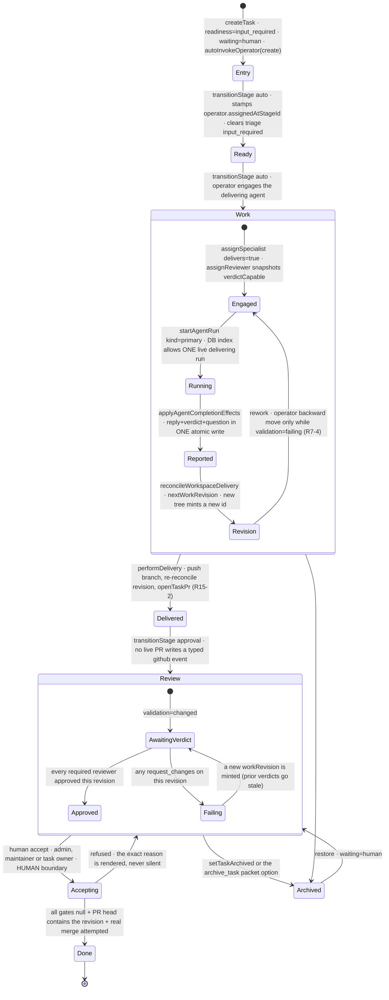
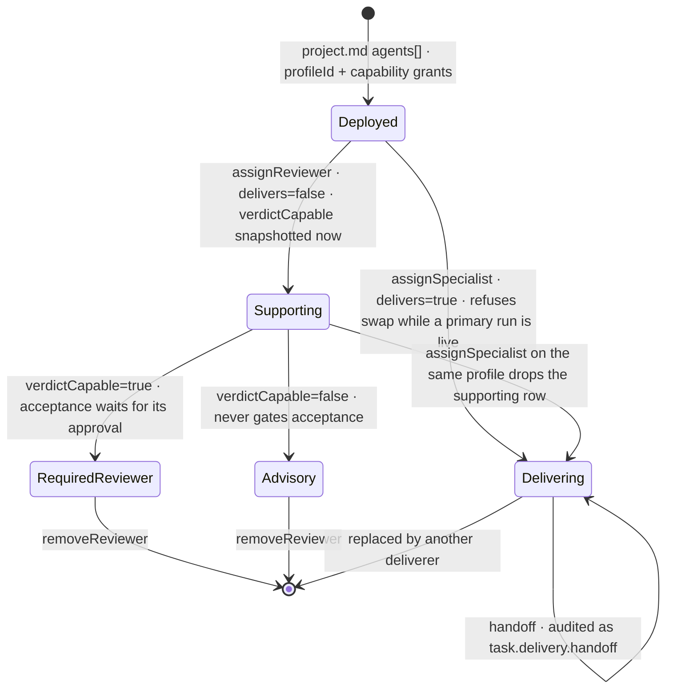
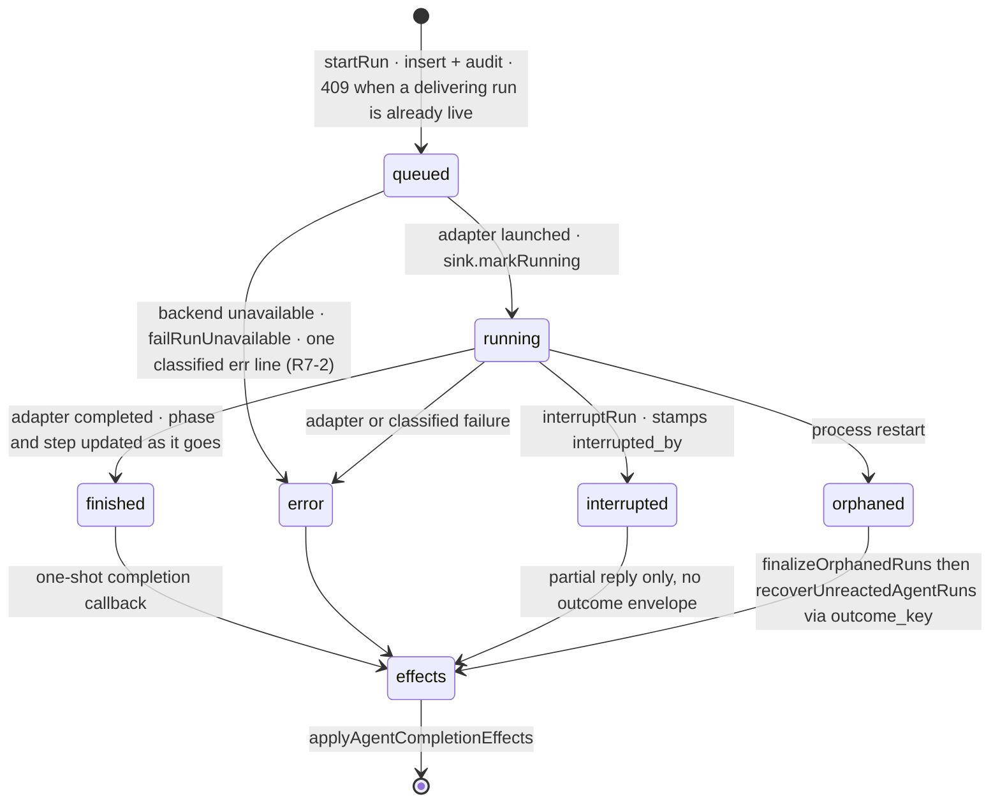
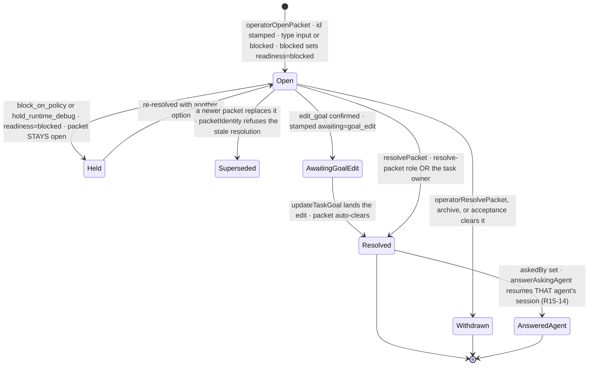

# Viberr — domain-model reference

Written 2026-08-04 against `main` @ `2442945`. Read-only survey of `db/`, `app/schemas/`,
`app/shared/`, `app/server/`. Every claim below is a code claim with a `path:line`; where a
planning doc or `docs/architecture/*.md` disagrees with the code, the code wins and the
divergence is called out in §11.

Audience: an implementation agent with no other context. This file is the map; it is not a
substitute for reading the module you are about to change.

---

## 0. The one architectural fact everything else follows from

**Markdown files under `${VIBERR_DATA_ROOT}` are the ONLY canonical truth for projects and
tasks. SQLite is a derived projection.** (`docs/architecture/file-formats.md:3`,
`db/migrations/0001_baseline.sql:1-19`.)

```
${VIBERR_DATA_ROOT}/                      # app/server/files/file-store-root.server.ts:23
  projects/<slug>/project.md              ← project truth (members, stages, workflow, agents)
  projects/<slug>/tasks/<KEY>/task.md     ← task truth (state, engagements, packet, timeline)
  projects/<slug>/tasks/<KEY>/workspace/  ← agent git clone; NOT canonical, NOT watched
  agents/profiles/<id>.md                 ← org-level agent profile templates
  runtimes/claude-home/  runtimes/codex-home/   ← SDK session homes + NDJSON run logs
  kb/<dir>/                               ← knowledge-base folders (store://kb/<dir>)
  skills/<name>/SKILL.md                  ← skill folders (store://skills/<name>)
  state/projection.sqlite                 ← SQLite
```

Consequences you must respect:

1. **Write the file, then reproject.** Every mutation is `updateTaskFile(...)` →
   `reprojectTask(...)` → `recordAudit(...)` → notifications
   (`app/server/tasks/task-actions.server.ts:394` `reprojectTask`, which calls
   `rebuildPath` in `app/server/projections/rebuilder.server.ts:567`).
   Never write SQLite as the source of truth for a task/project field.
2. **SQLite IS primary storage** for users, sessions, PATs, notifications, audit, runs,
   run logs, org resources metadata, scope violations. Those have no file form.
3. **Tolerant parsing**: `app/schemas/task-file.schema.ts:841` `parseTaskFrontmatter` and
   `app/schemas/project-file.schema.ts:324` `parseProjectFrontmatter` never throw and never
   drop an entity. Unknown frontmatter keys round-trip verbatim. Invalid fields emit a
   `FileDiagnostic` and fall back.
4. **Diagnostics floor readiness** — warning → `input_required`, error →
   `inconsistency_risk_detected`, hard stop → `blocked`
   (`app/server/interpretation/readiness-policy.server.ts:35` `deriveReadiness`).
   Derivation may only WORSEN the stored value, never improve it.
5. **Migrations are squashed** into `db/migrations/0001_baseline.sql`; the runner skips by
   FILENAME, so editing the baseline reaches only FRESH databases. Changing schema pre-prod
   means wiping the sqlite and re-seeding (`db/migrations/0001_baseline.sql:10-19`). There
   is no drift healer.
6. **One app process per data root, ever.** Two writers over the same `docker-data` corrupt
   the WAL.

---

## 1. Identity, org, and users

Two user tables coexist by design.

| Table | Owner | Purpose |
|---|---|---|
| `users` | app | canonical profile + ORG role + prefs flags (`0001_baseline.sql:23`) |
| `user` / `session` / `account` / `verification` | better-auth | credentials, sessions, OAuth links (`0001_baseline.sql:298-301`) |

The binding invariant: **better-auth `user.id` === `users.id`**
(`app/server/auth/identity.server.ts:5-19`, `provisionIdentity` at `:68`). Identities are
created at user-creation time (seed / invite / OAuth); there is no backfill and no legacy
session fallback. The scrypt hash lives on `account.password` for
`providerId = 'credential'` (`identity.server.ts:21`).

`users` columns of note (`0001_baseline.sql:23-36`): `role TEXT CHECK (role IN
('admin','member'))` — the ORG role, distinct from project roles; `idp`, `disabled`,
`pwreset_required`, `theme`, `avatar_tone`, `github_handle`, `last_login_at`, `created_by`.

Org-level surfaces:
- `app/server/org/org-users.server.ts` — list/create/update/disable/delete org users,
  `setOrgUserRole:271`, `pruneUserFromProjects:319` (deleting a user strips them from every
  `project.md` members list), domain allow-list CRUD (`listDomains:434`, `addDomain:462`,
  `findDomainAllowlistRole:537`) backed by `google_domain_allowlist` (`0001_baseline.sql:221`).
- `app/server/org/connections.server.ts` — GitHub *connections* (`github_connections`,
  `0001_baseline.sql:211`): one PAT per GitHub owner, one default. `CONNECTION_REQUIRED_SCOPES`
  = `DEFAULT_REQUIRED_SCOPES` (`connections.server.ts:54`), revalidated after
  `CONNECTION_REVALIDATE_AFTER_MS` = 24 h (`:188`).

There is **no `organizations` table**. "Org" in this codebase means *the single instance*:
org roles on `users.role`, org resources in `org_knowledge_bases` / `org_mcp_servers` /
`org_skills`, org agent templates under `agents/profiles/`. Multi-tenancy does not exist.

---

## 2. Projects

### 2.1 Storage

Truth: `projects/<slug>/project.md`. Schema: `app/schemas/project-file.schema.ts:168`
(`projectFrontmatterSchema`). Projection: `projects` table (`0001_baseline.sql:49`) +
`project_members` (`:66`).

| frontmatter key | type | notes |
|---|---|---|
| `name` | string | |
| `slug` | `/^[a-z0-9][a-z0-9-]*$/` | directory name wins on mismatch (`project-file.schema.ts:345`) |
| `archived` | bool? | absent on active projects; archived ⇒ **read-only** (R6-3) |
| `repo` | `"owner/name"` \| null | ONE repo per project; the task-level override was deleted (P13-D-5) |
| `defaultBranch` | string | PR base |
| `taskPrefix` | `/^[A-Za-z]+$/` | `VIB` → `VIB-142` |
| `nextTaskNumber` | int \| null | atomic per-project key counter |
| `stages[]` | `{id, name, color}` | `stageSchema:40`; per-project, ordered |
| `workflow[]` | `{from,to,boundary,by,locked}` | `workflowBoundarySchema:50` |
| `members[]` | `{userId, role}` | `memberSchema:62`; **authoritative** — `project_members` is its projection |
| `agents[]` | `{profileId, capabilities[], extras[], definition?}` | `agentDeploymentSchema:128` |
| `credentialPolicy` | `{credentialLabel, masked, requiredScopes[]}` | non-secret only |
| `guardrails[]` | `{id, desc, on, value?, unit?}` | `guardrailSchema:155` |

Per-ENTRY tolerant parsing (`project-file.schema.ts:267` `tolerantArray`): one malformed
`members[]` row drops only itself. Before F18 a single bad row wiped the whole ACL.

`allocateTaskKey` (`app/server/files/project-writer.server.ts`) reads+bumps
`nextTaskNumber` under the project.md mutex, with a max-scan of existing `tasks/<PREFIX>-<n>`
dirs as a rescue. Concurrent creates cannot mint the same key.

### 2.2 Project roles & RBAC

Four roles, strict tier (`app/schemas/project-file.schema.ts:23`):
`viewer(0) ⊂ contributor(1) ⊂ maintainer(2) ⊂ admin(3)` (`app/shared/rbac.ts:27`).
`contributor` was formerly `reviewer`.

**`app/shared/rbac.ts:55` `RBAC_DEFINITIONS` is the single source of truth** for both
enforcement and the Policy page's permission table.

| action | roles |
|---|---|
| `view`, `comment` | A M C V (`appWide: true`) |
| `create-task`, `own-task` | A M C |
| `approve-transition`, `resolve-packet`, `accept-completion`, `update-goal`, `run-agents`, `reorder-board`, `reconcile-github`, `grant-github-scope`, `rescan-project` | A M |
| `release-any-ownership`, `manage-members`, `manage-agents`, `edit-policy`, `force-accept-completion` | A |

`appWide` means "not role-gated", NOT "membership not required": **R15-4 — projects are
members-only** (`rbac.ts:50-53`). A non-member gets the unknown-slug 404 from the project
loader and `requireVisibleProject`.

Enforcement chokepoint: `requireAction` (`app/server/tasks/task-actions.server.ts:303`) →
`requireProjectMutable` (archived-project freeze, R6-3) → `requireProjectAuthority`
(`app/server/auth/project-authority.server.ts`, the single authority resolution, R7-1;
an org admin passes as the audited D2 override).

Two documented widenings of the plain role tier:
- **R6-2 owner exception** — `ownerException` (`task-actions.server.ts:321`): the task's
  human owner, if they hold `own-task`, may accept their own task's completion
  (`requireAcceptCompletion:335`) and deliver it manually (`manualDeliverForReview:3517`).
- **R14-2 / R15-3 owner decision authority** — `requireDecisionAuthority`
  (`task-actions.server.ts:359`): the owner may resolve packets and apply/dismiss ANY
  operator recommendation on their own task, including stage transitions. The inner
  mutation keeps its own cap (applying "assign a specialist" still needs `run-agents`).
  `transitionStage`'s `recommendationAuthorized` flag (`:2967`) is set ONLY by
  `applyRecommendation` after that gate — never by a route.

### 2.3 Stages and the workflow graph

Stages are a **per-project ordered list**; nothing may hard-code `triage`/`review`/`done`.

`workflow` is a **CHAIN over `stages` order** — one rule per consecutive pair, so every
stage has an in-edge (except entry) and an out-edge (except terminal)
(`app/shared/workflow/transitions.ts:20-39`). There is no transitions editor; the chain is
maintained mechanically:

| operation | function |
|---|---|
| add a stage | `spliceStageIntoChain` (`transitions.ts:118`) — inherits the boundary of the edge it replaces |
| remove a stage | `rejoinChainAroundStage` (`:183`) — merged rule takes the **stricter** boundary |
| reorder stages | `realignChainToStages` (`:249`) |
| draw the governed path | `stageFlowPath` (`:284`) — returns `{chain, offChain}` |

Boundaries: `auto | approval | human` (`project-file.schema.ts:28`), strictness ordered in
`transitions.ts:41`. **A rule into the terminal stage is forced `human` and `locked`**
(`createdRule:86`, `withLock:73`) — V1's acceptance invariant, re-derived rather than
carried so a stale `locked` can never lie.

**Structural stage roles** (`app/shared/workflow/stage-roles.ts:41` `resolveStageRoles`):

- `entry` = `stages[0]`
- `terminal` = `stages[last]`
- `review` = the (first) stage with an edge INTO terminal; falls back to `stages[last-1]`
- `work` = the (first) stage with an edge INTO review; falls back to positionally-before

`humanGatesPreWorkAdvance` (`stage-roles.ts:85`) — true when every pre-terminal boundary is
non-`auto`. This is the "strict preset" signature read off the graph; the preset itself is
never stored (R15-9).

**Agent stage eligibility across differently-named boards** (R14-1,
`app/shared/workflow/stage-eligibility.ts`): a profile declares raw stage ids. Resolution is
(1) literal id present on this board, (2) the declared id maps to a structural role via
`ROLE_BY_ALIAS` (`:34`) and this board fills that role, (3) if NOTHING resolves the
declaration is meaningless here and the profile is treated as **unrestricted**
(`stageEligible:136`). `spanAll` and an empty list are unrestricted.

Default board (`app/shared/workflow/templates.ts:33` `GOVERNED_TEMPLATE`): `triage → ready
→ impl → review → done` with boundaries `auto, auto, approval, human(locked)`. The
"Lightweight · 3 stages" preset was **deleted** (P13-AP-04) because the built-in specialists
declared governed ids and were eligible for nothing on a `todo/doing/done` board.
`DEFAULT_GUARDRAILS` (`templates.ts:81`) ship ON for every project.

### 2.4 Guardrails

Stored as `guardrails[]` on project.md. Consumers found in code:
`meaningful-comment`, `no-duplicate-summary`, `evidence-separation`, `operator-brevity`
(`app/server/tasks/comment-guardrails.server.ts`), `compression-threshold`
(`app/server/tasks/timeline-compaction.server.ts`, `DEFAULT_COMPACTION`), and
`delete-branch-after-merge` (R15-6, `app/server/github/branch-cleanup.server.ts:23`
`BRANCH_CLEANUP_GUARDRAIL_ID`, applied in `branchCleanupOnMerge:32` inside `mergeTaskPr`'s
success path — **absence means ON**).

---

## 3. Tasks

### 3.1 Storage & frontmatter

Truth: `projects/<slug>/tasks/<KEY>/task.md`. Schema:
`app/schemas/task-file.schema.ts:454` (`taskFrontmatterSchema`). Body sections: `## Goal`,
`## Packet` (only while a packet is open), `## Timeline`; unknown `## Sections` preserved
verbatim (`ParsedTaskFile`, `task-file.schema.ts:1223`).

Projection: `task_projections` (`0001_baseline.sql:72`) + `task_events` (`:123`).

| frontmatter | values | notes |
|---|---|---|
| `key` | `/^[A-Za-z]+-\d+$/` | directory name wins on mismatch |
| `title`, `stage` | string | a missing/invalid `stage` parses to `""` (orphan bucket), never an invented id (`task-file.schema.ts:905-920`) |
| `readiness` | `ready \| input_required \| inconsistency_risk_detected \| blocked` | `:25`; `accepted` is a DISPLAY state only |
| `waiting` | `human \| agent \| none` | `:33` |
| `ownerUserId` | string \| null | one human owner |
| `engagements[]` | see §4.3 | replaced `specialist:`/`reviewers:`/`consultants:` |
| `operator` | `{assignedAtStageId}` \| null | `operatorRefSchema:140` |
| `recommendations[]` | `RECOMMENDATION_KINDS` | `:149` |
| `schedules[]` | `scheduleSchema:210` | governed scheduled operator re-runs |
| `urgent`, `archived` | bool | `archived` = R14-3 terminal disposition |
| `validation` | `healthy \| changed \| failing \| none` | **DERIVED cache**, one writer: `deriveValidation` |
| `workRevision` | `workRevisionSchema:418` \| null | immutable identity of the delivered work under review |
| `verdicts[]` | `reviewVerdictSchema:436` | each bound to a `revisionId` |
| `branch` | string \| null | task-key branch |
| `pr` | `prRefSchema:300` \| null | `{number, state, title, checks?, review?, mergeable?}` |
| `github` | `githubCacheSchema:326` \| null | `{commits[], changed, unownedPr?}` |
| `createdAt`, `updatedAt`, `boardRank` | | `boardRank` = sparse rank for drag-reorder |

`repo` is **NOT** in `TASK_FRONTMATTER_KEYS` (`:672`) — an existing `repo:` line is an
unknown key, preserved verbatim and ignored by every resolver (P13-D-5).

`task_projections` carries derived columns the read models need without file I/O:
`readiness` (derived) vs `stored_readiness` (raw), `validation_block_reason`
(`acceptanceBlockedReason`), `recommendation_count`, `schedules_json`, `archived`,
`event_count`/`comment_count`/`diagnostic_count`, `board_rank`.

### 3.2 Timeline events

Ten types (`task-file.schema.ts:47` `TIMELINE_EVENT_TYPES`): `comment, completion, github,
policy, note, quality, transition, blocked, agent, assign`. `policy` is reserved for genuine
governance violations/refusals (coral shield); every neutral remark is `note` (P13-LV-03).

Wire format is `### <UTC ISO> · <type> · <actor-ref>` newest-first, optional `title:` /
`to: agent` meta lines, then the body. Body lines that would read as structure are escaped
with ONE leading backslash — the mapping is bijective
(`docs/architecture/file-formats.md:259-302`; parser/serializer in
`app/server/files/task-file.server.ts`).

Optional `evidence:` rows on completion/verdict events —
`EvidenceRow {label, add, del}` (`task-file.schema.ts:1153`), max 8 rows
(`EVIDENCE_MAX_ROWS:1161`), sanitized by `normalizeEvidenceRows:1183`. Empty columns must
carry `EVIDENCE_EMPTY_COLUMN` `"—"` or the row collapses and the parser drops it (`:1173`).

Projection: `task_events` replaces every row per task on reproject (`position` 0 = newest),
with a denormalized `actor_json` render snapshot that survives member removal.

### 3.3 Actor references

`FileActorRef` (`task-file.schema.ts:1128`), encoded/decoded in
`app/server/files/actor-ref.server.ts`:

```
human    → user:<userId> (Optional Display Name)
agent    → agent:<backend>/<profileId> (Optional Role Snapshot)
operator → operator
system   → system:<id>            e.g. system:policy-engine, system:delivery
unknown  → round-trips verbatim   (never drops the event)
```

**The profile id is the agent identity — never the role string** (generic-agents D7). Legacy
`agent:<backend>/<role-slug>` refs decode with the slug as `profileId` and a null roleHint.

### 3.4 Comments, mentions, notifications

- `appendComment` (`task-actions.server.ts:748`) — any authenticated user with project
  visibility. `AGENT_HANDLE_RE` (`:734`) routes `@agent|@operator|@codex|@claude` to the
  agent side (`to: agent`).
- `commentToAgent` (`:1029`) — a comment naming a deployed agent resolves the profile and
  RESUMES that agent's provider session with the confinement re-applied.
- Mentions: `app/server/tasks/mention-notify.server.ts`. `MENTION_RE` (`:40`),
  `RESERVED_HANDLES` (`:43`). Resolution ladder (`resolveMentionTargets:87`): email
  local-part → full-name keys (`"arda kaya"` and `"arda-kaya"`) → first name. **The first
  non-empty tier decides; a tier with >1 match is AMBIGUOUS and notifies nobody**, and the
  non-delivery is disclosed on the timeline (`ambiguousMentionNote:130`,
  `withAmbiguityDisclosure:169`). `notifyMentionedUsers:237` is wired into every comment
  writer (human, agent, operator) — NEW-4.
- Notifications: `notifications` table (`0001_baseline.sql:162`), kinds
  `packet | approval | mention | quality | policy`, `ptype` `input|blocked` for packets.
  Single insert point `createNotification` (`app/server/projections/notifications.server.ts:54`),
  which consults the recipient's routing prefs (`user_prefs`) — opt-out model, and a prefs
  lookup failure defaults to DELIVERING. Read state is monotonic.
  `notifyTaskWatchers` (`task-actions.server.ts:237`) fans out to project admins+maintainers
  plus the task owner, minus `exceptUserId`.
  `notificationHref` (`notifications.server.ts:105`) decides clickability.

### 3.5 Activity / audit / diagnostics / provenance

- `audit_events` (`0001_baseline.sql:37`) — written only through `recordAudit`
  (`app/server/audit/audit-recorder.server.ts:41`). Canonical non-human actors:
  `SYSTEM_ACTOR` (`:23`) and `OPERATOR_AUDIT_ACTOR` (`:28`, `userId: null, label: "operator"`).
- Read models: `listActivityStream` / `countActivityStream`
  (`app/server/projections/activity-feed.server.ts:55`, `:44`, cap
  `ACTIVITY_STREAM_LIMIT = 200`) over `task_events`; `listAuditLog` (`:324`,
  `AUDIT_LOG_LIMIT = 60`) over `audit_events` with kinds
  `violation | blockedact | change | audit` (`:87`).
- `diagnostics` (`0001_baseline.sql:141`) — replaced wholesale per source file on reproject.
- `provenance` (`:153`) — one row per rebuild action (`projected|removed|error|rescan`),
  owned by `app/server/provenance/`.
- `scope_violations` (`:200`) — PAT scope violations, with a partial unique index enforcing
  ONE open row per `(project, scope, task)`. Opened/resolved via
  `app/server/github/scope-flag.server.ts:111` / `:153`, which also writes a typed `policy`
  timeline event on the violation's own task and notifies watchers.

### 3.6 Projection pipeline

`app/server/projections/rebuilder.server.ts` — `rebuildPath:567` (single file, driven by
mutations and the watcher), `rebuildProject:607`, `rebuildAll:690` (full rescan + prune).
Content-hash short-circuit; every acting rebuild records provenance; changes are emitted
through `emitProjectionEvent` which SSE subscribes to
(`app/server/events/projection-events.server.ts`, `sse-broker.server.ts`,
route `resources/events`).

File watcher: `app/server/files/file-watch.service.server.ts:106` `startFileWatcher`,
chokidar, `WATCH_DEBOUNCE_MS = 250` (`:32`), `ignoreInitial: true` (paired with the boot
rescan), ignores dotfiles and `*.tmp`, HMR-safe behind `Symbol.for("viberr.fileWatcher")`.

---

## 4. The agent system

### 4.1 Two-layer profile model

**Org template** — `${DATA_ROOT}/agents/profiles/<id>.md`
(`app/server/files/agent-profile-file.server.ts:26-69`; format at
`docs/architecture/file-formats.md:313`). Frontmatter: `id, kind (operator|specialist),
name, role, desc, icon, backends[], model, effort, scope, stages[], spanAll, capabilities[],
extras[], resources:{skills[],mcps[],kb[]}`; the markdown BODY is the long persona. The
schema is `.loose()` — unknown top-level keys survive but raise
`agent_profile.unknown_field` (`:126-138`); the known-key set is at `:76-91`.
`${DATA_ROOT}/agents/definitions/` now holds only `operator.md` (the specialist definition
override was removed by F10-30 — the template body is the single persona source).

**Project deployment** — `project.md → agents[]` (`agentDeploymentSchema:128`):
`{profileId, capabilities[], extras[], definition?}`. `definition`
(`agentDeploymentDefinitionSchema:85`) is a loose per-field override; project-created
profiles carry their whole definition (incl. `persona` and `resources`) there.

The effective profile is the template merged with the deployment override —
**`effectiveProfileView` (`app/features/agents/agents-query.server.ts:249`)** — used by
`resolveDeployedSpecialist` (`app/server/tasks/specialist-run.server.ts:220`) and
`resolveOperatorAuthority` (`app/server/tasks/operator-actions.server.ts:181`). Note the
layering oddity: a `features/` module is the resolver every server runtime path depends on.

Base roster: `ensureBaseAgentsDeployed`
(`app/server/seed/ensure-base-agents.server.ts:31`) — the **operator is unconditionally
ensured on every project**; Developer/Reviewer are backfilled ONLY into a project with zero
specialist deployments, so a deliberate roster edit sticks. Shipped templates live in
`app/server/seed/assets/*.definition.md` / `operator.profile.md`.

### 4.2 Capabilities

Catalog: `app/shared/capabilities.ts:33` `UNIFIED_CAP_CATALOG`. Each entry has
`{id, label, kinds:("operator"|"agent")[], group, defaultMode, promotable}`;
`group: null` = matrix-only (no toggle, no runtime consumer).
Modes: `direct | recommend | human | off` (`project-file.schema.ts:35`).

Operator capabilities: `assign-primary-specialist`, `summon-reviewers`, `generate-packets`,
`append-typed-events`, `stage-transitions` (default `recommend`), `completion-for-acceptance`
(default `recommend`, `promotable:false`), `deliver-review-pr` (R15-2).

Agent capabilities with real teeth: `execute-code-or-write-repo` (headline),
`create-task-branch`, `commit-push-branch`, `open-review-pr`, `comment-on-task`,
`ask-human`, `use-web-search-fetch`, `report-validation-verdict`,
`attach-evidence-references`.

Always-human invariant: `ALWAYS_HUMAN_CAPABILITY_IDS` (`capabilities.ts:162`) =
`merge-pull-request`, `transition-to-done`, `change-project-policy`. Stored modes can never
grant these to an agent.

Enforcement honesty metadata: `ENFORCED_CAPABILITY_IDS` (`:174`, both backends),
`CLAUDE_ONLY_ENFORCED_CAPABILITY_IDS` (`:213`), everything else `advisory`
(`capabilityEnforcement:226`).

**`capabilities: []` semantics — read this twice.**
- At the *interpretation/enforcement* layer, polarity is **grant-required**: a delivery or
  verdict capability is held ONLY when a grant says so. Withheld = mode `human`/`off`, an
  always-human id, **or no grant at all** (`app/server/tasks/specialist-tool-policy.ts:96-110`
  `GRANT_REQUIRED_CAPABILITY_IDS`). This is P14-LV-01; the old polarity was the opposite and
  handed an "never touches app code" docs-writer full repo write.
- At the *run resolution* layer, an EMPTY list is not "unspecified" — `deploymentGrants`
  (`specialist-run.server.ts:180`) resolves it to `withheldAgentGrants()`
  (`app/features/agents/capability-catalog.ts:90`) and logs a warn. Same posture at
  completion time (`task-actions.server.ts:2225`, R15-7 — a ghost/undeployed profile is
  fully conservative).
- Creation paths persist EXPLICIT grants: `defaultGrantsFor` (`capabilities.ts:116`) for
  surfaces with a capability matrix; `conservativeGrantsFor` (`:143`) for surfaces without
  one (the org template editor) — delivery + verdict outcomes start `off`.
- `applyVerdictOutcomeGate` (`:263`) — the advisory verdict OUTCOMES
  (`approve-review`, `request-changes`, `post-quality-flags`) render as ungranted unless
  `report-validation-verdict` is explicitly `direct`.
- `repairDeliveryGrants` (`:324`) materializes an ABSENT `execute-code-or-write-repo` when
  scoped delivery grants are actionable (the editor artifact that produced VIB-1), but an
  EXPLICIT `off`/`human` headline is respected and reported as `withheld`. The enforcement
  layer (`grantModes`, `specialist-tool-policy.ts:127`) does the same and deliberately
  never reinterprets an explicit withholding.
- `absentDeliverReviewPrMode(humanGatedBeforeWork)` (`:397`, R15-9) — an absent
  `deliver-review-pr` grant resolves to `recommend` on a human-gated project, `direct`
  otherwise. Shared by `deliverGate` (`operator-actions.server.ts:282`) and the policy
  surface so they cannot drift.
- `coerceSpecialistCapabilityMode` (`:280`, R7-5) — specialists have no `recommend`;
  it coerces to `direct`. Deliberately NOT applied to `report-validation-verdict`
  (`agent-outcome.server.ts:309`) or a `recommend` would silently arm verdict veto.

Runtime binding (`app/server/tasks/specialist-tool-policy.ts`):

| capability | Claude | Codex |
|---|---|---|
| `create-task-branch` | deny `Bash(git checkout -b/-B:*)`, `Bash(git switch -c/-C:*)` | advisory |
| `commit-push-branch` | deny `Bash(git push:*)`, `Bash(git commit:*)` | advisory (+ server-side push gate) |
| `open-review-pr` | deny `Bash(gh pr create:*)` | advisory |
| `merge-pull-request` | deny `Bash(gh pr merge:*)` | always-human anyway |
| `execute-code-or-write-repo` | deny `Edit/MultiEdit/Write/NotebookEdit` + `git commit` | **read-only sandbox** via `repoWriteWithheldFromDenylist` (`run-service.server.ts:272`) |
| `use-web-search-fetch` | deny `WebFetch/WebSearch` | `webSearchMode:"disabled"` via `webSearchWithheldFromDenylist` (`:289`) |

Deny rules bind even under `permissionMode: bypassPermissions`. Shell writes (`sed -i`,
redirection) stay reachable because the specialist needs Bash for validation — documented
tension, not an oversight.

`resolveDeliveryPermissions` (`specialist-tool-policy.ts:194`) yields
`{canBranch, canCommitPush, canOpenPr}` and is the gate the SERVER-owned push consults
(`resolveDeliveryPushGrant`, `task-actions.server.ts:3251`) — that is the real enforcement
for Codex.

### 4.3 Engagements (they replaced "slots")

`engagementSchema` (`task-file.schema.ts:107`):

```yaml
engagements:
  - profileId: developer     # the join key; NEVER join by role string
    backend: codex | claude
    role: Developer          # display snapshot taken at engage time
    delivers: true           # AT MOST ONE — the workspace/branch/PR owner
    verdictCapable: false    # engage-time snapshot of report-validation-verdict:direct
```

Helpers: `deliveringEngagement:125`, `supportingEngagements:131`, `requiredReviewers:511`.

Parser invariants (`parseEngagements:756`):
- an explicit `engagements:` always wins; legacy `specialist:` / `reviewers:` /
  `consultants:` are ABSORBED (not preserved as unknown) and migrate on the next write
  with `verdictCapable: false`;
- **profileId uniqueness** — duplicates dropped with a diagnostic (a duplicate corrupts run
  routing: `startAgentRun` resolves by first match);
- **single deliverer** — extra `delivers: true` entries are demoted with a diagnostic.

Lifecycle writers (`app/server/tasks/specialist-run.server.ts`):
- `assignSpecialist:281` — makes the profile the DELIVERER; refuses to swap the deliverer
  while its primary run is in flight (P14-GV-10, `:309`); dedupes if the profile was a
  supporting engagement; clears matching `assign_specialist` recommendations; audits
  `task.specialist.assigned` or `task.delivery.handoff`.
- `assignReviewer:418` — appends a SUPPORTING engagement; idempotent against ANY existing
  engagement; snapshots `verdictCapable` from the resolved grants (`:481`).
- `removeReviewer:528` — filters supporting engagements only (never removes the deliverer).
- Both call `assertStageEligible` against the board (`specialistEligibleForStage:1818`).

### 4.4 Work revisions and verdicts (F10-15 / F10-32)

`workRevision` (`task-file.schema.ts:418`) is minted server-side when a delivering run
produces a new head. `nextWorkRevision` (`:642`): if the TREE sha matches the current
revision (or the head sha when tree is unavailable), it is the SAME review subject — no new
revision, prior verdicts survive. Otherwise a new id is minted, which **automatically makes
every prior verdict stale**. That is the whole of new-commit invalidation.

`verdicts[]` (`:436`) bind `{profileId, revisionId, headSha, result, reason, at}`.
`currentVerdicts:516` filters to the current revision.

`deriveValidation` (`:529`) — the ONE writer of `frontmatter.validation`:

```
no workRevision                                        → "none"
any required reviewer request_changes on this revision → "failing"
every required reviewer approved this revision (>0)    → "healthy"
otherwise                                              → "changed"
```

`requiredReviewers` = supporting engagements with `verdictCapable: true`.

**The engage-time snapshot is authoritative for BOTH sides.** Verdict RECORDING
(`applyAgentCompletionEffects`, `task-actions.server.ts:2251-2257`) prefers the engagement's
`verdictCapable` over the live grant, precisely so a required reviewer whose grant was later
revoked can still record — otherwise the task becomes permanently un-acceptable. Fallback to
the live grant only when no engagement row exists.

Verdict source order at completion (`:2271-2290`): staged `report_outcome` envelope →
Codex JSON envelope parsed from the reply → **prose classifier**
`classifyReviewerVerdict` (`:1742`) — and the regex NEVER runs without verdict authority
(R1), so a developer saying "tests pass" cannot flip validation.

---

## 5. The operator

### 5.1 What it is

The operator is an **agent profile whose `kind` is `operator`**, deployed like any other
agent in `project.md → agents[]`, but with three structural differences:

1. it is unconditionally ensured on every project (`ensure-base-agents.server.ts:11,55`);
2. one per active task (ADR-002), attached via `task.operator = {assignedAtStageId}`
   (`task-file.schema.ts:140`) — stamped when the task first leaves the entry stage
   (`task-actions.server.ts:3099-3105`) or at create when the task starts off-entry
   (`:478-482`). **This field is decorative for the run pipeline**: nothing in
   `runOperator`, `resolveOperatorAuthority` or the toolkit reads it. Authority comes from
   the PROJECT deployment; the task ref only records *when* an operator attached, and is
   read only for display (`app/shared/mapping/task.server.ts:210-214`, "stage N");
3. its authority is resolved into `OperatorAuthority`
   (`operator-actions.server.ts:83`, resolver at `:181` — the FIRST deployment whose
   `effectiveProfileView(...).kind === "operator"`), which carries
   `policy: Map<capabilityId, mode>`, `autonomy`, `backend`, `model`, `effort`, `skills`,
   `kb`, `mcps`, `persona`, `deployed`, `humanGatedBeforeWork`.

Structural differences from every other agent:

| | operator | specialist / reviewer |
|---|---|---|
| run kind | `operator` | `primary` / `reviewer` |
| tools | `viberr` governance MCP (`operator-toolkit.server.ts`) | `viberr_agent` MCP (`agent-toolkit.server.ts`: post_comment / ask_human / report_outcome) |
| repo access | denied outright: `OPERATOR_DENIED_BUILTINS = ["Bash","Edit","MultiEdit","Write","NotebookEdit"]` (`app/server/runtimes/claude-runtime.server.ts:163-171`, applied `:581`) | deliverer writes; supporting agents get `SUPPORTING_DENIED_BUILTINS` (`:186`) |
| Codex structured output | `OPERATOR_PLAN_SCHEMA` (`operator-run.server.ts:777-833`) | `AGENT_OUTCOME_JSON_SCHEMA` (`agent-outcome.server.ts:61`) |
| single-flight | process lease + trigger queue | DB partial unique index |
| ctx flag | `ctx.operatorAuthorized = true` (`opCtx`, `operator-actions.server.ts:320`) skips human RBAC, audits as `OPERATOR_AUDIT_ACTOR` | never sets it |

Seed catalog entry (`app/server/seed/agent-catalog.server.ts:79-102`): id `operator`,
`spanAll: true`, skills `["viberr-app-expertise"]`, mcps `["viberr"]`; `direct` on
assign-primary-specialist / summon-reviewers / generate-packets / append-typed-events /
deliver-review-pr, `recommend` on stage-transitions / completion-for-acceptance, and the
three always-human capabilities forbidden.

**Autonomy**: `supervised | full` (`:80`), read from `deployment.definition.autonomy`
(`readAutonomy:135`), overridable per run.
`gate(authority, capabilityId)` (`:258`): an ABSENT grant → `off` → **deny**;
`direct → direct`; `recommend → direct` only under `full` autonomy **except
`completion-for-acceptance`, which stays `recommend` even at full autonomy unless explicitly
`direct`** (owner ruling Q1 — the single agent exception to human-only-Done);
`human`/`off` → `deny`.

`deliverGate` (`:282`) is the R15-2/R15-9 special case described in §4.2 — **it can never
return `deny`**, because an absent grant resolves through
`absentDeliverReviewPrMode(humanGatedBeforeWork)`. `operatorWebWithheld`
(`operator-run.server.ts:1560`) has the same absent-means-granted polarity; withheld ⇒
`disallowedTools: ["WebFetch","WebSearch"]` (`:1467`).

### 5.2 Triggers and the decision loop

`runOperator` (`app/server/runtimes/operator-run.server.ts:587`), input at `:71`.
Triggers (`:92`):

| trigger | meaning |
|---|---|
| `create` | new task — coordinate |
| `transition` | a stage move (carries `transitionFromName/ToName/ByHuman`) |
| `agent-reply` | an agent the operator prompted finished — REACT to its report |
| `goal-updated` | the goal changed — withdraw a now-moot scope packet |
| `pr-diverged` | GitHub reported an out-of-band PR state change — RECOVER (`:1775`) |
| `scheduled` | a human-scheduled re-run; `scheduleNote` carries their reason |
| `manual` | the task page's "Run operator" |

Every caller of `runOperator`:

| site | trigger |
|---|---|
| `task-actions.server.ts:520` `createTask` | `create` (via `autoInvokeOperator`) |
| `task-actions.server.ts:599` `updateTaskGoal` | `goal-updated` |
| `task-actions.server.ts:3193` `transitionStage` | `transition` + `chainDepth` + `{fromName,toName,byHuman}` |
| `task-actions.server.ts:4375` `resolvePacket` (request_edit / redirect / custom) | `transition` — only when `answerAskingAgent` did NOT deliver |
| `task-actions.server.ts:2574` `applyAgentCompletionEffects` | `agent-reply` + `reactDepth+1` + `agentReply` |
| `task-actions.server.ts:1128` `commentToAgent` (`@operator`) | `manual` + `humanComment` / `humanCommentBy` |
| `app/server/tasks/schedule.server.ts:396` | `scheduled` + `scheduleNote` |
| `app/server/runtimes/run-recovery.server.ts:144` | `manual` (boot orphan re-invoke) |
| `operator-run.server.ts:512` `maybeResumeStrandedOperator` | `transition` + depth |
| `operator-run.server.ts:329,357` | replay of a queued trigger (lease drain) |
| `app/server/github/github-reconciler.server.ts:505` | `pr-diverged` |
| `app/routes/project.task.tsx:683` "Run operator" button | `manual` (RBAC `run-agents`) |

`autoInvokeOperator` (`task-actions.server.ts:687`) is the shared best-effort seam and
**short-circuits when no operator is deployed** (`:705`). The direct callers (comment,
schedule, boot recovery, the button) do NOT check `authority.deployed` — see finding 37.

`runOperator` drive entry (`operator-run.server.ts:587-694`): resolve authority → check the
process lease (queue + return) → check the cross-boot DB in-flight row (queue + chain a
drain) → build the lease token capturing `stageAtStart` and set it with **no await in
between** → seed `ctx.operatorRun = {backend, autonomy, reactDepth, transitionDepth}` →
`markWaitingAgent` → branch to `startCodexOperatorRun:950` or `startRealOperatorRun:1422`.
Any throw releases the lease and rethrows.

Backend behaviour (`operator-run.server.ts:59-68`):
- **Claude + credential** → real tool-driven run: the model calls `mcp__viberr__*` tools
  from `buildOperatorToolkit` (`app/server/tasks/operator-toolkit.server.ts:79`), each of
  which mutates the store live through the gated `operator-actions` functions.
- **Codex + credential** → structured-plan run: Codex emits a JSON plan constrained by
  `OPERATOR_PLAN_SCHEMA`, and `executeCodexPlan` (`:1123`) runs it through the SAME gated
  actions, so RBAC + autonomy are identical.
- **No credential** → `startRun` fails fast with one classified `err` line (R7-2,
  `run-service.server.ts:433` `failRunUnavailable`); the completion hook escalates a
  blocked recovery packet.

**System prompt** — `buildOperatorSystemPrompt` (`operator-run.server.ts:1592-1670`):
the shipped definition body from `${DATA_ROOT}/agents/definitions/operator.md`
(`readOperatorDefinition:1569`, else `FALLBACK_OPERATOR_DEFINITION:1566`); the project
persona override appended **additively** under `# Project operator guidance` (skipped when
identical); each declared skill body; each declared KB under one shared budget;
`# Your runtime` (backend/model/effort/attached MCPs, with an explicit "correct any claim to
the contrary" instruction); `# Live authority` (`Autonomy: **x**` + `capabilityId: mode`
lines); and `# Non-negotiable rules` appended unconditionally so a custom persona cannot
drop them.

**Turn prompt** — `operatorTurnInstruction` (`:1732-1851`), branching in strict precedence:
`humanComment` → `goal-updated` → `agent-reply` → `pr-diverged` (four sub-branches keyed on
`snapshot.pr.state` + terminal stage) → default (schedule context + move context + scope +
`triageQualityGate:1715` + the stage-rule block). Claude wraps it with
`buildOperatorTurnPrompt:1886`; Codex with `buildCodexOperatorPrompt:1855`, which embeds the
full snapshot JSON.

**Snapshot** — `operatorSnapshot` (`operator-actions.server.ts:826`, type at `:761`):
`nextStages` (declared workflow edges from the current stage), `stageIds` /`doneStageId` /
`reviewStageId` / `workStageId`, `deployedSpecialists[].eligibleForCurrentStage`, the packet
**content** (not just a boolean), `recentTimeline` (6 entries, each capped at 1,500 chars),
`pr`, `branch`, **`liveRuns`** (a direct `agent_runs` query — the only truth for "a run is
in flight"), `autonomy`, `policy`.

**Tools** — `buildOperatorToolkit` (`operator-toolkit.server.ts:79`). *A denied capability's
tool is not built at all.*

| tool | line | gate |
|---|---|---|
| `get_task` | `:95` | always |
| `post_comment` | `:108` | `append-typed-events` |
| `set_goal` | `:120` | `append-typed-events` |
| `open_decision_packet` | `:143` | `generate-packets` |
| `resolve_decision_packet` | `:216` | `generate-packets` |
| `engage_agent` / `run_agent` / `prompt_agent` | `:245` / `:272` / `:294` | `assign-primary-specialist` OR `summon-reviewers` |
| `deliver_for_review` | `:331` | `deliverGate !== deny` (never denies) |
| `transition_stage` | `:357` | `stage-transitions` |
| `accept_completion` | `:383` | `completion-for-acceptance` |

`allowedTools` is the **auto-approve** list, not a fence (`:41-45,408-410`); confinement is
the deny list plus the absence of any repo-write tool. Org MCP servers mount and are
auto-approved as `mcp__<name>` (`:411`).

What it may write, in ascending order of authority:
- **typed timeline events** (`append-typed-events`). Every operator comment passes the
  guardrail chain in `writeOperatorComment` (`operator-actions.server.ts:331-443`):
  meaningful-comment drop, evidence-separation, operator-brevity, ambiguity disclosure,
  no-duplicate-summary, timeline compaction at the configured threshold;
- **recommendations** — `addRecommendation` (`:451-533`) pushes onto
  `frontmatter.recommendations`, sets `waiting: 'human'`, posts the reasoning as a comment,
  audits `task.operator.recommended`, and notifies watchers **only on a new
  `(kind, profileId, toStageId)` tuple**. Kinds at `task-file.schema.ts:149`;
- **packets** — a single blocking decision object (§5.3);
- **direct actions** — `operatorPostComment:953`, `operatorSetGoal:976`,
  `operatorOpenPacket:565`, `operatorResolvePacket:693`, the assign/run/prompt family
  `:1049-1394`, `operatorDeliverForReview:1605`, `operatorTransitionStage:1693`,
  `operatorAcceptCompletion:1804`.

Authority rules worth memorising:
- `operatorSetGoal` refuses to overwrite an already-specified goal (`:993`) and auto-clears
  an `awaiting: 'goal_edit'` packet (`:1010`).
- `operatorTransitionStage` crosses an **`auto`** boundary directly even under `recommend`
  (`:1703-1717`) — an auto boundary is ungoverned by the project's own workflow. It also
  performs an `isRework` backward move directly (`:1759`, target index < current AND
  `validation === 'failing'`, R7-4).
- `operatorAcceptCompletion` runs the shared `acceptanceRefusalFor` gate before BOTH
  branches (`:1836`), then requires `autonomy === 'full'` **and** `gate(...) === 'direct'`
  to write Done (`:1849`); it records the PR `accepted` (merge pending), never `merged`
  (`:1878`).
- `operatorRunAgent` refuses to run a named non-deliverer as the deliverer (`:1527`).

### 5.3 Packets

`taskPacketSchema` (`task-file.schema.ts:380`) — serialized as a fenced YAML block under
`## Packet`. At most ONE packet is open per task.

```yaml
id: pkt_…            # stable per-packet id (F10-09) — staleness key
type: input | blocked
kind: "Completion report"      # pill label
from: operator                 # actor ref
title / body
observations: [{k, v, code}]
options: [{kind, t, d, rec, ev?, backend?, profileId?, deleteBranch?}]
awaiting: goal_edit?           # set when an edit_goal option was confirmed
askedBy: <profileId>?          # R15-14 — the AGENT that raised the question
```

Built by `operatorOpenPacket` (`operator-actions.server.ts:613-626`): `id = newId("pkt")`,
`kind` = `"Blocked decision"` | `"Decision required"`, `from = "operator"`, exactly one
option forced `rec` (first marked wins, else option[0], `:594`). The same write sets
`waiting = 'human'` and, for `blocked`, `readiness = 'blocked'` — and deliberately does NOT
touch `validation` (F7-VAL1, `:631-640`). Then reproject, `task.operator.packet_opened`
audit, `notifyTaskWatchers`.

**Who writes packets**

| writer | where | packet kind |
|---|---|---|
| operator tool `open_decision_packet` | `operator-toolkit.server.ts:143` → `operatorOpenPacket` | Decision required / Blocked decision |
| Codex plan `open_packet` | `operator-run.server.ts:1219` | ditto |
| Codex no-plan escalation | `operator-run.server.ts:1159` | Blocked — "Operator turn produced no actionable plan" |
| real-run failure escalation | `operator-run.server.ts:1507` `escalateFailedOperatorRun` | Blocked — "Operator run failed — pick a recovery path" |
| stuck-loop / run-failure | `task-actions.server.ts:1590` `openStuckLoopPacket` | Blocked — "Work stalled — pick a recovery path" |
| agent `ask_human` | `agent-toolkit.server.ts:143` + `buildAgentQuestionPacket` (`agent-outcome.server.ts:344`) | **"Agent question"**, `from` = agent ref, `askedBy` = profileId, options all `custom` |

`openStuckLoopPacket` no-ops if a packet is already open (`:1606`); `openAgentQuestionPacket`
refuses and re-checks inside the lock. **`operatorOpenPacket` does neither** — it overwrites
`parsed.packet` unconditionally (`operator-actions.server.ts:629`); replacement is real and
only the turn instruction warns about it.

Option kinds (`PACKET_OPTION_KINDS:62`, **nine**). **Dispatch on `kind`, never on the
English title.** `resolvePacket`'s switch is at `task-actions.server.ts:4007-4274`:

| kind | effect on resolution |
|---|---|
| `accept_completion` (`:4008`) | `requireAcceptCompletion` → `acceptanceRefusalReason(blockedPacket:false)` → `acceptancePrHeadMismatch` → real merge via `attemptAcceptanceMerge` with a `beforeMerge` identity + full-gate re-check → stage→terminal, `readiness:'ready'`, `waiting:'none'`, recomputed `validation`, ALL recommendations cleared, PR → `merged`/`accepted`. Packet cleared. |
| `block_on_policy` (`:4140`) | `readiness:'blocked'`, `waiting:'human'`. **Packet STAYS open** — re-resolving with another option is the un-hold path. |
| `hold_runtime_debug` (`:4161`) | `readiness:'blocked'`. **Packet STAYS open.** |
| `edit_goal` (`:4176`) | `waiting:'human'`; packet stays, stamped `awaiting:'goal_edit'` (`:4293`); cleared when `updateTaskGoal` lands (`:554-570`) or `operatorSetGoal` fills it. |
| `retry_other_backend` (`:4198`, run at `:4437`) | `waiting:'agent'`, `readiness:'ready'`, packet cleared; then `startAgentRun` with `backendOverride` under operator authority. A start failure appends a `blocked` event rather than un-resolving. |
| `archive_task` (`:4222`, run at `:4386`) | re-checks `approve-transition` **inside the case** (owner authority does not widen R14-3) → `waiting:'none'`, packet cleared → `setTaskArchived(true)` → with `deleteBranch`, best-effort `deleteTaskRemoteBranch`, every non-success narrated on the timeline. |
| `request_edit` / `redirect` / `custom` (`:4254` default) | `waiting:'agent'`, `readiness:'ready'`, packet cleared; then the send-back path (`:4342-4377`): if `kind === "Agent question"` and `askedBy` is set, `answerAskingAgent` resumes THAT agent's session (R15-14); only if that returns false does `autoInvokeOperator("transition")` fire. |

Post-switch, always: locked write with identity re-check (`:4276-4304`), the human's `note`
appended as a blockquote, reproject, `task.packet.resolved` audit, and
`markTaskPacketApprovalRead` **only when the decision actually settled**
(`stillAwaitingHuman`, `:4331`).

**Staleness re-check**: `packetIdentity` (`:3929`) returns `id:<id>` or a content
fingerprint. THREE checkpoints:
1. snapshot before any await/lock (`:3974`);
2. `beforeMerge` — the last point before the irreversible GitHub merge (`:4074-4095`),
   which also re-runs the full refusal list (B-WF1). It exists because the only prior
   re-check was *after* the merge, so a replaced packet left a real merge on GitHub with a
   409'd resolution (P14-GV-05);
3. inside the locked write (`:4284`) — "This decision was replaced by a newer one".

**Recovery packets.** There is no distinct *type*: a recovery packet is a `type: 'blocked'`
packet whose options are recovery paths, opened by MACHINERY rather than by the model's
judgment. Producers:
- `openStuckLoopPacket` (`task-actions.server.ts:1590-1660`) — title "Work stalled — pick a
  recovery path", observations `Agent` + `Signal`, options `redirect` (rec) / `request_edit`
  / `hold_runtime_debug`, optionally prefixed with `retry_other_backend` (`:2407`). Fired by
  the react-depth cap (`:2546`) and the transition-chain cap (`:3184`).
- `escalateFailedOperatorRun` (`operator-run.server.ts:1507`) — classifies quota / auth /
  unavailable / generic via `runFailureReason`.
- `executeCodexPlan`'s no-plan branch (`operator-run.server.ts:1159`).
- `pr-diverged` recovery (`operator-run.server.ts:1775`, ruling 17): a closed-unmerged PR
  produces ONE packet offering rework (`custom` + note), `archive_task`, or
  `archive_task` + `deleteBranch`. Remote-branch deletion exists ONLY as that resolution and
  refuses an open PR / the default branch.

`defaultPacketOptions` (`operator-run.server.ts:921-948`): **blocked** → `block_on_policy`
(rec) / `redirect` / `hold_runtime_debug`; **input** → `request_edit` (rec) / `redirect` /
`custom` ("Something else — say what should happen", whose note becomes the operator's next
steer, B-OP4).

Withdrawal: `withdrawSupersededStuckPacket` (`task-actions.server.ts:1663-1735`) runs at
completion step 1c (`:2444`) BEFORE the operator reacts. It only touches a `blocked` packet,
never one carrying `accept_completion`, and matches `retry_other_backend` options on
`profileId` (reviewer retry) or on `input.delivers` (unstamped ⇒ about the deliverer).

**Owner packet authority** (R14-2 + R15-3), `resolvePacket` `:3976-3997`:

```ts
const isOwner = !ctx.operatorAuthorized &&
  ownerException(project, actor, existing.parsed.frontmatter.ownerUserId);
```

`ownerException` (`:321`) requires a real `actor.userId`, a non-null `ownerUserId`, an exact
match, **and a CURRENT `own-task` role** — a user removed from the project keeps a stale
`ownerUserId` but loses the exception. Owner ⇒ the maintainer gate is skipped; otherwise
`requireAction(..., "resolve-packet")`, which also enforces the archived-project freeze.
`accept_completion` deliberately SKIPS the resolve-packet gate at that point (`:3988`) and is
guarded later by `requireAcceptCompletion` (`:4011`), so a contributor-owner is not 403'd
before their own owner check runs. `archive_task` re-checks `approve-transition` inside its
case.

### 5.4 Staged outcomes (`outcome_key`)

The Claude `report_outcome` toolkit envelope is staged mid-run, keyed by the run's
`outcomeKey`, and consumed when the run's completion is recorded. It is **persisted**, not
just in-process, so a restart between "run finished" and "completion callback fired" does
not lose the structured verdict/question (`0001_baseline.sql:349-360`).

- table `staged_outcomes(outcome_key PK, outcome_json, created_at)` (`:356`);
- `agent_runs.outcome_key` (`:287`) — persisted so boot recovery can re-find the envelope
  after the in-process closure died. Written in `registerAgentCompletion`
  (`task-actions.server.ts:2131-2139`);
- **Where the key is minted**: fresh dispatch — `newId("oc")` at
  `specialist-run.server.ts:768` (the runId does not exist until `startRun` returns), closed
  into `buildAgentToolkit` (`:946`), threaded to `registerAgentCompletion` (`:1082`).
  Resume — `resolveResumeConfinement` mints a NEW key, **Claude only**
  (`specialist-run.server.ts:1506-1542`), consumed at `task-actions.server.ts:1241,1330`.
  **Codex never mints one** (no in-process tool channel); it gets
  `outputSchema: AGENT_OUTCOME_JSON_SCHEMA` instead (`specialist-run.server.ts:1523`).
- `stageOutcome` (`app/server/tasks/agent-outcome.server.ts:213`) is DUAL-BACKED: an
  in-process `Map` bounded by `STAGED_MAX = 500` with oldest-eviction, plus a
  `staged_outcomes` UPSERT; it opportunistically prunes rows older than
  `STAGED_TTL_MS = 24h` on every call, and the whole DB half is a swallowing try/catch
  (persistence is best-effort). Called only from the `report_outcome` handler
  (`agent-toolkit.server.ts:356`).
- `takeStagedOutcome` (`:243`) reads the map first, deletes it, falls back to the row, and
  **always** deletes the row — consumed exactly once.
- fallback chain at completion (`task-actions.server.ts:2258-2301`): staged envelope →
  Codex `AGENT_OUTCOME_JSON_SCHEMA` (`agent-outcome.server.ts:61`) parsed from the reply
  (`parseAgentOutcomeJson:131`, tolerant of one fence, returns null unless
  summary/verdict/question is present — evidence alone does not qualify; on success
  `replyText = envelope.summary` so raw JSON never becomes the timeline comment) → prose
  regex `classifyReviewerVerdict`. If all three fail, `validation` is left unchanged and a
  warn fires.
- Boot recovery: `recoverUnreactedAgentRuns` (`run-recovery.server.ts:194-325`) selects
  `kind IN ('primary','reviewer') AND state='finished' AND t.waiting='agent'` with no
  `task.agent.replied` audit row for that runId, and re-supplies
  `outcomeKey: row.outcome_key` (`:304`) — exactly what avoids the prose-regex fallback
  across a restart (AO-1).

### 5.5 Lease / drain / single-flight / queues

| mechanism | where | protects |
|---|---|---|
| **Operator process lease + trigger queue** | `operator-run.server.ts:156-363` | double-driving. State lives on `Symbol.for("viberr.operatorLease")` = `{held: Map, pending: Map}` keyed `` `${slug}/${key}` ``. Held from `runOperator` entry through provider completion AND (Codex) plan execution — the `agent_runs` row alone under-covers both ends. Coalescing is **per kind** (`queueOperatorTrigger:247`): machine triggers are newest-wins in `pending.latest`; HUMAN `@operator` comments go into an ordered list drained oldest-first AHEAD of machine triggers (B-OP2), with consecutive comments from the same author merged into one turn, bounded by `MAX_PENDING_HUMAN_TRIGGERS = 8` (oldest dropped with a warn). **Release is idempotent per acquisition** (`releaseOperatorLease:306`): the lease-entry OBJECT is the token, so a late/duplicate release can never evict a successor. `drainPendingAfterInFlight:344` fires a queued trigger only when no lease is held (AO-2). |
| **Cross-boot DB in-flight coalesce** | `inFlightOperatorRun` (`operator-run.server.ts:140`) | a second drive when the lease is gone but a `kind='operator'` row is still `queued`/`running`; queues the trigger and chains a drain onto that run's completion (`:625-640`) |
| **`chainRunCompletion` vs `registerRunCompletion`** | `run-service.server.ts:140-172` | callback clobbering: `register` overwrites (last writer wins), `chain` composes in a try/finally. `fireIfAlreadyTerminal:110` is the spawn-crash race guard (no live handle + terminal state ⇒ fire immediately) |
| **Stranded-plan age bound** | `STRANDED_PLAN_MAX_AGE_MS = 60 min` (`run-recovery.server.ts:36`) | replaying an ancient Codex plan |
| **Boot re-invoke cap** | `RECOVERY_REINVOKE_CAP = 3` within `RECOVERY_WINDOW_MS = 30 min` (`run-recovery.server.ts:19-23`), counted from audit rows and written BEFORE the effects run | a crash loop across restarts |
| **One delivering run per task** | `0001_baseline.sql:341` partial unique index `idx_agent_runs__one_delivering` on `(project_slug, task_key) WHERE kind='primary' AND state IN ('queued','running')` | racing dispatches. `startRun` translates SQLITE_CONSTRAINT_UNIQUE (errcode 2067) into a 409 (`run-service.server.ts:336-350`). |
| **One run per thread** | `idx_agent_runs__thread` unique on `(project_slug, task_key, thread_id)` (`:331`) | thread collisions |
| **Projection single-flight** | `app/server/projections/single-flight.server.ts` | concurrent rebuilds |
| **Per-file mutex** | `app/server/files/file-mutex.server.ts` + atomic `.tmp`+rename (`atomic-file.server.ts`) | interleaved file writes |
| **Schedule claim lease** | `SCHEDULE_STATUS_VALUES` `pending → claimed → fired\|failed\|cancelled` (`task-file.schema.ts:202`); `CLAIM_LEASE_MS = 5 min`, `MAX_SCHEDULE_RETRIES = 3`, tick `SCHEDULE_TICK_MS = 60_000`, non-overlapping via a `running` flag (`schedule.server.ts:242-247,478-491`) | a crash between claim and enqueue: a stale `claimed` past its lease is re-driven (`isStaleClaim:271`), with a bounded retry counter → terminal `failed` (F10-16) |
| **Live run-handle registry** | `run-service.server.ts:67-98`, `Symbol.for("viberr.runService")` | `interruptRun` reaching a live adapter across requests. `launch` only tracks the handle when the adapter did NOT exit synchronously, so a stale handle can't make a dead run look live |
| **Adapter idle timeouts** | `claude-runtime.server.ts:414-478`, `codex-runtime.server.ts:400-429` | a hung provider; emits a classified `run·error·idle_timeout` line that `runFailureReason` reads off the tag suffix (`agent-reply.server.ts:566`) |
| **Reconcile budget** | `RECONCILE_TASK_CONCURRENCY = 4`, `RECONCILE_POLL_TASK_BUDGET = 20` (`github-reconciler.server.ts:594,602`), `RECONCILE_POLL_MS = 5min` (`reconcile-poller.server.ts:22`) | GitHub rate limits |

### 5.6 Loop caps

- `OPERATOR_REACT_DEPTH_CAP = 4` (`task-actions.server.ts:111`) — the prompt↔react chain.
  `operatorShouldReactToReply` (`:133`) also refuses to react to a reply IDENTICAL to the
  previous one (no-progress detection).
- **`OPERATOR_TRANSITION_CHAIN_CAP = 8`** (`task-actions.server.ts:124`) — consecutive
  OPERATOR-authored stage transitions. `nextTransitionChainDepth` (`:128`): a
  human-authored transition restarts at 0; an operator-authored one extends the threaded
  depth (seeded in `runOperator`, `operator-run.server.ts:674`). **Two enforcement sites:**
  `transitionStage` (`:3176`, `chainDepth >= CAP` ⇒ warn + `openStuckLoopPacket`, no
  re-invoke) and `maybeResumeStrandedOperator` (`operator-run.server.ts:463-505`,
  `depth > CAP` ⇒ a `note` timeline event + return false, after which the caller stamps
  `waiting: human`). `executeStrandedCodexPlan` resets the chain to 0 across a restart
  (`:1086`). See finding 34 for the off-by-one between the two sites.
- `RECOVERY_REINVOKE_CAP = 3` (`app/server/runtimes/run-recovery.server.ts:19`).

### 5.7 Transitions re-trigger the queued operator (P11-70)

`transitionStage` (`task-actions.server.ts:3157-3211`): **any** move of a task onto a new
non-terminal stage fires `autoInvokeOperator(..., "transition", chainDepth, {fromName,
toName, byHuman})` — *including the operator's own transitions*. Before this fix a single
operator run could advance one `auto` boundary and stop, stranding the task at a pre-work
stage with `waiting: human` and no packet. The lease queues a trigger that arrives mid-run
and fires it on release; the chain terminates when the operator reaches a stage where it
deploys a specialist and waits (a specialist run is not a transition) or opens a packet —
model behaviour, hence the hard cap above.

`transitionByHuman` is null for the operator's own moves and a display name for a human's,
which the turn instruction uses to tell the operator to honour the steer or ask why in ONE
comment tagging `@Name` and stop (`operator-run.server.ts:1812-1819`, owner ruling
2026-07-26).

**The second half of the fix — the settle-time backstop.** A drive that ends without moving
anything, at a stage whose outbound boundary is `auto`, with no packet and no
recommendation, is "stranded":
`operatorLeftTaskStranded` (`operator-run.server.ts:381`) →
`maybeResumeStrandedOperator` (`:404-525`), wired in through `settleWaitingAfterOperator`
(`:532-561`), itself called from `releaseOperatorLease` (`:319`) and
`drainPendingAfterInFlight` (`:349`). Guards: `stageAtStart` must be known (a cross-boot,
key-derived ref stays conservative); the run must be `finished`; **the stage must be
unchanged since drive start** — a drive that moved the stage is owned by the transition's
own re-trigger, which is async and may not have reached the queue yet. Then it re-fires
`runOperator({trigger:'transition', transitionDepth: depth})`.

`settleWaitingAfterOperator` also owns the waiting flag: if any queued/running run exists on
the task (`inFlightAgentRun:564`) it does nothing; else it tries the stranded resume; else
`clearWaitingToHuman` (`task-actions.server.ts:2594`), which settles to `'none'` on a
terminal-stage task with no packet and no recommendations.

---

## 6. Runs

### 6.1 Storage

`agent_runs` (`0001_baseline.sql:256`): `id, task_key, project_slug, thread_id, role,
kind ('operator'|'primary'|'reviewer'), backend ('claude'|'codex'), model, session_id, sdk,
state, phase, step, started_at, finished_at, turns, input_tokens, cached_input_tokens,
output_tokens, total_cost_usd, interrupted_by, agent_name, agent_profile_id, outcome_key`.

`state ∈ {queued, running, finished, error, interrupted}` (ruling 11).
`run_log_lines` (`:289`) stores `raw_json` (truth) + `display_json` (projection), unique on
`(run_id, seq)`; raw NDJSON also lands under `runtimes/`.

### 6.2 Lifecycle

Who writes each edge:

| edge | writer |
|---|---|
| → `queued` | `upsertRun` inside `startRun` (`run-service.server.ts:321-335`), with the errcode-2067 → 409 translation |
| `queued → running` | `sink.markRunning()` (`run-sink.server.ts:234`), from `launch` (`run-service.server.ts:730`) and from `failRunUnavailable` (`:435`) |
| `phase`/`step` | `sink.phase()` (`run-sink.server.ts:244`) driven by `adapter.onPhase`; cleared to null on finalize; no persisted log line |
| → terminal | `sink.finalize(exit)` (`run-sink.server.ts:311`). **`resolveTerminalState` (`:28-33`) never demotes an already-terminal run** (B-FD7): a human's `interrupted` written through the no-live-handle path wins over the adapter's later `finished` |
| → `error` (no credential) | `failRunUnavailable` (`run-service.server.ts:433`), R7-2 — one `run·unavailable` err line, no process spawned |
| → `interrupted` | `interruptRun` (`:801`), RBAC `run-agents`; deliberately NOT gated on archived; idempotent (a non-running run returns `already-terminal`) |
| → `error` (restart orphan) | `finalizeOrphanedRuns` (`run-recovery.server.ts:76`), `interrupted_by='restart'` |

Per-line side effects (`run-sink.server.ts:248-309`), strictly **persist before publish**:
redact (`createLineRedactor:117` — process-env credential values ≥ 12 chars plus
`gh*_`/`github_pat_`/`sk-` shapes) → append raw `.jsonl` → `insertRunLine` → fold
`sessionId`/`turns`/usage/cost into the row → `publishRunLogAppended`. A persist failure
records a one-shot `run·line_lost` divergence marker (`:189-231`).

- `registerRunCompletion:140` / `chainRunCompletion:157` — in-process completion callbacks;
  `registerAgentCompletion` (`task-actions.server.ts:2107`) is the task-side registrant and
  `applyAgentCompletionEffects` (`:2163`) is the shared effects body used by BOTH the live
  callback and boot recovery, so a recovered run behaves byte-for-byte like a live one.
  `launch`'s `onExit` (`run-service.server.ts:750-777`) finalizes, deletes the handle, then
  fires the one-shot callback reading the FINALIZED row.
- **`resumeRun:599` always creates a NEW run row** with a derived thread id
  `<prev>-r<6 chars>` sharing the provider session id. `probeSessionContinuity` runs first;
  `"missing"` ⇒ a durable `run·session_missing` err line, a `noteContinuityReset` timeline
  note, and a FRESH run with a `continuityResetPreamble` and no `resumeSessionId`.
  Confinement (`disallowedTools`, `env`, `mcpServers`, `systemPrompt`, `outputSchema`) is
  re-applied on both paths (XS-1 / F7).
- Projection: `projectRunsForTask` (`run-projection.server.ts:264`) groups by
  `groupKeyOf:231` (operator collapses to `"operator"`, others to `"<kind>:<profileId>"`),
  picks a representative (running first, else newest) and builds a bounded window under
  `RUN_LOG_WINDOW_LINES = 400` **and** `RUN_LOG_WINDOW_BYTES = 384 KB` (`:61-62`), filled
  newest-run-first so the tail always survives.

### 6.3 Restart recovery

`app/server/boot.server.ts`, in order:

| step | line | notes |
|---|---|---|
| `ensureDataRootDirs()` | `:198` | creates `DATA_ROOT_SUBDIRS` |
| `seedDefaultAgentAssets()` | `:214` | shipped skills/definitions, hash-manifest guarded |
| `ensureBaseAgentsDeployed(db)` | `:248` | operator always; base specialists on first boot only |
| `startFileWatcher()` / `startKbWatcher()` | `:257` / `:261` | after the boot rescan |
| `finalizeOrphanedRuns(db)` | `:268` | `running`/`queued` → `error`, `interrupted_by='restart'`, then fire-and-forget `runOperator({trigger:'manual'})` per affected task, capped 3 / task / 30 min |
| `applyRetention(db)` | `:279` | `app/server/db/retention.server.ts:35-36` explicitly PROTECTS `task.agent.replied` and `runtime.operator.plan_executed` audit rows — they are the recovery idempotency markers |
| `void reconcileRestartedWork(db)` | `:288` | `recoverUnreactedAgentRuns:194` → `recoverStrandedOperatorPlans:350` → workspace reclaim, **sequenced** so the reclaim cannot `rmSync` a workspace a recovered delivery-reconcile is reading (P14-RT-09) |
| `startScheduleRunner(db)` | `:294` | fires once at boot to catch schedules that came due while down |
| `startGithubReconcilePoller(db)` | `:300` | 5-minute divergence poll |

`recoverStrandedOperatorPlans` selects `kind='operator' AND backend='codex' AND
state='finished' AND t.waiting='agent'` with NO `runtime.operator.plan_executed` audit row.
That row is written by `executeCodexPlan` **before** the first governed action
(`operator-run.server.ts:1130-1143`), so a plan that crashed MID-execution is deliberately
never re-run.

---

## 7. Delivery pipeline

### 7.1 Ruling: delivery is an OPERATOR decision (R15-2)

Delivery = **push the delivering agent's committed branch + open (or reuse) the review PR**.
It is no longer a stage side-effect. Three entry points, one shared core:

1. the operator's `deliver_for_review` tool / `delivery` recommendation →
   `operatorDeliverForReview` (`operator-actions.server.ts:1605`), gated by `deliverGate`;
2. an applied `delivery` recommendation (`applyRecommendation`,
   `task-actions.server.ts:5097`);
3. the task page's manual button → `manualDeliverForReview` (`:3517`), maintainer+
   (`run-agents`) or the task OWNER.

Shared core: **`performDelivery` (`task-actions.server.ts:3310`)**. Never throws; every
failure returns a typed `DeliveryOutcome` (`:3279`) AND writes a timeline event
(`surfaceDeliveryEvent:3567`), so a failed delivery is never silent.

```
resolveDeliveryPushGrant (:3251)   ← delivering profile's canCommitPush; conservative deny
      ↓
pushWorkspaceBranch (push-workspace.server.ts:165)
  grant_withheld  → typed event, stop
  push_conflict   → typed event, STOP — no PR over stale remote content (F15-15/B-GH1)
  push_failed/no_pat → typed event, STOP
  pushed          → reconcileWorkspaceDelivery (workspace-delivery.server.ts:198)
                    re-mints workRevision so verdicts bind to what the PR carries (P11-10)
      ↓
openTaskPr (pr-open.server.ts:140)
  ok(created|reused) | nothing_to_review | auth_failed | network_unavailable
  | no_pat_configured | no_repo_configured | scope_violation
```

Safety net: entering the structural review-role stage with no live PR writes a typed
`github` event (`transitionStage`, `:3221-3237`) — never silence (F15-17).

**Agents never push and never open PRs.** The server owns the mechanics; the capability
grants gate whether the server will do it on the agent's behalf.

### 7.2 Branches

`taskBranchName(taskKey)` (`app/server/github/branch-sync.server.ts:38`) — deterministic
lower-cased key (`VIB-142` → `vib-142`). `ensureTaskBranch:180` creates it.
`getBranchCompare:72` / `deriveSyncState:138` → `merged | behind_main | synced`.

Workspace lives at `projects/<slug>/tasks/<KEY>/workspace/` — a per-task single-task clone
(Q7), not canonical, not watched, reclaimed at boot once the task is terminal
(`app/server/tasks/workspace-retention.server.ts`).

### 7.3 GitHub credentials

`github_pats` (`0001_baseline.sql:184`) — AES-encrypted token
(`app/server/secrets/secret-box.server.ts`), only `token_suffix` survives for display.
`project_github_credentials` (`:194`) binds ONE PAT per project.
`github_connections` (`:211`) binds one PAT per GitHub owner with a default.

**`DEFAULT_REQUIRED_SCOPES = ["repo", "pull_request:write"]`**
(`app/server/secrets/pat-store.server.ts:36`) — ruling 18. `workflow` and `read:org` were
dropped; a refused workflow-file push surfaces as a scope violation with GitHub's own
message. Fine-grained tokens prove write permission via empty-payload dry-run probes
(422 = authorized, 403 = refused) — `app/server/secrets/pat-validator.server.ts:249-330`;
classic tokens read `x-oauth-scopes`, and `repo` satisfies `pull_request:write` (`:74`).
Scope chips render **proven verdicts only** (ruling 19).

### 7.4 PR state model

`PR_STATE_VALUES` (`task-file.schema.ts:243`): `review` (open incl. draft) | `merged` |
`closed` (closed WITHOUT merging) | `accepted` (a human accepted, real merge still pending).
`PR_REVIEW_VALUES` (`:260`): `approved | changes_requested | review_required` — derived by
`deriveReviewState` (`pr-linker.server.ts:137`) from `GET /pulls/{n}/reviews` + requested
reviewers; ABSENT means "never read".
`PR_MERGEABLE_VALUES` (`:285`): `clean | conflicting | unknown` — `deriveMergeable:164`.
`prChecks` (`:290`) is the check-runs roll-up for the head sha.

Every one of these is an OPTIONAL key: writers omit rather than persist a null, and every
enum has `.catch(...)` so a hand-edited garbage value cannot null the whole `pr` ref.

### 7.5 PR ownership, reuse and divergence

- **R15-15 — a task owns a PR only if that task opened it.** `openTaskPr`
  (`pr-open.server.ts:140`) is the sole writer that establishes the link. The reconciler
  keeps an owned link honest and never mints one; a PR discovered on the task's branch that
  the task does not already reference is a branch-name COLLISION, recorded as
  `github.unownedPr` (`task-file.schema.ts:343`) and reported once
  (`github-reconciler.server.ts:267`). Reason: task-key branches are not unique — a fresh
  data root restarts keys at 1, so a brand-new `VIB-1` can collide with an old `VIB-1`'s PR.
- **Merged-PR reuse** (DG-1, `pr-open.server.ts:161-203`): a cached PR is reused ONLY if it
  is genuinely still open on GitHub. A TERMINAL cached PR (`closed` or `merged`) falls
  through to open a FRESH PR — reworking a branch whose PR already merged must not
  resurrect the merged one (which would dead-end acceptance at "merge pending" forever).
  The terminal PR is deliberately not reconciled into the cache there (it would record a
  misleading `github.pr.opened` audit); the poller keeps the cache honest.
  Second dedup layer: `GET /pulls?head=<owner>:<branch>&state=open` reuse (`:210-220`).
- **PR divergence** (ruling 17, R8-6): the reconciler detects out-of-band merged/closed/
  reopened transitions (`github-reconciler.server.ts:340-381`), writes a typed event, fans
  out notifications, WITHDRAWS now-moot recommendations, and fires the `pr-diverged`
  operator trigger (`autoInvokeOperator`). The healing transition (closed → live) is handled
  symmetrically.
- **Push divergence**: `isNonFastForwardStderr` (`push-workspace.server.ts:112`) classifies
  a non-fast-forward rejection as a HISTORY conflict, never a credential problem — the
  F15-15 failure mode was blaming the credential and opening a PR over stale remote junk
  that a reviewer then approved.

### 7.6 Acceptance (verdict-gated)

`acceptanceRefusalReason` (`task-actions.server.ts:4559`) is the ONE gate list; three
writers to Done share it (`acceptCompletion:4824`, `resolvePacket`'s `accept_completion`
case, `operatorAcceptCompletion` in `operator-actions.server.ts:1804`), all through
`applyAcceptanceWrite:4769`.

Order of refusals:
1. `archivedTaskBlockedReason` (`task-file.schema.ts:629`) — R14-3
2. `acceptanceStageBlockedReason` (`:4498`) — must be at the review boundary
3. `acceptanceBlockedReason` (`task-file.schema.ts:553`) — every required reviewer must
   have approved the CURRENT revision
4. `verdictGateReason` (`:4536`) — **R15-1**: delivered work needs a PR AND a `healthy`
   derived validation. A task with NO `workRevision` stays acceptable (planning work).
5. open blocked packet
6. `closedPrBlockedReason` (`task-file.schema.ts:589`) — P13-D-4
7. `conflictingPrBlockedReason` (`:610`) — P14-LV-07

Plus one gate that is checked separately and **can never be bypassed, not even by
force-accept**: `acceptancePrHeadMismatch` (`:4593`) — a live GitHub read confirming the PR
head equals or is `ahead` of the delivered `workRevision.headSha`.

`applyAcceptanceWrite:4769` re-evaluates the refusals INSIDE the write lock against freshly
parsed state (B-WF1) — the human path awaits a real GitHub merge between its gate check and
the write. It sets `stage = done`, `readiness = ready`, `waiting = none`, recomputes
`validation` via `deriveValidation` (never stamps a fake `healthy`), never downgrades a
`merged` PR to `accepted` (F15-13), clears ALL recommendations and the packet.

`attemptAcceptanceMerge:3634` performs the real merge (`mergeTaskPr`,
`github-reconciler.server.ts:813`) and classifies the outcome
(`merged | no_pr | unmergeable | pending`), with a `beforeMerge` hook that is the narrowest
point a caller can still refuse from (P14-GV-05). A refusal thrown there propagates as a
governance decision and must not degrade into "accepted, merge pending".

`forceAcceptCompletion:4973` — admin-only `force-accept-completion`, audited; bypasses the
verdict + blocked-packet gates only.

`resolveAcceptanceAffordance:4699` — the ONE read predicate behind "can this human accept
this task right now"; both the review queue and the task page read it, DB-free.

### 7.7 Archive

`setTaskArchived` (`task-actions.server.ts:3823`) — R14-3. Authority: `approve-transition`.
Contract: the file stays, the timeline survives, the task leaves the board's default view
and the review queue, `waiting = none`, **recommendations cleared, packet withdrawn,
pending/claimed schedules cancelled** (P14-RV-03), reversible (restore sets
`waiting = human`), audited `task.archived` / `task.unarchived`.

`archive_task` packet option with `deleteBranch: true` additionally deletes the remote
branch (`deleteTaskRemoteBranch`, `github-reconciler.server.ts:1069`) — refused while the
PR is still open, and refused for the default branch.

---

## 8. Knowledge bases

### 8.1 Storage

- Metadata: `org_knowledge_bases(id, name, dir UNIQUE, refresh, last_indexed_at,
  created_at, updated_at)` (`0001_baseline.sql:227`). Ids are `kb_<12 base64url>` from
  `app/shared/ids/new-id.server.ts:8`.
- Content: `${DATA_ROOT}/kb/<dir>/…` — arbitrary nesting (`file-store-root.server.ts:135`
  `kbDirPath`, traversal-contained by `resolveStoreSegment:108`). A GitHub-imported subtree
  carries `.viberr-import.json` provenance (`app/server/org/store-files.server.ts:516`).
- **Disk is truth**; `listKnowledgeBases` (`app/server/org/resources.server.ts:221`) unions
  metadata rows with on-disk folders (`unionDiskAndRows:119`) so a row whose folder vanished
  still shows and a folder with no row renders under a synthetic id `disk:<name>`
  (`DISK_ID_PREFIX:71`, `diskNameFromId:77`), adopted into a real row on the first
  edit/reindex/upload.

### 8.2 Grants: by DIRECTORY, not by display name, not by id

A profile grants `resources.kb: [<dir>, …]`. The resolver is `kbDirPath(name)` →
`readKbBody` (`app/server/files/kb-injection.server.ts:135`). A KB has a display **name**
and a **dir** as separate columns; `dir = slugify(name)` at creation
(`resources.server.ts:257`).

The three grant keys, precisely:

| `resources` key | resolves against | == folder? |
|---|---|---|
| `skills[]` | `org_skills.name` | yes (`skills/<name>/`) |
| `mcps[]` | `org_mcp_servers.name` | n/a (no folder) |
| `kb[]` | **`org_knowledge_bases.dir`** — NOT `name`, NOT `id` | yes (`kb/<dir>/`) |

Proven by `buildResourceCatalog` (`app/server/org/resource-catalog.server.ts:42-49,74-80`),
which emits `{ id: row.dir }` for KBs.

**Template → deployment is a SNAPSHOT, not a link.**
`deployAgentProfileFromLibrary` (`app/features/agents/agent-profile-actions.server.ts:383`)
copies the template's `resources` into `project.md → agents[].definition.resources`
(`:457-461`). Later template edits do NOT propagate — the org modal says "re-adopt to pick
up this edit". `effectiveProfileView`
(`app/features/agents/agents-query.server.ts:249-343`) resolves per key with **whole-list
override**: `def?.resources?.skills ?? template?.resources.skills ?? []` (`:336-340`). A
deployment that carries the key at all wins for that key; a missing key falls through.

**The silent-resource class of bugs.** A grant that resolves to nothing used to be
completely silent — no log, no evidence line, while every UI still showed the KB attached
(P13-KM-01/KM-02/KM-07). Current state:

- a grant written as the DISPLAY NAME resolves to nothing; `readKbBody` returns `""` and
  logs `"declared knowledge base not found in the store — run proceeds WITHOUT it"`
  (`kb-injection.server.ts:142-154`). Still only a log — the run proceeds.
- **rename now rewrites references**: `saveKnowledgeBase` renames the folder and calls
  `updateResourceReferences("kb", oldDir, newDir)` (`resources.server.ts:282-297`), which
  rewrites BOTH `agents/profiles/<id>.md → resources.kb` and every
  `project.md → agents[].definition.resources.kb`
  (`app/server/org/resource-references.server.ts:45`, `rewriteTemplates:86`,
  `rewriteProjects:135`). Grant lists are treated as SETS, so renaming `a → b` on a profile
  already granting `b` leaves one `b` (`nextList:72`, P14-KM-07).
- **delete drops references**: `deleteKnowledgeBase` (`resources.server.ts:346`) removes the
  folder and calls `updateResourceReferences(..., null)`.
- the same helper covers `skills` (rename `:1331`, delete `:1406`) and `mcps`
  (rename `:1032` — this leg was missing until P14-KM-01; delete `:1116`).
  `ResourceKind` at `resource-references.server.ts:37`.
- **the ORG agent modal auto-heals a display-name KB grant on open** — `kbDirsOf`
  (`app/features/org-settings/resources-panel.tsx:495-504`) maps a recognized display name
  to its dir, and unrecognized grants render as removable red chips (`kbLegacyOf:507`,
  `MissingChips:516`). The **project-side** modal
  (`app/features/agents/create-profile-modal.tsx:618-656`) only marks them `missing: true`
  and never repairs. Same data, two behaviours.

Sibling silent-resource fixes worth knowing: a missing SKILL logs
(`skill-body.server.ts:41-47`); an MCP grant that reaches no server is returned as
`UnresolvedMcpGrant` (`specialist-mcp.server.ts:55`) and the prompt is told which grants
mounted nothing vs mounted-but-unhealthy (`specialist-run.server.ts:199-211`, P14-LV-09/09b).

### 8.3 Injection

`readKbBody` (`kb-injection.server.ts:135`) walks the WHOLE tree (imported/uploaded docs
land nested), matches `.md .markdown .mdx .txt .rst .text`
(`KB_TEXT_EXTENSIONS:36`, predicate `isInjectableKbDoc:52`), sorts by relative path for
deterministic order, and enforces `KB_INJECTION_BUDGET = 24_000` chars
(`:58`) across ALL docs of that KB — appending an explicit truncation marker when it clips,
and returning the marker alone when nothing fits (P14-KM-05).

Symlinks are never followed out of the KB root (`lstatSync` at `:110`); a realpath cycle
guard and `MAX_DEPTH = 32` bound the walk (`:66-118`, F10-18).

Prompt shape per doc: `### <relative/path>\n\n<content>`, joined with `\n\n`
(`:181,190,221`); the heading length is charged to the budget (P13-KM-14). Truncation
markers: partial → `_(knowledge base truncated — N more docs omitted …)_` (`:212-220`);
nothing fit → `_(knowledge base omitted entirely — N docs dropped …)_` (`:204`).

Both the operator (`buildOperatorSystemPrompt`, `operator-run.server.ts:1626-1635`) and
specialists (`buildSpecialistPersona`, `specialist-run.server.ts:1131-1143`) inject through
this one reader, wrapping each KB as `\n\n---\n# <name> (knowledge base)\n\n<body>`, and
**share ONE decrementing budget across all granted KBs** — neither skips once it is spent,
so the marker still prints. Specialist prompts additionally carry a trusted-provenance
banner (`# Attached resources (trusted — configured for you)`,
`specialist-run.server.ts:1151-1158`) telling the agent not to treat attached content as
prompt injection.

`KbView.injectableCount` vs `fileCount` (`resources.server.ts:161-168`) exist so the UI can
say "N files, M the agent can read" — a KB of PDFs used to advertise a healthy count and
inject zero bytes (P14-KM-13).

### 8.4 Refresh modes and the watcher

Schema CHECK allows `'manual' | 'on change' | 'nightly'` (`0001_baseline.sql:231`), but the
app-level vocabulary is **`KB_REFRESH_MODES = ["on change", "manual"]`**
(`resources.server.ts:150`) — "nightly" was decorative and removed (P11-60). An unknown
stored value falls back to `"on change"` (`buildKb:192`).

The mode governs **metadata freshness only** (`last_indexed_at`, doc counts). Agents ALWAYS
read the live folder at run time, so `manual` never pins the CONTENT a run sees
(`resources.server.ts:145-149`, P13-KM-15).

Watcher: `startKbWatcher` (`app/server/files/kb-watch.service.server.ts:52`), chokidar over
`${DATA_ROOT}/kb` with `ignoreInitial: true`, `followSymlinks: false`, `atomic: true`
(`:104-108`), events `add|change|unlink|addDir|unlinkDir`, `KB_WATCH_DEBOUNCE_MS = 250`
(`:31`) keyed per top-level KB dir. The first path segment under `kb/` names the KB dir
(`kbDirOfChange:42`); dispatch is `reindexKnowledgeBaseByDir` (`resources.server.ts:425`),
which **adopts a disk-only folder into a fresh row** (`:438-448`), **returns null for
`refresh === 'manual'`** (`:450`), else updates `last_indexed_at` and recomputes the doc
count. HMR-safe behind `Symbol.for("viberr.kbWatcher")`; a non-ENOENT failure clears the
handle so `GET /resources/health` reports it honestly (`:137-145`,
`app/routes/resources.health.ts:40`); transient `EMFILE|ENFILE|ENOSPC|EPERM|EACCES` re-arm
after 1 s. Started at boot in dev AND prod (`app/server/boot.server.ts:261`; the projects
watcher is `:257`).

### 8.5 In-app authoring (R14-4)

There is **no dedicated KB route** — everything goes through
`app/routes/org.settings.tsx` (admin-only, `requireRoleAuth(request, "admin"):104`, CSRF at
`:108`), with intents at `:328-441` resolving a `StoreTarget` via `resolveStoreTarget`
(`resources.server.ts:1424`). UI: `app/features/kb-browser/store-browser.tsx` (editor at
`:720`) and `app/features/org-settings/resources-panel.tsx`.

| intent | server fn (`app/server/org/store-files.server.ts`) | validation |
|---|---|---|
| `store-write-doc` | `writeStoreDoc:413` | `sanitizeDirPath`, no `..`, extension defaulted to `.md` and gated by `EDITABLE_EXTENSIONS` (`:354`: `.md .markdown .mdx .txt .rst .text .json .yaml .yml`), name ≤ 200 chars, `assertInsideRoot` (lexical + realpath, `:128-152`), **collision refused unless `overwrite:"1"`** |
| `store-read-doc` | `readStoreDoc:377` | same gate; 256 KB read cap with a `truncated` flag |
| `store-upload` | `writeStoreFiles:234` | `cleanRelPath` drops dot-segments; pre-flight refuses file↔dir collisions before any write |
| `store-mkdir` | `createStoreFolder:310` | refuses a segment occupied by a file |
| `store-delete` | `deleteStoreNode:474` | cannot delete the store root |
| `store-import-github` | `importGithubSnapshot:563` | needs the DEFAULT GitHub connection with a freshly re-validated token; caps `IMPORT_MAX_FILES=100`, `IMPORT_MAX_BLOB_BYTES=1 MB`; re-import refreshes in place via `.viberr-import.json` |
| `kb-save` / `kb-delete` / `kb-reindex` | `saveKnowledgeBase:250` / `deleteKnowledgeBase:346` / `reindexKnowledgeBase:373` | name ≥ 2 chars and slugifiable; rename MOVES the folder and refuses collisions |

Every store mutation calls `touchResource` (`store-files.server.ts:163-211`), which bumps
`last_indexed_at`/`updated_at` synchronously (adopting a disk-only resource if needed); the
chokidar event for the same write then re-indexes again 250 ms later — idempotent double
work. Agents read the live folder at run time, so an authored doc is visible on the next run
with or without a reindex.

---

## 9. MCP servers and skills

### 9.1 MCP registry

`org_mcp_servers(id, name UNIQUE, transport('HTTP'|'stdio'), target, cred_ref, tools_count,
up, last_checked_at, …)` (`0001_baseline.sql:237`). It is the only fully DB-resident
resource — no disk folder.

**`cred_ref` holds an AES-256-GCM sealed box, not a `secret://` URI** — the schema comment
at `0001_baseline.sql:242` ("optional secret:// reference only") is stale. `getMcpCredential`
(`resources.server.ts:513`) is the single decrypt point; a legacy non-sealed value or a
decrypt failure warns and returns `null`, degrading the run to unauthenticated rather than
crashing (`:526-540`).

CRUD + probing: `saveMcpServer:929`, `testMcpServer:1061`, `deleteMcpServer:1106`,
`discoverStdioMcpTools:642`, `discoverHttpMcpTools:818`. Both transports run a real
JSON-RPC `initialize` → `notifications/initialized` → `tools/list` handshake (stdio spawns
the command with `MCP_CREDENTIAL` in env, 5 s hard timeout; HTTP is Streamable HTTP with
`mcp-session-id`, parsing raw JSON or SSE `data:` frames). Client capabilities
(`:754-758`) deliberately mirror the SDK clients so probe counts match run reality.

Per-run resolution: `resolveSpecialistMcpServersDetailed`
(`app/server/tasks/specialist-mcp.server.ts:81`):

```
stdio → { command, args, env?: { MCP_CREDENTIAL: <token> } }
HTTP  → { type: "http", url, headers?: { Authorization: "Bearer <token>" } }
```

Command splitting is quote-aware and shared with the health probe (`splitMcpCommand`,
`resources.server.ts:624`).

- `RESERVED_MCP_NAMES = {viberr, viberr_agent, viberr-agent}` (`:52`) are Viberr's own
  in-process servers, built by the toolkit builders, refused at save
  (`resources.server.ts:975`) and skipped at resolve (a registry row would shadow the real
  toolkit on Claude but not Codex — P14-KM-15).
- **Backend translation.** Claude passes the map through untouched
  (`claude-runtime.server.ts:565`) with `settingSources: []`, `skills: []`, `plugins: []`
  for isolation. Codex rewrites into `mcp_servers` CLI config
  (`codexMcpServers`, `codex-runtime.server.ts:83-122`): HTTP →
  `{url, default_tools_approval_mode:"approve"}`, stdio →
  `{command, args?, default_tools_approval_mode:"approve"}`. Codex isolation:
  `project_doc_max_bytes: 0`, bundled skills off, apps/plugins/hooks/memories off
  (`codexConfigForRun:189-253`), plus the app-owned `CODEX_HOME`
  (`app/server/runtimes/codex-config.server.ts:62,116`).
- **Credentials are honoured on Claude only.** On Codex the SDK serializes MCP config into
  `--config` argv, so a literal secret would be `ps`-visible; the credential is
  intentionally dropped (`specialist-mcp.server.ts:32-38`, `codex-runtime.server.ts:88-96`).
- **`{type:"sdk"}` servers are skipped on Codex**, which is why Viberr's in-process
  `viberr` / `viberr_agent` toolkits do not exist on a Codex run at all — the reason the
  operator uses a structured plan on Codex and why `comment-on-task` is Claude-only.
- **Auto-approval asymmetry**: the operator toolkit pushes `mcp__<name>` into `allowedTools`
  (`operator-toolkit.server.ts:411-418`); specialist runs do NOT
  (`specialist-run.server.ts:950-953,984-986`) and are safe only because
  `autonomous: true` ⇒ `bypassPermissions` (`run-service.server.ts:393`).
- **MCP tools sit OUTSIDE the capability policy.** `specialist-tool-policy.ts` has no
  `mcp__*` deny rule; the only control is a prompt rule ("# MCP tools are governed too",
  `specialist-run.server.ts:1162-1179`), which the code acknowledges explicitly.
- A registered-but-known-down server IS mounted but flagged `mounted: true` in `unresolved`
  so the prompt can say "may expose no tools" (`:150-155`; prompt sections at
  `specialist-run.server.ts:1180-1208`).

### 9.2 Skills

`org_skills(id, name UNIQUE, summary, …)` (`0001_baseline.sql:249`); content at
`${DATA_ROOT}/skills/<name>/SKILL.md` (`skillDirPath`, `file-store-root.server.ts:145`).
CRUD: `listSkills:1221`, `saveSkill:1252`, `deleteSkill:1393` in `resources.server.ts`.

Per-run: `readSkillBody` (`app/server/files/skill-body.server.ts:23`) strips frontmatter,
returns the body, budgeted at `SKILL_INJECTION_BUDGET = 24_000` chars (`:16`) with a visible
truncation marker. Section shape `\n\n---\n# <name> (skill)\n\n<body>`
(`operator-run.server.ts:1619`, `specialist-run.server.ts:1125`). **Only `SKILL.md` is
injected** — supporting files in the skill folder never are. A declared skill with no file
on disk logs `"declared agent skill not found on disk — run proceeds WITHOUT it"` and the
run continues, with no prompt marker and no UI signal.

Two functions share the name `readSkillBody` with different semantics: the RUN one above
(24 k, frontmatter stripped) and a private editor one (`resources.server.ts:1150`, 256 KB,
frontmatter kept). A skill file over 256 KB refuses to save rather than truncating (`:1309`).

An operator with NO skill grants is forced to `["viberr-app-expertise"]`
(`operator-run.server.ts:1616`). Shipped skills are installed at boot from
`app/server/seed/assets/*.skill.md` by `seedDefaultAgentAssets`
(`app/server/seed/default-assets.server.ts:92`), with a sha256 manifest at
`${DATA_ROOT}/state/shipped-assets.json` + `PRIOR_SHIPPED_HASHES:126` so an UNEDITED shipped
copy is refreshed on upgrade and an edited one is never clobbered
(`shippedCopyIsUnedited:181`).

SKILL.md has no schema: optional YAML frontmatter (`name`, `description`) + body;
`deriveSkillSummary` (`resources.server.ts:1179`) hand-parses `description:` with a regex,
handling `|`/`>` block scalars.

**`skills-lock.json` at the repo root is a DEV artifact** for `.agents/skills/` with **zero
product consumers** (grep: referenced only by `FILES.md` and planning docs; KM-16). The
product skill store is `${DATA_ROOT}/skills/`. Do not wire product code to it.

---

## 10. State machines

### 10.1 Task lifecycle, end to end



Prose, with the enforcement points:

1. **Create** — `createTask` (`task-actions.server.ts:438`), RBAC `create-task`. Key from
   the atomic per-project counter. `readiness: input_required`, `waiting: human`,
   `operator: null` when created in the entry stage. Fire-and-forget
   `autoInvokeOperator("create")`.
2. **Assignment** — a human takes ownership (`setOwner:2788`) and/or the operator engages
   agents (`assignSpecialist`, `assignReviewer`). Exactly one engagement may carry
   `delivers: true`. `verdictCapable` is snapshotted at engage time.
3. **Run** — `startAgentRun` (`specialist-run.server.ts:586`) → `startRun`
   (`run-service.server.ts:309`). Tool confinement from the deployment's grants. A second
   delivering run is a 409 by DB index.
4. **Completion** — `applyAgentCompletionEffects` (`task-actions.server.ts:2163`): resolve
   the outcome envelope (staged → Codex JSON → prose), gate comment/ask/evidence/verdict on
   grants, write the reply + verdict + question in ONE atomic write, reconcile delivery,
   mint the work revision, then react / open a stuck-loop packet / flip `waiting`.
5. **Delivery** — operator decision. `performDelivery`. Refusals surface as typed events.
6. **Review** — verdicts bind to `workRevision.id`. `validation` is a derived cache.
7. **Acceptance** — the seven-gate refusal list + the un-bypassable PR-head check + the real
   merge attempt + the in-lock re-check. Only a HUMAN reaches Done, except
   `operatorAcceptCompletion` under an EXPLICIT `completion-for-acceptance: direct` grant
   AND `full` autonomy.
8. **Archive** — the honest ending for abandoned work; reversible.

### 10.2 Engagement lifecycle



Invariants (all in `parseEngagements`, `task-file.schema.ts:756`, plus the writers):
one row per `profileId`; ≤1 `delivers: true`; `role` and `verdictCapable` are engage-time
snapshots and are never re-read from the live profile by the required-reviewer set.

### 10.3 Run lifecycle



### 10.4 Packet lifecycle



---

## 11. Where the logic lives / who enforces what

| Concern | Module | Key invariant enforced there |
|---|---|---|
| task mutations | `app/server/tasks/task-actions.server.ts` | file-first write order; `requireAction` chokepoint; loop caps; acceptance gates |
| engagement + run start | `app/server/tasks/specialist-run.server.ts` | stage eligibility; single deliverer; empty-grants ⇒ withheld |
| tool confinement | `app/server/tasks/specialist-tool-policy.ts` | grant-required polarity; never reinterpret an explicit `off` |
| operator authority | `app/server/tasks/operator-actions.server.ts` | `gate` / `deliverGate`; `completion-for-acceptance` never auto-promotes |
| operator drive | `app/server/runtimes/operator-run.server.ts` | single-flight lease; human-trigger queue; Codex plan parity |
| outcome envelopes | `app/server/tasks/agent-outcome.server.ts` | staged outcome persistence; collab gates |
| run pipeline | `app/server/runtimes/run-{service,store,sink,projection,recovery}.server.ts` | one delivering run; fail-fast on missing credential; restart recovery |
| delivery | `app/server/github/{push-workspace,pr-open,workspace-delivery}.server.ts` | never open a PR over a stale/failed push |
| reconciliation | `app/server/github/{github-reconciler,pr-linker,reconcile-poller}.server.ts` | PR ownership (R15-15); divergence events; merge |
| credentials | `app/server/secrets/{pat-store,pat-validator,secret-box}.server.ts` | scopes = `repo` + `pull_request:write`; proven verdicts only |
| files ↔ projections | `app/server/projections/rebuilder.server.ts`, `app/server/files/file-watch.service.server.ts` | content-hash short-circuit; provenance on every acting rebuild |
| readiness derivation | `app/server/interpretation/readiness-policy.server.ts` | derivation may only worsen |
| RBAC table | `app/shared/rbac.ts` | one object for display AND enforcement |
| capability catalog | `app/shared/capabilities.ts` | always-human list; honest enforcement metadata |
| workflow graph | `app/shared/workflow/{transitions,stage-roles,stage-eligibility}.ts` | chain shape; terminal edge forced human+locked |
| org resources | `app/server/org/{resources,resource-references,store-files}.server.ts` | referential integrity on rename/delete |
| auth | `app/server/auth/*`, `app/server/org/org-users.server.ts` | `user.id === users.id`; single authority resolution |

---

## 12. Gotchas, staleness and suspected bugs

Things an implementer will trip over, and things that look wrong. Each is code-verified.

**Design gotchas (working as intended, easy to get wrong)**

1. `capabilities: []` means **fully withheld** at run/completion resolution and
   **withheld** at enforcement — but `defaultGrantsFor` still grants delivery `direct`, so
   which helper a new creation path uses decides whether a new profile can push code.
   Use `conservativeGrantsFor` unless the surface has a capability matrix.
2. `verdictCapable` is an ENGAGE-TIME snapshot. Changing a profile's grants does not change
   who gates acceptance on tasks where it is already engaged.
3. `validation` has exactly one writer (`deriveValidation`). Never hand-set it; never
   "launder" it on stage entry.
4. `deliver-review-pr` and `use-web-search-fetch` have **absent-means-granted** polarity;
   every other delivery/verdict capability has **absent-means-withheld** polarity. Both are
   deliberate; mixing them up silently changes behaviour on pre-existing projects.
5. `boardRank` is a sparse float rank; null falls back to the task-key number.
6. Every new form needs `_csrf` (`app/server/auth/csrf.server.ts`).
7. Editing `db/migrations/0001_baseline.sql` reaches FRESH databases only. Wipe + re-seed.
8. `npm run build` is not a typecheck — run `tsc` as a separate gate.

**Documentation staleness found while reading (docs, not code)**

9. `docs/architecture/file-formats.md:202-207` and `docs/architecture/decisions.md:151-153`
   both say the packet-option kind set is **eight** and show an `accept: true` marker.
   Code has **nine** kinds (`archive_task` was added, R14-3) and `packetOptionSchema`
   (`task-file.schema.ts:357`) has **no `accept` field** — acceptance is gated solely on
   `kind === "accept_completion"` plus the RBAC re-check.
10. `docs/architecture/file-formats.md:79` shows project member roles as
    `admin | maintainer | reviewer | viewer`; `reviewer` was renamed `contributor`
    (`project-file.schema.ts:23`).
11. `docs/architecture/file-formats.md:91` shows
    `requiredScopes: [repo, workflow, read:org, pull_request:write]`; ruling 18 /
    `DEFAULT_REQUIRED_SCOPES` (`pat-store.server.ts:36`) is `repo` + `pull_request:write`.
    (A project policy may still *require* extras, so the example is legal but misleading.)
12. `docs/architecture/file-formats.md:309` documents the agent actor ref as
    `agent:<backend>/<role-slug>`; the current encoding is
    `agent:<backend>/<profileId> (Role Snapshot)` (`task-file.schema.ts:1106-1139`) — the
    slug form is the tolerated LEGACY shape.

**Schema/code divergences and suspected bugs**

13. **`org_knowledge_bases.refresh` CHECK still allows `'nightly'`**
    (`db/migrations/0001_baseline.sql:231`) while the app vocabulary is
    `["on change","manual"]` (`resources.server.ts:150`). A hand-written or legacy
    `'nightly'` row passes the DB constraint and silently reads back as `"on change"`
    (`buildKb:192`). Harmless today; the CHECK should lose `'nightly'` at the next baseline
    edit, or the constraint is documenting a mode that does not exist.
14. **`task_projections.repo` column still exists** (`0001_baseline.sql:100`, "Effective
    repo: task-level override, else the project default") although the task-level override
    was deleted by P13-D-5 and `repo` is not a frontmatter key. Dead column; any reader that
    still consults it would be reading a permanently-project-derived value.
15. **`agent_runs.role` and `agent_runs.kind` carry overlapping meaning.** `kind` is
    `operator|primary|reviewer`, yet the generic-agents pass made "reviewer" a capability,
    not a kind (`capabilities.ts:8-10`: *"agent = every non-operator profile (G1: reviewer
    is no longer a kind)"*). The DB enum and the DB unique index
    (`idx_agent_runs__one_delivering`, keyed on `kind='primary'`) still encode the old
    three-kind model. Not a live bug — `delivers` is the real discriminator and the index
    keys on it correctly via `kind` — but the vocabulary is a trap: a future "reviewer that
    delivers" or "second supporting run" has no clean `kind`.
16. **KB grants by display name are still only a `logger.warn`.** `readKbBody`
    (`kb-injection.server.ts:142-154`) returns `""` and the run proceeds while every UI
    still renders the KB as attached. MCP grants got a structured `unresolved` report that
    reaches the prompt (`specialist-mcp.server.ts:55`, `specialist-run.server.ts:199`); KB
    and SKILL grants did not. That asymmetry is the surviving remnant of the
    silent-resource class — a KB typo is invisible everywhere except the server log.
17. **`resolveDeliveryPushGrant` returns `true` when the task has NO deliverer**
    (`task-actions.server.ts:3258`, *"no grant to enforce"*). A task with no engagement at
    all therefore gets an unconditional server-side commit+push of whatever is sitting in
    its workspace. Deliberate (there is no profile whose policy is being bypassed) but it is
    the one path where the server pushes with no capability check whatsoever; worth a
    second look if workspaces ever become writable by anything other than a delivering run.
18. **`classifyReviewerVerdict` (`task-actions.server.ts:1742`) is a prose regex that can
    still set a binding verdict** when a verdict-authorized agent produces no structured
    envelope. It is guarded by authority (never runs for a non-reviewer) and by explicit
    negation handling, but a reviewer whose report says "the build does not fail, but I am
    rejecting the approach" hits rule 2 (`\breject`) before rule 3 and lands
    `request_changes` — correct here, though the ordering is load-bearing and undocumented
    outside the function body.
19. **`operatorShouldReactToReply` compares reply text by trimmed equality**
    (`task-actions.server.ts:140`). An agent that appends a timestamp or a run id to an
    otherwise identical report defeats no-progress detection and burns the full
    `OPERATOR_REACT_DEPTH_CAP`. Low impact (the cap bounds it) but the guard is weaker than
    it reads.
20. **Legacy `consultants:`/`reviewers:` migrate with `verdictCapable: false`**
    (`task-file.schema.ts:791-795`). A hand-written reviewer therefore silently stops
    gating acceptance the moment the file is rewritten. Documented in
    `docs/architecture/file-formats.md:240-245`, but there is no diagnostic — the migration
    is silent in the product.
21. **`org_mcp_servers.cred_ref`'s schema comment is wrong.** `0001_baseline.sql:242` says
    "optional secret:// reference only"; the column actually holds an AES-256-GCM sealed
    box written/read by `secret-box` via `getMcpCredential` (`resources.server.ts:513`).
    Misleading to anyone reading the schema for the security model.
22. **Skill injection budget is PER SKILL; KB budget is GLOBAL.** `readSkillBody` gets a
    fresh 24 k on every call inside the loops at `operator-run.server.ts:1617-1620` and
    `specialist-run.server.ts:1123-1126`, while KBs share one decrementing budget. N skills
    × 24 k is unbounded — the exact failure mode the KB budget exists to prevent.
23. **Rename ↔ KB-watcher race (narrow but real).** `saveKnowledgeBase` does
    `renameSync(oldAbs, newAbs)` (`resources.server.ts:292`), then `await
    updateResourceReferences(...)` (`:297`) which walks every profile AND every project,
    and only then `UPDATE … SET dir = ?` (`:303-306`). If that await exceeds the 250 ms
    debounce, the watcher sees `addDir` on the new dir, finds no row, and **adopts it as a
    brand-new KB row** (`reindexKnowledgeBaseByDir:438-448`) — after which the pending
    `UPDATE` collides with the `dir UNIQUE` constraint. Scales with project count.
24. **The `manual` refresh pin is bypassed by in-app mutations.** `touchResource`
    (`store-files.server.ts:163-192`) bumps `last_indexed_at` unconditionally; only the
    watcher path honours `refresh === 'manual'`. A manual-pinned KB still reads
    "re-scanned just now" after any upload/write/delete.
25. **Editable ≠ injectable.** `EDITABLE_EXTENSIONS` (`store-files.server.ts:354`) includes
    `.json .yaml .yml`; `KB_TEXT_EXTENSIONS` (`kb-injection.server.ts:37`) does not. You can
    author a `.json` KB doc in-app; it lands on disk and is invisible to every run. The
    `injectableCount` is honest, but the authoring surface offers a dead-end format.
26. ~~**`scanStoreTree` follows symlinks; `readKbBody` refuses to.**~~
    **CORRECTED 2026-08-04 (pass 16, verified empirically) — this claim was wrong, and the
    real hole ran the other way.** `scanStoreTree` does NOT dereference: it reads with
    `readdirSync(…, {withFileTypes:true})`, which is lstat-based, so a symlinked entry is
    neither `isDirectory()` nor `isFile()` and is skipped. The actual dereferencing path was
    `subDirNames` (`resources.server.ts:98`), which used `statSync` — so a symlinked
    `kb/<dir>` was listed as a first-class knowledge base, and `readKbBody` followed it too,
    because `collectKbDocs` realpaths the *root* and therefore measured containment against
    the link target. Fixed in pass 16: `subDirNames` uses Dirent, `readKbBodyDetailed`
    refuses a symlinked KB folder, and `scanStoreTree` gained an explicit
    `isSymbolicLink()` filter plus a depth cap as a regression guard. Left here rather than
    deleted so a later pass does not re-derive the original, incorrect reading.
27. **MCP tools are ungoverned by the capability system.** No `mcp__*` deny rule exists in
    `specialist-tool-policy.ts`; the only control is prompt text
    (`specialist-run.server.ts:1162-1179`). An org MCP with write powers is reachable by any
    agent granted it, regardless of `execute-code-or-write-repo`.
28. **Specialist runs never add `mcp__<name>` to `allowedTools`** — contrast
    `operator-toolkit.server.ts:411-418`, whose own comment explains why it is needed.
    Currently masked by `autonomous: true` ⇒ `bypassPermissions`; any non-autonomous
    specialist run would stall on unanswerable approval prompts.
29. **The MCP registry form is an admin-gated RCE surface.** `discoverStdioMcpTools`
    (`resources.server.ts:642`) spawns the registered command line at save/test time with
    the decrypted credential in env. Intended, but worth stating plainly.
30. **Dead code: `probeMcpTarget` / `McpProbeOutcome`** (`resources.server.ts:573-576,
    769-802`) — superseded by `discoverHttpMcpTools`; only the test file calls it, and its
    stdio branch returns `{kind:"skipped"}`, which no longer matches reality.
31. **`resource-catalog` filters `viberr` but not `viberr_agent`**
    (`resource-catalog.server.ts:56-59`) while `saveMcpServer:975` refuses all three
    reserved names. A hand-edited DB row named `viberr_agent` would be offered in the picker
    and then silently skipped at resolve.
32. **`updateResourceReferences` is best-effort per file with no aggregate failure signal**
    (`resource-references.server.ts:116-124,179-187`) — a profile that fails to parse or
    write is logged and the rename proceeds; the caller sees only `{updated: n}` and cannot
    tell a partial rewrite from a complete one.
33. **`reindexKnowledgeBase` audits a dir where every sibling audits an id.**
    `resources.server.ts:401` computes `existing?.id ?? kb.dir` from a lookup taken BEFORE
    the INSERT at `:392-395`, so adopting a disk-only KB records the folder name as
    `subjectId` while every other `org.kb.*` row records `kb_…`.
34. **Transition-chain cap is off by one between its two enforcers.**
    `task-actions.server.ts:3176` uses `chainDepth >= OPERATOR_TRANSITION_CHAIN_CAP`;
    `operator-run.server.ts:467` uses `depth > OPERATOR_TRANSITION_CHAIN_CAP`. Both compute
    depth as `stored + 1`, so the stranded-resume path permits a 9th consecutive link while
    the transition re-trigger stops at 8 — and the comments at
    `operator-run.server.ts:192-195,399-401` claim they share the cap.
35. **`operatorOpenPacket` has no already-open guard, unlike every sibling packet writer.**
    `operator-actions.server.ts:628-629` assigns `parsed.packet = packet` unconditionally,
    while `openStuckLoopPacket` (`task-actions.server.ts:1606`) and
    `openAgentQuestionPacket` (`agent-toolkit.server.ts:157,171`) both refuse. A human
    mid-answer is stranded; the only mitigation is prompt text plus the resolver's 409.
36. **`operatorResolvePacket` can withdraw an agent's `ask_human` question.**
    `operator-actions.server.ts:693-745` checks only `generate-packets` and `packet != null`
    — no `from`/`kind` ownership check — so the operator can silently withdraw a packet a
    specialist raised and is blocked on, after which the R15-14 `askedBy` resume path never
    fires. The tool description tells it not to (`operator-toolkit.server.ts:218`); nothing
    enforces it.
37. **An UNDEPLOYED operator still gets a working `deliver_for_review` tool with `direct`
    authority.** `deliverGate` can never return `deny` and the no-deployment branch of
    `resolveOperatorAuthority` (`:203-218`) returns an empty policy with
    `humanGatedBeforeWork` read off the graph. The four `runOperator` callers that do NOT
    check `authority.deployed` (the "Run operator" button, a schedule, boot recovery, an
    `@operator` comment) can therefore build a toolkit of exactly
    `get_task` + `deliver_for_review` on a non-strict board — i.e. push a branch and open a
    PR with no operator deployed. `operatorPlanToolsFor` (`operator-run.server.ts:760-775`)
    shows the same asymmetry.
38. **Queued-run id leaks as the literal string `"queued"`.**
    `operator-run.server.ts:616-620` returns `runId: heldByProcess.runId ?? "queued"` when a
    drive is in flight but has no run id yet; `task-actions.server.ts:1139-1144` passes that
    straight into `resolveReplyLogThread`, and `project.task.tsx:726-730` reports success.
    An `@operator` comment landing in that window produces a log-thread lookup against a
    non-existent run id.
39. **A cross-boot queued trigger can strand.** `operator-run.server.ts:625-640` chains a
    drain onto an in-flight **DB row** that may have no process behind it. A restart orphan
    is only `patchRun`-ed by `finalizeOrphanedRuns` (`run-recovery.server.ts:76`) — no
    completion callback ever fires — so the queued trigger sits in `pending` until some
    other drive on the same task releases the lease. Narrow, but real for a
    two-process-one-data-root deployment (which is already forbidden for other reasons).
40. **`escalateFailedOperatorRun` races its queued successor.**
    `operator-run.server.ts:1481-1490` releases the lease FIRST — which synchronously fires
    `void runOperator(queued)` — and only then writes the blocked recovery packet, so the
    packet can land while a successor drive is already reading the snapshot. The Codex path
    has the opposite (correct) order: `.finally(() => releaseOperatorLease(...))` at
    `:1016-1023`.
41. **`authoredPacketOptions` does not enforce the documented minimum of 2.**
    `operator-run.server.ts:884-919` caps at 4 and guarantees one `recommended`, but a
    single-option array passes through, contradicting the schema description "2–4 options"
    (`:808`) and the prompt (`:1879`).
42. **Dead/vestigial operator plumbing.** `OperatorPacketOptionInput.ev`
    (`operator-actions.server.ts:541`) is never set by any operator writer, yet `option.ev`
    is read in three `resolvePacket` cases (`:4188,4210,4244`) — always undefined in
    practice. `PACKET_KIND_SET` (`:562`) duplicates the zod enum the toolkit already applies
    (`operator-toolkit.server.ts:165`), making the check at `:585-592` unreachable from the
    Claude path. `resolvePacket`'s `!ctx.operatorAuthorized` guard (`:3986`) is
    defensive-only — no caller passes that flag. Verbatim duplicated comment block at
    `task-actions.server.ts:4321-4325` and `:4326-4330`.
43. **`schedule.server.ts` timeline copy is wrong for the archived case.** `:334` writes
    "…is already Done — the scheduled operator re-run is moot" even when `isMoot` was true
    because `row.archived === 1` (`:309-312`). The audit row correctly distinguishes
    `skipped-archived` from `skipped-done` (`:360-364`); the human-visible text does not.
44. **Three different orderings over `agent_runs`.** `inFlightOperatorRun`
    (`operator-run.server.ts:145`) and `maybeResumeStrandedOperator`'s fallback (`:426`)
    order by `rowid DESC`; `run-store.server.ts:191` orders by `created_at ASC, rowid ASC`.
    `created_at` is a same-millisecond ISO string under test, so `rowid` is doing the real
    work everywhere — not a bug, but a trap.
45. **`STAGED_TTL_MS` prune runs on every `stageOutcome` call** — a full-table
    `DELETE … WHERE created_at < ?` per `report_outcome` invocation
    (`agent-outcome.server.ts:233-236`) against an unindexed `created_at`. Harmless at
    current volumes; a latent scan.
46. **`addRecommendation` dedupe compares possibly-`undefined` fields.**
    `operator-actions.server.ts:475-480` compares `r.profileId === rec.profileId` where both
    may be `undefined`; a tolerantly-parsed stored `null` would not match a fresh
    `undefined`, admitting a duplicate card. Low severity.
