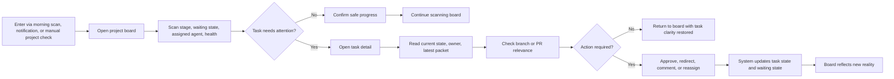
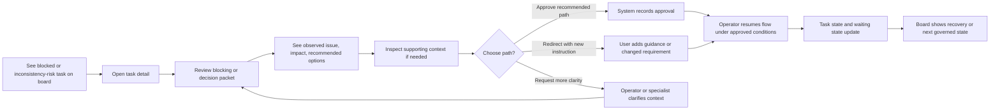
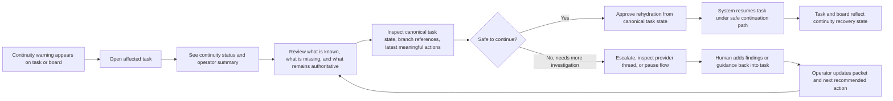

---
stepsCompleted:
  - 1
  - 2
  - 3
  - 4
  - 5
  - 6
  - 7
  - 8
  - 9
  - 10
  - 11
  - 12
  - 13
  - 14
lastStep: 14
inputDocuments:
  - /Users/akinozer/projects/viberr/_bmad-output/planning-artifacts/prd.md
  - /Users/akinozer/projects/viberr/_bmad-output/planning-artifacts/product-brief-viberr.md
  - /Users/akinozer/projects/viberr/_bmad-output/planning-artifacts/product-brief-viberr-distillate.md
  - /Users/akinozer/projects/viberr/_bmad-output/brainstorming/brainstorming-session-2026-03-29-12-02-32.md
workflowType: ux-design
---

# UX Design Specification viberr

**Author:** akin-ozer
**Date:** 2026-03-30

---

<!-- UX design content will be appended sequentially through collaborative workflow steps -->

> **Line-citation drift — do not trust a `ux-design-specification.md:NNN` citation without re-checking it.** *(Recorded 2026-08-31, pass 31 — A4a.)* Every line citation to this file that was written into a code comment **before 2026-08** is stale, and in one direction only: the amendment blocks inserted since keep pushing the cited text further down. Measured across the tree on 2026-08-31 the drift was uniformly **+37 lines**; this pass then inserted its own amendments above the cited passages, and the controller retrofit later in the same pass pushed them further still, so the offset is no longer one number worth quoting. Exactly three such citations exist in the tree. The targets below are **located by their text and re-verified** after this pass's last amendment, not derived by adding an offset — the arithmetic version of this table was itself two lines out:
>
> | Code comment | Cites | Real target here | What is actually at it |
> |---|---|---|---|
> | `app/features/shell/nav.ts:48` | `:824-825` | **1052-1053** | §Navigation Patterns → *Context preservation* — "Filters, queue position, and recent focus should not reset unnecessarily" |
> | `app/features/board/board-filters.ts:205` | `:846-847` | **1074-1075** | §Additional Patterns → *Empty states* — "explain what is absent, why it matters, and what the user can do next" |
> | `app/features/shell/route-pending-bar.tsx:9` | `:849-850` | **1077-1078** | §Additional Patterns → *Loading and refreshing* — "preserve layout stability … skeletons or placeholder structures are preferable to large spinners" |
>
> Those citations live in **code**, so this document cannot repair them from here — this note is the correction of record. Two things follow. First, the **named** citations in the tree (`§Accessibility Strategy`, `§Breakpoint Strategy`, `§State Semantics`) are unaffected and still resolve: prefer a section name over a line number in any new citation, because a section name cannot drift out from under an amendment, and the numbers above will themselves go stale the next time this file is amended. Second, the `§4.6` / `§5.11`-style section numbers in code comments (`app/routes.ts:15`, `org-settings-page.tsx:20`, `board-page.tsx:962`, `rich-text.tsx:6`, `mini-modal.tsx:9`) do **not** address this document at all — they belong to the deleted `docs/build/specs/*.md` set, removed in commit `c1acf2c` (2026-07-22) and still readable with `git show c1acf2c^:docs/build/specs/<name>.md`. *(2026-09-23: the three comments in the table now cite the section by name, so the table is history.)*

## Executive Summary

### Project Vision

Viberr is a multi-user web application for governed AI software delivery, designed for engineering teams that want agents to execute meaningful work without losing human control over quality, review, and completion. The product vision is to make the task the canonical operating contract between humans, persistent coding agents, and GitHub execution, so delivery stays legible, governable, and recoverable even as work becomes multi-agent and long-running.

From a UX perspective, Viberr should feel familiar enough to adopt quickly while making a deeper shift obvious in use: humans are not the primary workers moving tickets through a board. Agents are the native workers, and humans govern flow, intervene when needed, and explicitly authorize consequential decisions. The UX must make that responsibility model visible without becoming noisy, bureaucratic, or intimidating.

### Target Users

The primary users are small AI-forward engineering teams already using tools like Codex or Claude Code for meaningful software work. Within those teams, the most important daily user is the senior engineer or tech lead who needs to supervise multiple active tasks, understand what agents are doing, identify blockers quickly, and decide when intervention is required.

Secondary users include workflow owners or administrators who configure project rules, repository defaults, human permissions, and agent capability policies. Another important supporting persona is the senior troubleshooter who steps in when runtime continuity fails, branch health drifts, or task state becomes ambiguous. Across all personas, users need clarity, control, and confidence more than novelty.

### Key Design Challenges

The first major UX challenge is making an agent-native operating model feel understandable at a glance. Viberr must communicate current stage, owner, waiting state, branch health, and the latest meaningful decision without forcing users to reconstruct delivery state from timelines, logs, or GitHub history.

The second challenge is preserving readability in the presence of persistent multi-agent activity. Because operator agents and specialist agents act over time, the interface must prevent commentary spam, duplicate summaries, and evidence overload from turning the task into unreadable machine exhaust.

The third challenge is balancing governance with speed. Human approvals and intervention are core to the product, but the UX cannot make users feel like clerks approving endless workflow paperwork. The interface has to surface only the moments that deserve human judgment and make those moments concise, actionable, and trustworthy.

### Design Opportunities

Viberr has a strong opportunity to differentiate through supervision-first UX. The board can become a real triage surface where humans instantly understand which tasks are ready, blocked, under inconsistency risk, or waiting on review, instead of just seeing static task status.

The task detail experience is another major opportunity. By emphasizing current state, assigned execution profile, and the latest blocking or decision packet before historical detail, Viberr can create a task view that feels more like an operations console than a ticket page. This would make the product’s governed delivery model immediately tangible.

A third opportunity is to make intervention itself feel like a strength rather than a failure mode. If blocked tasks produce clear, structured, low-noise decision packets with recommended options and visible implications, Viberr can turn one of the hardest parts of agent-driven delivery into one of its most credible UX advantages.

## Core User Experience

### Defining Experience

The defining experience of Viberr is governed supervision of live agent-driven software delivery. The primary user is not manually pushing tickets through a board. Instead, they are monitoring active work, understanding what agents are doing, and stepping in only when judgment, approval, or correction is needed.

The core loop should feel direct and low-friction: scan the board, identify what needs attention, open a task, understand the current state immediately, review the latest meaningful packet, and take the next human action with confidence. Viberr should feel less like a passive tracker and more like a calm operations console for supervised AI delivery.

If one interaction must be excellent, it is this transition from uncertainty to clarity. A user should be able to move from “something may need me” to “I know exactly what happened and what I should do next” in seconds.

### Platform Strategy

Viberr should be designed as a desktop-first web application for modern browsers, optimized for mouse-and-keyboard workflows and multi-panel operational review. The primary usage context is an engineering team supervising real delivery work from laptops or desktop machines, not mobile browsing or lightweight casual use.

The platform should support fast movement between board supervision, task inspection, and GitHub-linked execution context. Near-real-time updates are important because multiple humans and persistent agent threads may affect the same project concurrently. Offline capability is not a core requirement, and mobile-first behavior is not necessary for V1.

The interface should support both light and dark themes, but its main platform job is not aesthetic flexibility. Its main job is maintaining a stable, high-signal operational environment for live governed work.

### Effortless Interactions

The board should make triage effortless. Users should be able to see current stage, waiting state, assigned agent, and validation health without opening every task. Attention should naturally flow toward the items that need a human decision, not toward the noisiest items.

The task view should make comprehension effortless. A user should immediately understand the current state, active execution profile, latest blocker or decision packet, and branch or PR relevance before reading historical detail. They should not need to scroll through commentary to discover the real issue.

Human action should also feel effortless. Approving, redirecting, commenting, or reassigning should require minimal ceremony and should happen in the same context where the decision is being made. Raw logs, validation chatter, and older context should stay available, but out of the way unless needed.

### Critical Success Moments

The first critical success moment is when a user opens the board and immediately understands which tasks are ready, which are blocked, and which are waiting on them. That moment establishes trust in Viberr as a real supervision surface rather than a decorative board.

The second critical success moment is when a user opens a blocked task or a task with inconsistency risk and sees a clear, structured explanation of what happened, what changed, what options exist, and what decision is required. This is where Viberr proves that intervention can be a strength instead of a breakdown.

The third critical success moment is when a team can supervise several active specialist agents across multiple tasks without losing clarity. That is the point where the user feels that Viberr is truly better than combining Jira, GitHub, and ad hoc agent sessions.

The make-or-break failure point is the opposite: if users ever feel they must reconstruct the truth from logs, PRs, or side conversations, the product loses its core UX promise.

### Experience Principles

- Status before history: show what is happening now before showing how we got here.
- Decisions before discussion: surface the latest blocking or decision packet ahead of general commentary.
- Human attention is scarce: only interrupt users when judgment is required.
- Calm over chatter: preserve legibility by suppressing noise, duplication, and raw machine exhaust.
- One task, one truth: the canonical task record should remain the trusted coordination surface across humans, agents, and GitHub execution.

## Desired Emotional Response

### Primary Emotional Goals

The primary emotional goal for Viberr is confident control. Users should feel that they understand what is happening, that the system is behaving legibly, and that they can step in effectively whenever judgment is needed. The product should reduce the anxiety that usually comes from agent ambiguity, hidden execution state, and scattered operational context.

A second major emotional goal is calm operational trust. Viberr should feel composed, high-signal, and steady even when work is blocked, under inconsistency risk, or under review. Rather than making users feel rushed or overwhelmed, it should create the sense that complex delivery work is governable and understandable.

A third supporting emotional goal is empowerment. Users should feel that they are supervising a capable system, not babysitting a chaotic one. When the product works well, the user should feel sharper, more effective, and more in command of team delivery.

### Emotional Journey Mapping

When users first arrive in Viberr, they should feel oriented rather than impressed by surface novelty. The first impression should be that the system is structured, readable, and serious about real work. Curiosity is useful, but immediate clarity matters more.

During the core supervision experience, users should feel informed and in control. As they scan the board and open tasks, they should feel that the system is helping them allocate attention correctly and that nothing important is being hidden behind noise or fragmentation.

After completing a decision, approval, or intervention, users should feel relief and confidence. The experience should reinforce that human input changed the trajectory of the task in an intentional and visible way. When they return later, they should feel continuity rather than re-entry friction.

When something goes wrong, the desired emotional outcome is not excitement or urgency. It is contained seriousness. Users should feel that the problem is visible, framed, and actionable, not chaotic or mysterious.

### Micro-Emotions

The most important micro-emotion is confidence over confusion. Every key screen should reinforce that users know what state a task is in, who owns it, what happened recently, and whether action is required.

Trust over skepticism is also essential. Because AI systems often overstate certainty or create noisy output, Viberr must make users feel that what they are seeing is current, relevant, and decision-worthy. This trust must be earned through legible state, concise summaries, and clear links between task truth and GitHub execution.

Another important micro-emotion is calm focus over alert fatigue. Users should not feel bombarded by updates, overexposed to logs, or pressured by excessive workflow ceremony. The product should preserve a steady operational rhythm.

Finally, accomplishment matters. After resolving a blocker or guiding a task forward, the user should feel that their judgment had leverage and that the system translated that judgment into coordinated progress.

### Design Implications

To create confident control, the UX should prioritize current state, waiting status, latest blocking or decision packet, and execution ownership above secondary detail. The information hierarchy must answer “What is happening?” and “Do I need to act?” before anything else.

To create calm operational trust, the interface should avoid noisy visual density, repeated summaries, and uncontrolled activity streams. Logs, evidence, and low-level output should be available but visually subordinate to decisions, outcomes, and implications.

To create empowerment, the system should make human interventions feel decisive and well-scoped. Approval, redirect, reassignment, and comment actions should be easy to understand, easy to trigger, and clearly connected to their effects on the task.

Negative emotions to avoid include confusion, skepticism, alert fatigue, and bureaucratic frustration. If users feel they need to reconstruct reality manually or approve too many low-value transitions, the emotional design has failed.

### Emotional Design Principles

- Clarity creates trust: users should rarely wonder what the system is doing or what it needs from them.
- Calm beats excitement: the interface should feel composed and reliable even under operational stress.
- Intervention should feel powerful: when humans act, the system should make that action feel consequential and well-supported.
- Serious, not sterile: the product should feel professional and controlled without becoming cold or bureaucratic.
- Confidence is cumulative: every screen should reinforce that Viberr is a trustworthy supervision layer for agent-driven delivery.

## UX Pattern Analysis & Inspiration

### Inspiring Products Analysis

A strong inspiration source for Viberr is Linear. Linear handles issue management with unusual calmness: the interface is fast, the hierarchy is clear, and the product avoids visual clutter even when showing dense workflow state. Its biggest lesson for Viberr is that a task system can feel operationally serious without becoming noisy or heavy. The board and issue views keep attention on what matters now rather than overwhelming the user with metadata.

GitHub is another critical reference, especially in pull request and review flows. GitHub excels at making code review feel grounded in real artifacts rather than abstract workflow status. For Viberr, the transferable lesson is that review state, branch context, changed files, and discussion should feel tied to durable execution truth. GitHub is also useful as a reminder that users trust systems more when actions are visibly connected to concrete outputs.

Datadog is a useful reference for supervision-oriented UX. Its best patterns are not about beauty first, but about helping users understand live system state quickly, prioritize attention, and drill into detail only when needed. For Viberr, the key lesson is how an operational interface can signal urgency, health, and actionability without collapsing into dashboard chaos.

Together, these products suggest a combined direction for Viberr: Linear’s calm structure, GitHub’s artifact-linked trust, and Datadog’s triage-first operational visibility.

### Transferable UX Patterns

**Navigation Patterns**

A two-level navigation model is highly transferable: a project-level workspace for broad supervision and a task-level workspace for deep intervention. Linear demonstrates this well. Viberr should let users move quickly from board context into a focused task view without losing orientation.

Progressive disclosure is another useful pattern. GitHub and Datadog both avoid forcing every detail to compete equally on first view. Viberr should show current state, assigned execution profile, waiting status, and latest blocking or decision packet first, while keeping logs, validation evidence, and historical context secondary.

**Interaction Patterns**

Keyboard-friendly, low-friction task navigation from Linear is worth adapting. Viberr’s users are likely to be frequent operators, so switching tasks, filtering attention, and moving across projects should feel fast and deliberate rather than click-heavy.

GitHub’s review-centered interaction model is also transferable. Important decisions should happen next to the evidence and context they affect. In Viberr, that means approvals, redirects, and comments should live close to the blocking packet, branch state, or execution summary they relate to.

Datadog contributes a valuable triage pattern: surface state severity before detail depth. Viberr should make it visually obvious which tasks are ready, blocked, under inconsistency risk, or waiting on human action before the user has to inspect the full timeline.

**Visual Patterns**

Linear’s restrained visual density is highly relevant. Viberr should avoid ornamental complexity and instead use typography, spacing, and emphasis to create a calm field of attention.

GitHub’s artifact-led layout is also useful. Rather than relying on abstract labels alone, Viberr should connect state to branches, PRs, decisions, and task records that users recognize as real sources of truth.

Datadog’s use of high-signal status indicators is worth adapting carefully. Viberr should use visual emphasis to guide attention toward risky or blocked work, but without turning the whole interface into a field of warnings.

### Anti-Patterns to Avoid

One anti-pattern to avoid is generic kanban sameness. If Viberr looks and behaves like a standard project board with AI badges added on top, it will weaken the product’s actual differentiator and make the system feel conceptually shallow.

Another anti-pattern is dashboard overload. Many operational tools show too many metrics, states, or alerts at once, which creates visual anxiety instead of clarity. Viberr should not try to prove sophistication by showing every signal everywhere.

A third anti-pattern is log-first design. If users need to scroll through verbose agent commentary, raw execution output, or repeated summaries to determine what happened, the interface will fail its core promise of supervised clarity.

A fourth anti-pattern is detached approval UX. Requiring users to approve transitions or decisions from generic modal flows without contextual grounding would make governance feel bureaucratic rather than useful.

### Design Inspiration Strategy

**What to Adopt**

Adopt Linear’s calm hierarchy and navigational speed because Viberr needs to make dense workflow state feel manageable and readable.

Adopt GitHub’s artifact-linked trust model because Viberr’s users need visible connection between task state, code reality, and review status.

Adopt Datadog’s triage-first signaling because Viberr’s board should act as a supervision surface, not just a status display.

**What to Adapt**

Adapt Linear’s issue focus into a stronger operator-first task view. Viberr needs more emphasis on active ownership, waiting state, and decision packets than a standard issue tracker would.

Adapt GitHub’s review model into a broader intervention model. In Viberr, the key human action is not only code review, but also governance, correction, and task steering.

Adapt operational alert patterns from Datadog into a calmer, more selective system. Viberr should signal urgency precisely, not continuously.

**What to Avoid**

Avoid consumer-style delight patterns that prioritize novelty over trust, because Viberr’s users are managing consequential engineering work.

Avoid high-noise AI interaction patterns where every agent action is surfaced equally, because this conflicts directly with the product’s emotional goal of calm operational trust.

Avoid rigid workflow bureaucracy that makes human governance feel like paperwork, because Viberr’s value comes from supported judgment, not excessive gating.

## Design System Foundation

### 1.1 Design System Choice

Viberr should use a themeable design system approach built from semantic design tokens, low-opinion primitives, and a thin internal component layer. The product is a browser-based web application optimized for desktop workflows and screen sizes, so the design system should prioritize information density, keyboard-friendly interaction, predictable states, and workflow-specific clarity over decorative novelty.

In practical terms, this means choosing a strong primitive foundation that supports accessible behavior, focus management, overlays, menus, inputs, and layout building blocks, then layering Viberr-specific components on top. If the implementation stack is React, headless primitives are a strong fit, but the decision should remain architectural rather than tied to a single vendor.

### Rationale for Selection

This choice fits Viberr’s current balance of needs. The product needs speed and consistency because it is a greenfield web application for a lean, technically strong team. At the same time, it cannot afford to look like a generic admin dashboard or a standard enterprise board with AI labels attached.

A heavily opinionated established system would accelerate delivery, but it would also pull the UX toward default visual and interaction conventions that weaken Viberr’s differentiation. A fully custom system would allow perfect control, but it would consume too much effort too early and slow down product learning.

A token-driven system built on low-opinion primitives gives Viberr the right middle path. It supports fast implementation, reusable patterns, and accessible interaction foundations, while still allowing the product to shape a distinct operational character around calm supervision, high-signal status, and governance-centered workflows.

### Implementation Approach

The design system should begin with a small, disciplined foundation rather than an ambitious UI catalog. Start with semantic tokens for color, typography, spacing, radius, elevation, border treatment, motion, and workflow-state semantics. Then build a compact first-party component layer for Viberr’s core supervision workflow.

> **Amended 2026-08-06 (pass 19, N19-4) — `app/app.css`'s `:root` is the ONLY token source, and it has drifted from the design-system mock in both directions.** The token *naming convention* held (flat, unprefixed: `--bg`, `--fg`, `--blue`), but the values did not, and `design/design-system.html` is a build input that was never updated to match. What actually ships:
>
> - **Radius scale is smaller.** Shipped: `--radius-button: 8px`, `--radius-chip: 999px`, `--radius-card: **16px**`, `--radius-panel: **22px**`. The mock documents card **18** / panel **28** and a **44px** canvas radius; there is no canvas or large radius token in the app at all.
> - **Documented-but-undefined tokens.** `--pink`, `--dark-red` and `--radius-large` appear in the mock and in nothing else. Using one in app code yields an empty value, not a colour — they are not part of the system.
> - **Tokens the app added that no spec records:** `--agent` / `--agent-dark` / `--agent-soft` (the violet agent-identity tint), `--cta-*`, `--faint`, `--hairline`, `--shadow-ring` / `--shadow-card` / `--shadow-pop`, `--ease-out`, `--rail-w`, `--topbar-h`, `--radius-chip`.
> - **No spacing scale and no elevation scale.** The "start with tokens for spacing … elevation" instruction above was only partly taken: spacing is per-component rem values (see the Spacing note below), and elevation is three named shadow tokens rather than a scale.
>
> The app is deliberately right here and the documents are the ones being corrected (`planning/README.md`'s canon rule). The integrity gate is `app/app.css.test.ts`, which checks token integrity and contrast against the real stylesheet. Never copy a value out of `design/*.html`; read the `:root` block.

> **Amended 2026-08-31 (pass 31) — the "no spacing scale and no elevation scale" bullet above is itself stale; design pass 30 built both.** The note it corrects was true on 2026-08-06 and false by 2026-08-27, which is the failure the Typography note already names: *a superseding note that has itself gone stale is worse than the advisory text it supersedes.* Re-verified against `app/app.css` on 2026-08-31:
>
> - **Spacing IS a scale now — nine steps:** `0 · .125 · .25 · .375 · .5 · .75 · 1 · 1.5 · 2` rem. Design pass 30 (`6ca0f25`, 2026-08-27) snapped ~760 `gap` / `padding` / `margin` values onto it. Sub-`.1rem` optical nudges and negative overlaps were deliberately left literal, and a handful of genuine one-offs survive. The steps are a *convention carried by the sheet*, not a `--space-*` token family: there is nothing to `var()`, and `gap: .5rem` is meant to say more at the call site than a token name would. "Match the surrounding component's rhythm" is still the right instinct — the rhythm is now one of these nine.
> - **Elevation IS a scale now — five tokens**, declared in the `:root` block and described there as four resting steps plus one interaction step, chosen by z-position: `--shadow-ring` · `--shadow-card` (resting surfaces) · `--shadow-menu` (anchored popovers, calendar, stage menu) · `--shadow-pop` (modals, toast, page overlays) · `--shadow-lift` (the hover-raise every lifting surface shares). The bullet above lists only ring/card/pop, so it also under-counts the "tokens the app added that no spec records" line.
> - The type scale the original note never mentioned is **13 steps** (`.62 … 1.9` rem), documented at the token block and locked in `app/app.css.test.ts`.
>
> The canon rule is unchanged: read the `:root` block, not this table. What changed is that the instruction at the head of this section — "start with semantic tokens for color, typography, spacing, radius, elevation …" — was **eventually taken in full**, three passes late.

The initial component inventory should be intentionally narrow and tied directly to real product surfaces: buttons, inputs, filters, command surfaces, badges, cards, panels, tabs, tables, drawers, dialogs, timeline blocks, decision packets, task-health indicators, and execution-profile displays. The system should avoid rebuilding a full generic component library before those core surfaces are proven.

Because Viberr is a browser-based web application optimized for desktop workflows and screen sizes, the system should support compact layouts, strong keyboard behavior, clear focus handling, and progressive disclosure. These interaction rules are part of the design-system foundation, not implementation detail.

### Customization Strategy

Customization should focus on establishing a distinct operational identity rather than decorative novelty. Viberr should use restrained typography, disciplined spacing, controlled contrast, and clear semantic status language so the interface feels calm, serious, and trustworthy under real workflow pressure.

The visual system should avoid heavy framework defaults, overly soft consumer-SaaS styling, and noisy enterprise-dashboard density. Instead, it should emphasize precision, legibility, and hierarchy across board, task, and intervention views.

Custom components should be introduced only where Viberr’s workflow model is genuinely different from standard applications. Examples include decision packets, operator summaries, task health states, execution-profile displays, and mixed human-agent timeline structures. Standard interaction elements should remain close to proven conventions, while workflow-specific components should carry Viberr’s unique identity.

## 2. Core User Experience

### 2.1 Defining Experience

The defining experience of Viberr is helping a human supervisor scan active agent-driven work, understand the current reality immediately, and steer the right task with confidence. The core interaction is not generic task management and not merely approving workflow steps. It is moving from ambiguity to clear operational understanding in one short flow.

If users describe Viberr to a colleague, the experience should sound like this: “It turns messy agent work into something I can scan and steer with confidence.” That is the product’s most important promise.

If Viberr gets one thing perfectly right, it should be the transition from board-level triage to task-level clarity. Users should be able to identify what needs attention, open it, understand what is happening now, and decide what to do next without reconstructing the truth from GitHub, logs, or chat history.

### 2.2 User Mental Model

Users will arrive with a familiar mental model shaped by Jira or Linear for tasks, GitHub for execution truth, and CLI or chat-based coding agents for AI work. They already understand boards, tickets, branches, pull requests, and review. What they lack today is a reliable operating surface that compresses those fragments into one steerable view.

Their expectation will be that a task should tell them what is happening now, who owns it, whether it is ready for safe continuation, and whether they need to act. Their frustration with current workflows is that this truth is fragmented across project tools, repository state, and opaque agent sessions. They are used to reconstructing reality manually.

Viberr should not fight these familiar mental models. It should preserve recognizable workflow objects while changing the role of the task from a static ticket into a live operating contract. Confusion is most likely if the product foregrounds novel AI concepts before grounding the experience in familiar workflow structures.

### 2.3 Success Criteria

The core experience succeeds when a user can scan the board and understand which tasks are ready, blocked, under inconsistency risk, or waiting on them within seconds. It also succeeds when opening any task, whether ready or problematic, quickly answers the questions “What is happening?”, “Why does it matter?”, and “Do I need to act?”

Users should feel that Viberr is doing real sensemaking and compression work for them. They should not need to read full timelines, inspect raw logs, or jump to GitHub just to determine the current situation. The latest meaningful packet, current ownership, waiting state, and execution truth should align visibly enough to support confident action.

Key success indicators for the defining experience are:
- users can identify whether a task needs human action in seconds
- users can confirm a ready task is on track without unnecessary reading
- users can understand a blocked or inconsistency-risk task without reconstructing context manually
- users can approve, redirect, or comment with confidence about the likely outcome
- the system visibly updates the task and board to reflect the changed state after action

### 2.4 Novel UX Patterns

Viberr should combine familiar patterns with a novel operating model rather than inventing a fully new interaction language. The board, task page, branch references, and review-linked workflow should remain recognizable. This lowers adoption friction and helps users orient quickly.

The novelty should come from how those familiar surfaces behave together. The task is no longer just a planning artifact; it is a live coordination surface for humans, operator agents, specialist agents, and GitHub execution. The most distinct interaction pattern is the structured decision or intervention packet: a compact, high-signal explanation of task reality that supports human steering directly inside the workflow.

This means Viberr does not need radical interface novelty. It needs a disciplined remix of established patterns with one strong twist: the system is designed to compress operational ambiguity into a steerable decision surface for supervising persistent agent work.

### 2.5 Experience Mechanics

**1. Initiation**

The user begins on the board or project workspace. Visual signals such as waiting state, validation status, stage, assignment, and task health help them identify where attention is required and where things are progressing normally. Filters, ordering, and compact status cues make scanning fast.

**2. Understanding**

The user opens a task and lands directly in a high-signal task view. The top of the page presents current state, assigned execution profile, waiting state, and the latest meaningful packet, supported by visible execution truth such as branch or PR relevance. The system’s first job is orientation.

**3. Steering**

The user reviews the concise summary and supporting context, then takes the next human action if needed: approve, redirect, comment, reassign, or simply confirm that no action is required. These controls should live close to the decision context they affect.

**4. Feedback**

The system makes success legible through explicit state changes, updated waiting indicators, visible decision history, and refreshed summaries. If the user acts, it should be obvious that the action was recorded and changed the task’s trajectory.

**5. Completion**

The interaction feels complete when the task is understandable again and the board reflects the new reality. The successful outcome is not only “action submitted,” but “task clarity restored and the work moving under the right conditions.”

This mechanic should feel fast, contextual, and calm from beginning to end. The user should leave each interaction feeling more oriented than when they entered.

## Visual Design Foundation

### Color System

Because no formal brand guidelines have been provided, Viberr should adopt a visual system built around calm operational clarity. The palette should emphasize neutral structure, disciplined semantic signaling, and restrained emphasis rather than expressive decoration. The interface should feel like a trustworthy control surface for live work, not a stylized AI product.

The base visual language should be built from graphite, fog, cool gray, and steel-blue tones. These neutrals should do most of the structural work so the interface feels stable, serious, and readable under pressure. A controlled steel-blue accent should signal active focus, primary actions, and current selection without washing the interface in color.

Semantic colors should remain highly legible and tightly scoped:
- success: grounded green for ready, verified, or completed states
- warning: amber for inconsistency risk, caution, or review-needed conditions
- error/blocking: restrained crimson or brick red for blocked states and failures
- info/active: steel blue for active execution, selected context, and primary controls

Color should never operate alone. State meaning should also be reinforced by iconography, labels, badges, borders, and layout emphasis. This is especially important in board and task views, where users need to distinguish active, waiting, blocked, and review-relevant states quickly and reliably.

A practical palette direction is:
- graphite for primary text and structural depth
- fog and cool gray for background layers and neutral surfaces
- steel blue for active emphasis and focus
- grounded green, amber, and restrained crimson for semantic state cues

Both light and dark themes should be supported, but semantic meaning must remain consistent across modes. Core workflow views should avoid decorative gradients, glow effects, or ornamental color treatments. If atmospheric visual treatments are used at all, they should stay outside the main operational surfaces.

> **Superseded — the concrete palette above is advisory and the build did not take it.** The shipped palette *direction* is `design/design-system.html` (a bright Miro-inspired canvas): a `#5b76fe` blue accent rather than steel blue, pastel semantic surfaces, a violet agent-identity tint distinct from human blue, and two heavily transparent radial gradients washing the page background behind opaque surfaces. `app/app.css`'s `:root` block is the single source of the real tokens; use those names, never a literal hex. The *principles* in this section still hold and are enforced — color never operates alone, semantic meaning stays consistent across light and dark, and the light theme's secondary text ladder is contrast-constrained rather than free.

> **`design/design-system.html` is a reference MOCK, not the token source — and it has itself drifted.** *(Recorded 2026-08-06, pass 19 — N19-4.)* The note above and the one under Typography both cited the mock as "the shipped X", which reads as an authority claim it cannot support: the mock is a static prototype nobody re-renders, while `app/app.css` is compiled into the product on every build. Where they disagree the **app is right and the doc is what gets corrected**. Five values verified against `app/app.css` on 2026-08-06:
>
> | `design/design-system.html` `:root` | `app/app.css` `:root` (shipped) |
> |---|---|
> | `--radius-card: 18px` | `--radius-card: 16px` |
> | `--radius-panel: 28px` | `--radius-panel: 22px` |
> | `--radius-large: 44px` (the large `.system-card` canvas radius) | **not ported** — no such token. The shipped radius vocabulary is exactly four: button `8px`, chip `999px`, card `16px`, panel `22px`. |
> | `--pink: #fde0f0`, `--dark-red: #e3c5c5` | **not ported** — neither is ever declared. Pink-adjacent surfaces use `--rose-light` / `--red-light`, which both files define. |
> | `--font-display: "Roobert PRO Medium", …` | `--font-display: "Manrope", …` — see the Typography note below. |
>
> The two radius tightenings were deliberate at port time; the rest are simply tokens the port did not take. Nothing in the product can reach for the unported four by accident: the porting rule is **a `var(--x)` that is not defined in `:root` is a bug, not a style choice**, and `app/app.css.test.ts` enforces it with no allowlist ("every var(--x) reference resolves to a declared token"). So the drift is a *documentation* hazard only — nobody's build breaks, a reader is just told the wrong number. Which is exactly why it is written down here instead of left for the next reader to re-derive: the mock stays as the visual reference it is good at being, and the token values are read from the stylesheet.

> **Amended 2026-08-31 (pass 31) — "the shipped radius vocabulary is exactly four" is no longer true; it is six.** Design pass 30 (`61da697`, 2026-08-27) added two steps between the existing ones so every adjacent pair is a real jump. Re-verified against `app/app.css`'s `:root` on 2026-08-31, in declaration order:
>
> | Token | Value | What it is for (the sheet's own words) |
> |---|---|---|
> | `--radius-small` | `6px` | sub-28px icon buttons, chips, kbd, calendar days |
> | `--radius-button` | `8px` | inputs, buttons, menu rows |
> | `--radius-box` | `12px` | nested sub-cards, popovers, the console, toast |
> | `--radius-chip` | `999px` | full pills |
> | `--radius-card` | `16px` | top-level cards |
> | `--radius-panel` | `22px` | modals and page panels |
>
> `--radius-small` and `--radius-box` are the two additions; `card 16` / `panel 22` and the never-ported `--radius-large` are unchanged, so the row above still reads correctly against the mock — only the count sentence went stale. Deliberate non-steps survive and are documented in the sheet itself: `50%` for a true circle, `0`, `inherit`, the 2–3px micro radii on meters and inline highlights, and 4px on a 16px box such as the checkbox — proportional to a tiny box rather than steps. Everything else rounds through a token: of the 226 `border-radius` declarations counted on 2026-08-31, all but a couple of dozen are `var(--radius-*)`, and every literal among the rest falls in that sanctioned set. Read `app/app.css`'s `:root` for the values and `app/app.css.test.ts` for whatever the gate currently locks; do not re-derive a count from this note.

### Typography System

The typography system should reinforce precision, calmness, and rapid scanning. Viberr is a scan-first interface, not a read-first editorial product, so the hierarchy should prioritize status labels, ownership, waiting state, packet headings, and operational summaries before longer narrative content.

A strong typographic direction would use IBM Plex Sans as the primary interface typeface and IBM Plex Mono as a precision accent for task keys, branch names, commit references, agent identities, code-adjacent metadata, and selected operational labels. The mono typeface should be used intentionally, not broadly, so the interface remains technical without becoming harsh or overly mechanical.

The hierarchy should be compact and highly functional:
- page titles: strong and clear, but not oversized
- section headers: crisp and scannable
- packet headings and status labels: visually distinct and operationally prominent
- body text: readable at dense desktop usage
- metadata and references: compact, structured, and easy to parse

The type scale should support dense workflows without feeling cramped. Line lengths in task views should remain controlled, and longer narrative sections such as timelines or decision explanations should remain readable without dominating the visual hierarchy.

A practical type strategy:
- primary UI typeface: IBM Plex Sans
- technical/reference typeface: IBM Plex Mono
- hierarchy designed for scanning first, reading second
- restrained heading scale
- moderate body line-height
- tighter spacing for labels, metadata, and compact operational blocks

> **Superseded — the named typefaces are advisory and the build did not take them.** The shipped stack is `app/app.css`'s `:root`: **Manrope** for display (`--font-display`), **Noto Sans** for body (`--font-body`), **JetBrains Mono** for the technical/reference role (`--font-mono`) — all three bundled and self-hosted (`@fontsource/manrope` 500/600/700/800, `@fontsource/noto-sans` 400–700, `@fontsource/jetbrains-mono` 400–600, imported in `app/root.tsx`). The mono-used-intentionally rule and the scan-first hierarchy above are honoured; only the family names changed.
>
> *(Corrected 2026-08-06, pass 19 — N19-2. This note previously named **Roobert PRO Medium** for display and cited `design/design-system.html` as the shipped stack. Roobert PRO is not web-available and has never shipped anywhere in the product: the mock declares it, the app does not, and no Roobert font file is bundled. Manrope was chosen as the geometric-humanist stand-in. The app once carried the mock's Roobert-first stack in its token block while a second `:root` 2600 lines further down silently overrode it with Manrope — P16-UI-04 deleted the duplicate, so `--font-display` is now declared exactly once, at the token block, and `app/app.css.test.ts` pins that count. A superseding note that has itself gone stale is worse than the advisory text it supersedes, because it is the line a reader trusts instead of checking; so the citation now points at the stylesheet, the one source that cannot drift from itself.)*

### Spacing & Layout Foundation

Viberr should use a disciplined spacing system that balances information density with calmness. The product needs to present substantial workflow state, but it should never feel stuffed or chaotic. The layout must help users parse urgency without making urgent states noisier.

The foundation should use an 8px base spacing system with 4px sub-steps for tighter internal component structure. This provides enough precision for compact board cards, dense metadata zones, and layered task views while preserving consistency across components.

> **Superseded — the ported design system defines no spacing tokens and no 12-column grid.** `app/app.css` uses rem values chosen per component and CSS grid/flex layouts sized to their content. Match the surrounding component's rhythm rather than introducing a spacing scale now; a retrofit would touch every surface for no user-visible gain. The intent below — spacing reinforces hierarchy, urgent states get clearer rather than louder — is what actually binds.

> **Amended 2026-08-31 (pass 31) — the retrofit happened, and the note above is half stale.** Design pass 30 (`6ca0f25`, 2026-08-27) did exactly the sweep this note advised against, and it was worth doing: ~760 `gap` / `padding` / `margin` values were snapped onto a **nine-step spacing scale** — `0 · .125 · .25 · .375 · .5 · .75 · 1 · 1.5 · 2` rem — re-measured against `app/app.css` on 2026-08-31, where those nine are the only values that reach double-digit usage. So:
>
> - **"No spacing scale" is now false.** "Match the surrounding component's rhythm" still holds as advice, but the rhythm is one of those nine steps, and a new value that is not a step is drift rather than a judgement call. Sub-`.1rem` optical nudges, negative overlaps and a small tail of one-site values stay literal on purpose; what the scale exists to prevent is a tenth value quietly becoming a step nobody chose.
> - **"No spacing tokens" is still true**, and the distinction matters: the scale is a convention the sheet keeps, not a `--space-*` token family. There is nothing to `var()`, and `gap: .5rem` reads better at the call site than a token name would.
> - **"No 12-column grid" is still true.** Zero `repeat(12, …)` declarations exist; the "12-column grid for major page structures" bullet below remains unbuilt, and layouts are still sized to their content.
> - The `8px` base with `4px` sub-steps prescribed above never shipped in those units, but the shipped scale is the same idea at a 16px root: `.5rem` = 8px, `.25rem` = 4px, `.125rem` = 2px. The prescription was directionally right; the units are rem.
>
> The intent sentence at the end of the superseded note is unchanged and still binds.

The layout should be optimized for browser-based desktop workflows and screen sizes:
- 12-column grid for major page structures
- compact board density for fast triage
- structured task-detail layouts with strong separation between current state, latest packet, timeline, and supporting evidence
- clear grouping of controls with the state they influence

Spacing should reinforce hierarchy rather than decoration. Larger spacing shifts should separate conceptual zones, while smaller spacing should bind tightly related metadata, controls, and status indicators together.

A critical layout rule is that urgent, blocked, or review-needed states should become clearer, not visually louder. The interface should increase emphasis through hierarchy, placement, and semantic treatment rather than through clutter, oversized alerts, or uncontrolled visual weight.

### Accessibility Considerations

Core workflows should meet a WCAG 2.2 AA baseline in V1 because accessibility directly supports trust, readability, and operational speed in consequential governance flows.

The visual system should ensure:
- strong contrast between text and surfaces in both light and dark themes
- color never acting as the sole indicator of state
- clear focus states for keyboard navigation
- readable type sizes for dense operational views
- semantic consistency across badges, labels, icons, and border treatments
- restrained motion that supports orientation rather than spectacle

Because Viberr depends on rapid sensemaking, accessibility is not only a compliance matter. It is part of the core product logic. Contrast, focus visibility, non-color cues, and stable hierarchy all make the system easier to supervise with confidence.

## Design Direction Decision

### Design Directions Explored

Six design directions were explored for Viberr, each applying the same visual foundation and UX strategy with different emphasis.

Signal Console explored a triage-first supervision surface where board status, waiting state, and semantic health cues dominate. Operator Desk explored a task-first approach where the latest packet, execution truth, and steering actions define the experience. Calm Kanban tested a more familiar and lower-friction adoption path. Split Focus explored a persistent board-and-task hybrid workspace. Packet First emphasized governance artifacts as the main organizing surface. Evidence Rail pushed execution truth and validation signals closer to the default task view.

Together, these directions tested the key tradeoff in Viberr’s interface: whether the product should feel primarily like a supervision board, a task intervention workspace, or a hybrid that keeps multiple modes open at once.

### Chosen Direction

The chosen direction for Viberr should be defined primarily by Signal Console for the board experience and Operator Desk for the task-detail experience.

Signal Console should shape the board because Viberr needs a fast, high-signal supervision surface where users can identify ready, blocked, inconsistency-risk, and waiting tasks in seconds. Operator Desk should shape the task page because the product’s strongest interaction is moving from ambiguity to task-level clarity and confident steering.

This gives Viberr a clearer product identity: a triage-first board paired with an operator-first task view. Split Focus should not define the product’s main layout model, but selected split-view patterns may be used where they improve continuity during task switching or preview flows.

### Design Rationale

This direction best supports Viberr’s core promise of helping users scan active agent work, understand the current reality immediately, and steer the right task with confidence.

A calmer kanban-led direction is easier to adopt, but too safe to express the product’s deeper differentiation. A packet-first direction makes the governance model highly visible, but risks making the default experience feel more bureaucratic than operational. An evidence-heavy direction increases technical confidence, but can make the product feel denser than necessary for the primary supervision workflow.

By contrast, Signal Console plus Operator Desk creates a stronger balance. The board becomes a compact, trustworthy attention-routing surface, while the task page becomes the product’s deepest expression of operational legibility, governance, and actionability. This gives Viberr a distinct feel without relying on novelty or visual complexity.

### Implementation Approach

The board should be implemented using compact, high-signal cards with strong semantic state cues, disciplined density, and minimal noise. Current stage, waiting state, assigned execution profile, and validation or health status should remain visible without opening the task. The board should answer “what needs me now?” with very little interpretation work.

The task-detail view should be implemented as an operator-first workspace. Current state, execution truth, latest blocking or decision packet, and immediate human steering actions should appear above timeline depth and secondary evidence. Logs, validation detail, and deep technical context should remain accessible, but progressively disclosed.

> **The run controls SHOW configuration; they do not pick it.** *(Recorded 2026-08-21, pass 22 — owner rulings R21-9 and R22-schedule, `docs/architecture/decisions.md` rulings 92 and 94.)* The operator run control on the task page carries no per-run backend or autonomy dropdowns: both are configured on the deployed operator profile, the card states the backend the run will actually use, keeps Run, and offers an optional steer that is recorded as the human's own timeline comment. The schedule-a-re-run form follows the same rule and offers no pickers either — a scheduled run resolves the live deployed profile at fire time. Full autonomy announces itself on the run surface as a caption; supervised is the quiet default; an unconfigured profile backend disables Run with the reason rendered. Design any future run-adjacent surface the same way: configuration lives on the profile, the surface discloses it.

Split-view behavior should be treated as a secondary pattern rather than a primary product structure. It may be used in lightweight preview panes, queue-to-task transitions, or continuity-supporting task-switching flows, but the main product model should remain clear: board for scan and triage, task for clarity and steering.

> **Amended 2026-08-31 (pass 31) — the product model is three surfaces now, not two.** *(Ruling 99, owner directive 2026-08-30, `docs/architecture/decisions.md`.)* "Board for scan and triage, task for clarity and steering" is still the spine and nothing above is retracted. What it no longer covers is the **controller**: one conversational agent per instance, sitting above the operators, for the work that has no task yet — decomposing an outcome into a chain of tasks, reading across projects, applying a change a form would cost several navigations. It is not a third way to look at a task, which is why it is neither a split view nor a preview pane and does not weaken the paragraph above; Signal Console and Operator Desk continue to define the board and the task page unchanged. §Controller and Goal Chain Surfaces specifies the third surface in full.

## User Journey Flows

### Arda Supervises Active Work

This journey defines the default daily loop for the primary user. Arda may enter the flow through a morning check-in, a notification-driven review, or a deliberate project scan. In every case, the UX goal is the same: help him understand live agent-driven work quickly, identify what needs attention, and restore task clarity with minimal friction.

The flow should make ready tasks easy to dismiss confidently and risky tasks easy to inspect deeply. The board must compress state effectively, while the task page must make the latest packet, execution truth, and next action obvious.

**Optimization focus:**
- Make the board answer “what needs me now?” in seconds
- Let users confirm ready tasks without opening unnecessary detail
- Keep task truth and execution truth visibly aligned
- Make returning to the board feel like completing a task-clarity loop

### Arda Intervenes On A Task With Inconsistency Risk

This is the most important exception journey in the product. A task with inconsistency risk must not feel like a failure in the UX. It should feel like a contained, governable situation with a clear packet, visible evidence, and supported next actions.

The key interaction is not reading everything. It is understanding the blocking condition, evaluating recommended paths, and making a confident human decision without reconstructing the situation manually.

**Optimization focus:**
- Present the blocking packet before raw history
- Keep recommended options concise and comparable
- Show enough evidence to support trust without flooding the screen
- Make clarification loops return to a trusted packet, not a noisy timeline
- Make recovery visible in both the task and the board after action

### Murat Investigates Runtime Continuity Failure

This journey proves the product’s trust model under stress. A runtime-history failure should not make the system feel broken or opaque. It should make clear what is known, what is missing, and why the canonical task still allows safe continuation.

The UX goal is to help Murat verify that the task remains governable, understand the continuity risk, and choose whether to continue, redirect, or escalate.

**Optimization focus:**
- Make continuity degradation visible without causing panic
- Show authoritative task truth before secondary runtime history
- Clarify what can still be trusted and what cannot
- Support safe continuation without forcing manual reconstruction from scattered tools
- Restore user confidence as explicitly as normal task recovery does

### Journey Patterns

Across these journeys, several reusable UX patterns emerge:

**Navigation Patterns**
- Board as supervision surface, task as clarity surface
- Fast transition from project scan to task intervention
- Return-to-board flow that reinforces changed task reality

**Decision Patterns**
- Packet-first framing for consequential moments
- Recommended actions presented before raw evidence
- Human approval or redirect always tied to visible operational impact

**Feedback Patterns**
- State changes shown immediately in both task and board
- Waiting-on-human versus waiting-on-agent always explicit
- Execution truth such as branch or PR status kept near the decision context

**Recovery Patterns**
- Error or drift paths should feel governed, not chaotic
- Clarification loops should return users to a trusted packet
- Recovery success should restore task clarity as visibly as normal progress does
- Continuity failures should explain what remains authoritative before exposing low-level debugging detail

### Flow Optimization Principles

- Compress ambiguity early: show users the current situation before the historical narrative.
- Keep ready flows lightweight: confirming that nothing is wrong should be fast.
- Make exception flows structured: blocked or degraded work should become clearer, not noisier.
- Place actions next to evidence: approvals, redirects, and comments should live close to the state they affect.
- Close the loop visibly: after action, task state and board state should both reflect the result.
- Standardize governance moments: packet structure, waiting states, and recovery patterns should feel consistent across the product.
- Restore task clarity deliberately: every critical journey should reduce ambiguity and return the user to a trusted understanding of system state.

## Controller and Goal Chain Surfaces

*(Added 2026-08-31, pass 31 — ruling 99, owner directive 2026-08-30, `docs/architecture/decisions.md`; the two requirements it produced are FR40 and FR41. The controller and chained goals shipped on 2026-08-30, after every section above was written, and this document then went on describing a two-surface product — the drift the amendment notes above keep repairing after the fact. What follows is specification, not amendment: it describes surfaces that exist. Every claim was verified on 2026-08-31 against `app/routes/controller.tsx`, `app/routes/project.controller.tsx`, `app/features/controller/`, `app/features/org-settings/controller-admin-panel.tsx`, `app/features/shell/nav.ts` and `app/app.css`.)*

Viberr runs one **controller** per instance: a conversational agent above the operators, carrying no capability matrix of its own, whose every tool call resolves the live authority of the person asking. It is not a fourth board view and does not replace the task page. It is the surface for work that has no task yet — decomposing an outcome into a chain of tasks, reading across projects, applying a configuration change that would otherwise cost several navigations — and for questions whose honest answer is a sentence rather than a screen.

That also makes it the riskiest surface in the product for the promises this document has been making since §Anti-Patterns to Avoid. A chat box is the easiest place in software to lose operational legibility, because it invites users to reconstruct truth from a conversation instead of reading it off a surface. Three rules hold the line, and every design decision below follows from them:

- **The controller is an instrument, never an authority.** It can do exactly what the asking human could already have done, resolved per tool call and never snapshotted (ruling 99(b)). What it cannot do, it says out loud.
- **Consequential outcomes land on durable surfaces, not in the transcript.** A created task appears on the board, a chain appears in the Goals panel and on its tasks, a configuration change appears in the settings form and the audit log. The conversation is the instruction; it is not the record.
- **Ceremony that exists to be human stays human.** There is no tool for merge, acceptance, force-accept, packet resolution, or a move into the terminal stage; the move tool refuses a Done target out loud and points at the task page, because ruling 88's disclosure ceremony is the load-bearing thing a chat surface cannot impersonate (ruling 99(c)).

### Where The Controller Appears

The controller is reached from three places, and the split between **talking to it** and **configuring it** is the load-bearing distinction across all three.

- **`/controller`, the instance surface.** Open to every signed-in user. It carries no project scope, so it has no Goals panel; it is where instance-level work happens — projects, users, org resources, global agent templates, audit and run analytics, each still gated on the asker's own org role. Because it sits outside the project rail it renders its own way back to the project list, and the project list offers a secondary Controller button beside its primary New project action.
- **`/projects/:slug/controller`, the board surface.** A first-class workspace rail item, third of eight, after Board and Review queue. Same conversation machinery, bound to one board, plus the Goals panel. Membership is enforced on this route's own loader rather than only the layout's, so the members-only 404 posture of R15-4 (`docs/architecture/decisions.md` 25) holds even for a single-route fetch.
- **The org-settings Controller tab, the configuration surface.** Admin-only, and it configures the controller itself rather than talking to it. See §The Configuration Surface below.

A user who may not act is still allowed to ask. Conversing is universal; the tool call is where authority binds.

### The Conversation Surface

**Layout.** Two columns under a page header: transcript and composer in the main column, a fixed 340px side column carrying the Goals panel above the conversation list. The transcript scrolls inside its own bounded height so the composer never leaves the viewport, and the newest message is brought into view whenever the message count or the working state changes. At the 1100px reflow point the side column drops beneath the main one and the transcript's height cap is released — the same collapse the settings, policy, activity and profile grids take, and a layout reflow rather than a capability boundary (§Breakpoint Strategy).

**Header.** The controller's configured name as the page title, with one line of scope and authority underneath: *"Managing the `<slug>` board with your own permissions"* on the project surface, *"Managing this instance with your own permissions"* at instance scope. When the Claude backend is unavailable the header carries a risk pill rather than the page going quiet — the controller is Claude-only by the same in-process security decision as `read-github-api` (ruling 99(d)), and a surface that cannot answer should say so where the user is already looking.

**Transcript.** Human and controller messages alternate as bubbles distinguished by side, background and border: the human on the trailing edge over the neutral well, the controller on the leading edge carrying the violet agent-identity tint the rest of the product uses for agent authorship. Each carries an author label and a local timestamp, and the body renders markdown, so a controller answer can be a short table or a list instead of a wall of prose.

**Composer.** A plain labelled textarea, ⌘↵ to send, and one primary Send action — the surface's only primary, per §Button Hierarchy. Its footer states the contract in the same breath as the shortcut: *"Acts with your permissions · refusals say why · ⌘↵ sends"*. The composer disables itself in exactly two conditions and the placeholder names which: the backend is unavailable, or the open conversation belongs to someone else and the viewer is reading it rather than continuing it.

**Empty states.** Both follow §Additional Patterns — what is absent, why it matters, what to do next. With no conversation open the transcript names the controller's actual reach rather than greeting the user: *"Ask a question or ask for a change: boards, tasks, users, resources, agents, goal chains. Everything runs with your own permissions, and refusals say why."* With no conversations at all, the list says so and sends the user to the composer rather than offering a create control the composer already is.

**Permissions**
- Anyone signed in may converse; the page is not the gate.
- The composer is owner-only. A reader of someone else's conversation gets an explicit read-only placeholder rather than a control that fails on submit.
- Org admins get a *Show everyone's* / *Show mine only* toggle over the conversation list. Nobody else sees it.

### Runs, Cost, And What The Surface Chooses Not To Show

One user message is one agent run. That run is an ordinary run record of kind `controller`, so run-log capture, secret redaction, token accounting, the run-log console and boot orphan finalization are inherited rather than rebuilt (ruling 99(d)).

The conversation surface itself shows exactly one live signal — *"`<controller name>` is working…"* — and no token count, elapsed time, cost figure, or link into the run console. That is deliberate. The controller is the surface where a user is thinking in sentences, and metering the conversation in place would make every question feel expensive, which is the opposite of the calm this document asks for under §Desired Emotional Response. The run record is still reachable: the run-log console gates a controller run to the conversation's **owner or an org admin**, the same audience that may read the transcript, so the console cannot become a side door into someone else's conversation.

Cost is disclosed where cost is the subject. The Insights coordination measure attributes spend to *"operator and controller runs"* together rather than naming only the operator, so the controller's turns are never implied to be free.

Two refusals are scheduling facts rather than authority facts, and both are written **into the transcript** instead of a toast: a conversation whose queue is full behind the turn in flight, and a turn a server restart interrupted before it could answer. This is §Feedback Patterns applied literally — a toast must never be the sole record of a consequential event, and "your message went nowhere" is consequential.

### Refusal Is A First-Class Reply

Because authority resolves per call, one turn can succeed at part of what was asked and be refused the rest. The rule is that the refusal is relayed rather than paraphrased: a denied tool answers with the guard's own sentence, and the controller is instructed to treat a denial as final rather than retrying around it. An instance-scope denial also writes an audit row, so a denial reached through chat does not read cleaner than the same denial reached through a form.

Two consequences for the interface. First, a refusal is **not an error state** — no error styling, no failure toast. It is a message in the transcript like any other, which is what lets a user ask freely without treating the surface as a minefield. Second, a project the asker cannot see returns one uniform "not visible" sentence whether it is missing or forbidden, so a conversation cannot be used to probe for a project's existence (R15-4).

### Transcript Visibility

A controller conversation is owned by the person who started it and is readable by that person **and by org admins**. Project members do not read each other's conversations; a non-owner without org admin gets the not-found shape, so "not yours" and "never existed" are indistinguishable.

This is a deliberate asymmetry with the rest of the product, and it is designed rather than incidental. Task truth is **members-only and member-wide**: every member of a project reads the whole task timeline, and nobody reads it without passing the project's own membership gate (R15-4, `docs/architecture/decisions.md` 25). A controller transcript inverts both halves. It is *narrower* than task truth, because it is one person's working conversation rather than the project's record. It is *wider*, because an org admin may read every conversation on the instance. The reasoning confirmed in ruling 99(d) is that a transcript is scoped to what **its user** was entitled to hear, which makes it personal rather than shared, and that an instrument holding everyone's live authority has to be supervisable by whoever is accountable for the instance. Nothing in a transcript is the authoritative record of anything: the durable trail is the audit log and the surfaces the actions landed on.

Two interface consequences follow, and both are built:
- **Lists are scope-partitioned, never merged.** The instance surface lists only conversations with no project; a project surface lists only that project's. The org-admin *Show everyone's* toggle widens the owner filter within the current scope; it never widens the scope.
- **Reading is not writing.** An org admin reading another user's conversation gets the read-only composer, exactly like any other non-owner. Supervision is a read, and the interface never blurs it into a takeover.

### Goal Chains

A **goal chain** decomposes one outcome into an ordered sequence of tasks inside a single project (FR41, ruling 99(e)). It is the product's answer to a piece of work that a single task record would either oversimplify or turn into a checklist nobody executes.

Note the vocabulary collision and hold it. A *task* already has a `goal` — the sentence describing what that task delivers. A *goal chain* is the ordered outcome above several tasks. The surfaces keep them apart by never using the bare word alone: the panel is titled Goals, and its empty state, its cards and its task-side chip all speak in chains and links.

**Authoring is conversational; there is no create form.** A chain is planned in the conversation and written by the controller, which is why the Goals panel's empty state is an instruction rather than a button: *"No goal chains yet. Ask the controller to plan one: it decomposes an outcome into an ordered chain of tasks and advances it as each link completes."* This is a deliberate departure from §Form Patterns' structured-form guidance and it earns the exception: decomposition is the judgement being bought, and a form would collect twenty link titles without improving any of them. A chain carries a bounded number of links and a failure policy chosen at authoring time — pause the chain on a failed link, or mark it skipped and ride past it.

**Progression is lazy and convergent.** Only the first link's task exists when the chain is created; each later task is created when the previous link completes. Every link's task is an ordinary task with its own operator, so nothing about the board changes to accommodate a chain — that is the strongest property of the design and the interface should keep it true. One reconcile engine derives every link's state from canonical task truth and re-runs wherever task truth changes, plus on a periodic sweep, so the panel converges on reality rather than being separately maintained.

**How a chain appears**
- **On the project Controller surface,** as one card per chain in the Goals panel: the chain id in mono, its title, a status pill, then the links as an ordered list. Each link row carries its own status pill, its title, a mono link to its task once one exists, and its note when the engine left one. The link the chain is currently on is marked positionally as the current row.
- **On a task,** as a chip in the task hero beside the readiness and validation pills, naming the chain and the link index and linking back to the project Controller surface. The chip is the whole of the chain's presence on the task. The task page never restates the chain, which keeps *one task, one truth* intact: the chain file owns the list, the task carries only its position.
- **On the board, not at all.** A board card carries no chain cue; outside the Goals panel the task hero chip is the chain's only presence.

**Redirect controls.** The panel is where a human steers a chain without going back through the conversation. Pause, Resume and Cancel act on the chain. Retry and Skip act on a link and appear only on a **failed** one — a live chain offers no per-link controls, because the engine is mid-flight and the useful intervention is on the task itself. All controls withdraw once the chain settles into completed or cancelled. The remaining redirects — editing a pending link, adding one, removing one — are conversational only, on the reasoning that they are authoring rather than steering.

**Completion semantics.** A chain completes on its own when every link has settled and nothing has parked it for attention. A failed link either parks the chain in `attention` or is marked skipped and ridden past, per the failure policy chosen at authoring. Cancelling is terminal in the same way completing is. Nothing deletes a chain: cancelled and completed chains stay in the panel and stay readable, which is what makes the panel a record rather than a queue.

**Permissions.** Redirect is the chain's creator, or a member at the run-agents tier. The server re-checks on every submit and the panel only declines to render controls that would be refused — the display never becomes the authority. The instance surface passes no redirect authority at all, because it has no project scope to resolve one against.

**State vocabulary.** A chain is `active`, `paused`, `attention`, `completed` or `cancelled`; a link is `pending`, `active`, `done`, `failed` or `skipped`. These are a second state family beside the canonical readiness states and obey the same rules — see the amendment under §State Semantics.

### The Configuration Surface

Configuring the controller is an org-admin act with its own **Controller** tab in org settings, deliberately apart from the agents CRUD panel, which never lists it. The panel opens by stating the distinction in its own copy — *"One controller manages this instance. Anyone can talk to it; every action it takes runs under the asking person's own permissions. This tab configures the controller itself, which only org admins can do."* — because the likeliest misreading of this surface is that it grants the controller power.

It edits the model, three grant lists (skills, knowledge bases, MCP servers), and the instructions. There is deliberately **no capability matrix**, and the interface says why rather than leaving it to the ruling: the MCP grants *"widen no authority"*. A stored grant row would be a toggle with no effect, because the controller's authority is the asker's, and offering one would be the interface lying about what it controls (ruling 99(a)).

Three smaller rules the panel already follows, and which any later edit should keep:
- **A missing profile degrades; it does not down the surface.** When the profile file is absent the panel says so, states that defaults apply, and stays usable.
- **A grant that is no longer in the store still renders, marked as not in the store,** rather than vanishing. A silently dropped grant is the resource-orphan failure this product has hit before.
- **The save is honest about when it takes effect:** *"Changes apply from the next controller turn."* One primary action, per §Button Hierarchy.

## Component Strategy

### Design System Components

The chosen design-system approach should provide the foundation for common interface needs through semantic tokens, low-opinion primitives, and a thin internal component layer. Viberr should rely on the foundation for standard UI building blocks rather than reinventing them.

**Foundation primitives from the design system should include:**
- buttons and icon buttons
- text inputs, search fields, and text areas
- select menus, comboboxes, and filters
- tabs, segmented controls, and breadcrumbs
- dialogs, drawers, popovers, and tooltips
- cards, panels, tables, and list containers
- badges, labels, and status chips
- command surfaces and keyboard-triggered overlays
- layout primitives such as page shells, split panes, stack/grid utilities

These primitives are sufficient for generic structure, navigation, filtering, and interaction. They should not be treated as the product’s identity layer. Viberr’s identity lives in the workflow-specific patterns and components layered on top.

**Gap analysis:**
The design system does not natively express governed AI delivery concepts such as packetized intervention, mixed human-agent task truth, continuity recovery, or execution-profile visibility. Those must be handled through semantic product patterns and a small set of first-party workflow components.

### Semantic Product Patterns

Semantic product patterns are reusable state and meaning systems that can appear inside multiple components. They are not always standalone components themselves, but they must be standardized across the product.

**Health and Waiting State Pattern**
- expresses waiting-on-human, waiting-on-agent, and canonical readiness states `ready`, `input_required`, `inconsistency_risk_detected`, and `blocked`
- combines text, iconography, and semantic color
- appears inside task cards, task headers, packet surfaces, and queue rows

**Execution Profile Pattern**
- expresses current owner, role, and execution context
- appears in board cards, task headers, and reassignment or packet contexts

> **Amended 2026-08-31 (pass 31) — "reassign" is retired vocabulary; the verb is DISPATCH.** *(Ruling 98, owner directive 2026-08-29, `docs/architecture/decisions.md`; it amends FR14 and FR39 in the PRD.)* This note is recorded once, here, because the Execution Profile Pattern is where the retired concept was most load-bearing — but it governs **every** occurrence of "reassign" in this document. Nothing below is deleted: the historical text is what the retirement is a correction *to*.
>
> **What was retired.** There are no assignment slots to reassign. The static delivering/reviewer assignment is gone: `engagements[]` is now written by the dispatch itself — running an unengaged deployed profile engages it, *delivering* if the task has no deliverer and the profile holds repo-write, *supporting* otherwise. The assign/engage menus, the per-row Run buttons and the `assign-specialist` / `run-specialist` / `assign-reviewer` / `run-reviewer` intents were **deleted**, not renamed. The operator's `engage_agent` / `run_agent` / `prompt_agent` trio collapsed into one `run_agent(profileId, prompt?, delivers?)` behind the `dispatch-agents` capability.
>
> **What replaced it.** One selector-plus-prompt control (`run-agent`): a human picks *which* deployed agent and *when* — the same picker carries the now / 5m / 1h / 6h / 24h delay that flips Run into Schedule. Releasing a supporting engagement survives as the ledger's ✕ (`release-agent`), and an explicit `delivers: true` is a delivery hand-off through the single-deliverer machinery. So the human steering verbs this spec teaches are now **approve · redirect · comment · dispatch · release**, and this pattern's third bullet should read "board cards, task headers, and dispatch or packet contexts".
>
> **Where the retired word still stands in this document** (kept as history, read them with this note): *Effortless Interactions* — "Approving, redirecting, commenting, or reassigning"; *Design Implications* — "Approval, redirect, reassignment, and comment actions"; *§2.5 Experience Mechanics* — "approve, redirect, comment, reassign"; the *Arda Supervises Active Work* mermaid journey node "Approve, redirect, comment, or reassign"; this pattern's own third bullet; and *Button Hierarchy*'s worked example of a primary action, "confirming a reassignment" — where the live equivalent is confirming a dispatch or a schedule.
>
> **One consequence for the run-control law below.** Ruling 98(d) partially supersedes the *"the run controls SHOW configuration; they do not pick it"* note in §Design Direction Decision → Implementation Approach: backend and autonomy are still shown-and-never-picked, but the human now explicitly picks *which agent* and *when it runs*. Restated: **configuration lives on the profile and the surface discloses it; the dispatch target and timing are the human's choice.**

**Packet Severity Pattern**
- expresses blocked, warning, informational, and completion-ready packet states
- standardizes visual hierarchy, action emphasis, and escalation language

These patterns ensure the same underlying product truth is rendered consistently across multiple surfaces.

### Custom Components

The number of truly first-party workflow components should remain small. Most of Viberr’s screens should be composed from standard layout primitives plus a handful of screen-defining workflow components.

### Task Status Card

**Purpose:** Represent a task on the board as a high-signal supervision object rather than a generic ticket card.  
**Usage:** Used in board and queue views where users scan for readiness, waiting state, assignment, and urgency.  
**Anatomy:** Task key, title, current stage, waiting state, assigned execution profile, readiness or validation state, optional latest packet cue.  
**States:** default, hover, selected, `ready`, `input_required`, `inconsistency_risk_detected`, `blocked`, waiting-on-human, waiting-on-agent.  
**Variants:** compact board card, expanded queue card, preview card.  
**Accessibility:** Entire card should be keyboard focusable; state labels must not rely on color alone.  
**Content Guidelines:** Prioritize current truth over secondary metadata.  
**Interaction Behavior:** Open task detail on select; support keyboard navigation across board lanes.

> **Ruled, not deferred — the "keyboard navigation across board lanes" clause is being built.** *(Recorded 2026-08-08, pass 19 — owner ruling R19-10, `docs/architecture/decisions.md` 64.)* This clause had been open as **D19** for several passes; pass 19's audit found the board's only `onKeyDown` was the new-task dialog's Enter handler, so the cards were reachable but the lanes were not crossable. The owner ruled it **built** rather than converted into a deliberate divergence — a supervision board a keyboard cannot cross only half-honours the WCAG 2.2 AA baseline this document sets, and the board is the surface the product asks people to live on. The line above stands as the build target and is no longer a carried question. This note records the **ruling**, which stands independently of any single implementation attempt; the implementation lands in the same pass-19 wave (`app/features/board/board-page.tsx`) and this document does not certify it — read the tree.

### Decision Packet

**Purpose:** Present blocking, transition, or completion decisions in a compact, trusted structure.  
**Usage:** Appears at the top of task detail when a consequential human decision is needed.  
**Anatomy:** packet type, severity, observed issue, impact summary, recommended options, confidence/risk framing, next action area.  
**States:** informational, warning, blocked, completion-ready, policy-related, continuity-related.  
**Variants:** blocked-decision packet, transition-request packet, completion-report packet, continuity-recovery packet.  
**Accessibility:** Heading structure, explicit labels, keyboard access to all decision actions, screen-reader-friendly semantic grouping.  
**Content Guidelines:** Keep concise, compare options clearly, avoid raw logs inside the primary packet.  
**Interaction Behavior:** Expand supporting evidence progressively; allow approve, redirect, and request-clarification actions close to the content.

### Execution Truth Strip

**Purpose:** Keep branch, PR, validation, and runtime truth visible next to task state.  
**Usage:** Top section of task detail and selected board previews.  
**Anatomy:** branch status, PR reference, validation state, runtime continuity state, latest sync health.  
**States:** aligned, review-linked, inconsistency-risk, blocked, degraded continuity, unknown.  
**Variants:** inline compact strip, expanded technical rail.  
**Accessibility:** Status text must remain readable without relying on icon color alone.  
**Content Guidelines:** Show only the most decision-relevant execution facts.  
**Interaction Behavior:** Allow drill-in to detailed evidence without replacing the primary task view.

### Mixed Timeline Item

**Purpose:** Represent human comments, agent comments, and typed important events in one coherent chronology.  
**Usage:** Task history and supporting narrative zones.  
**Anatomy:** author, type, timestamp, summary, expandable body, linked evidence if present.  
**States:** default, expanded, system event, human instruction, agent summary, important event.  
**Variants:** compact summary row, expanded narrative block, important-event marker.  
**Accessibility:** Clear heading/order semantics, readable time labels, expandable content controls.  
**Content Guidelines:** Emphasize meaning and outcome over verbosity.  
**Interaction Behavior:** Expand in place; support jumping from timeline item to related packet or evidence.

> **File attachments render on the producing comment, as thumbnails, opening an in-app lightbox.** *(Recorded 2026-08-21, pass 22 — #177/#184; the underlying mechanic is the attachments drop, `docs/architecture/decisions.md` rulings 75 and 96.)* A file an agent posts through the task's `attachments/` directory appears on the timeline item of the reply that produced it: images as inline thumbnails, opening an in-app lightbox rather than a raw-file tab, other files as named links (member-only serving). The "linked evidence if present" clause in the anatomy above includes these files; they follow the same anti-noise posture as the rest of the timeline — evidence humans need to SEE, not artifact dumps.

### Continuity Recovery Panel

**Purpose:** Explain runtime-history degradation without breaking trust in the system.  
**Usage:** Task detail when runtime continuity becomes partial or unavailable.  
**Anatomy:** what is known, what is missing, what remains authoritative, recovery path, escalation options.  
**States:** degraded but recoverable, escalated, paused pending review, recovered.  
**Variants:** inline warning panel, dedicated recovery packet.  
**Accessibility:** Must clearly distinguish warning from failure and present recovery options in text.  
**Content Guidelines:** Lead with authoritative task truth, not provider failure detail.  
**Interaction Behavior:** Guide users toward safe continuation, deeper inspection, or escalation.

> **Ruled, not deferred — this component is being built.** *(Recorded 2026-08-08, pass 19 — owner ruling R19-10, `docs/architecture/decisions.md` 64.)* The Panel had been carried as open question **D18** for several passes and pass 19's audit found it at zero: no such component existed anywhere in the tree, and pass 18's warning-toned `continuity` typed event was its only partial. The owner ruled build rather than retire, because this component sits on the product's trust story rather than its feature list — degraded runtime continuity is exactly the moment the interface must explain itself instead of going quiet, and the Murat journey above has no other home. The anatomy, states, and content guidance above stand as the build target. This note records the **ruling**, which stands independently of any single implementation attempt; the implementation lands in the same pass-19 wave (`app/features/task-detail/continuity-recovery.tsx`) and this document does not certify it — read the tree.

### Controller Conversation

**Purpose:** Let a human direct the instance conversationally without letting the conversation become the place operational truth lives.  
**Usage:** The whole of the instance controller surface, and the main column of the project Controller surface.  
**Anatomy:** Controller identity header with a scope-and-authority line, backend-availability pill, transcript of authored messages with author and local time, working indicator, composer with send shortcut and authority footnote, conversation list with owner labels and an org-admin scope toggle.  
**States:** empty (no conversation open), reading (someone else's conversation, composer read-only), composing, working, unavailable (backend down), refused (a denial rendered as an ordinary message, never as an error).  
**Variants:** instance scope (no goals), project scope (Goals panel alongside).  
**Accessibility:** Labelled transcript region and composer, working indicator as a status live region, keyboard send, no state carried by bubble side or tint alone.  
**Content Guidelines:** State authority where the action is taken; relay refusals in the guard's own words; keep scheduling refusals in the transcript rather than a toast.  
**Interaction Behavior:** One message is one run; sending with no conversation open starts one and selects it; the surface revalidates on the owner-routed live event, with a slow fallback poll while a turn is working so a missed event cannot read as a hang.

### Goal Chain Panel

**Purpose:** Make an outcome that spans several tasks readable and steerable in one place.  
**Usage:** Side column of the project Controller surface; the chain's task-side presence is a chip in the task hero.  
**Anatomy:** Per chain — id, title, status pill, ordered link list carrying per-link status pill, title, task link and note, current-link marker, chain-level and per-link redirect controls.  
**States:** chain `active`, `paused`, `attention`, `completed`, `cancelled`; link `pending`, `active`, `done`, `failed`, `skipped`; settled (controls withdrawn); read-only (viewer below the redirect tier).  
**Variants:** panel card on the Controller surface, task hero chip naming chain and link index.  
**Accessibility:** Labelled region, ordered-list semantics for link order, every state carrying its own word, redirect controls labelled by outcome.  
**Content Guidelines:** Name the chain and the link; never restate the task's own goal text; keep link notes to what the engine observed.  
**Interaction Behavior:** Redirect controls submit and are re-checked server-side; Retry and Skip appear only on a failed link; the empty state instructs rather than offering a create control, because chains are authored in conversation.

> **Both components above were added 2026-08-31 (pass 31) and describe what shipped on 2026-08-30.** *(Ruling 99, `docs/architecture/decisions.md`.)* They are specified in full under §Controller and Goal Chain Surfaces; the entries here exist so the component inventory is complete, and so the rule at the head of §Custom Components — first-party only where the product model is genuinely different — is visibly satisfied rather than assumed. Neither duplicates an existing component. A Controller Conversation is not a Mixed Timeline Item: a transcript is one person's working thread, not the task's shared chronology, and it is scoped to its owner rather than to the project. A Goal Chain Panel is not a Task Status Card: it renders a chain's shape, while each link's task keeps its own card on the board.

### Component Implementation Strategy

Viberr should implement its UI in three layers:

**1. Foundation Layer**
Use design-system primitives for generic interaction and layout. This layer handles consistency, keyboard behavior, focus management, overlays, and token-driven styling.

**2. Semantic Product Pattern Layer**
Create shared semantic wrappers for task state, waiting state, packet severity, execution truth, and role presentation. This layer translates raw product states into consistent visual and interaction language across multiple screens.

**3. Workflow Component Layer**
Build first-party components only where Viberr’s product model differs materially from generic software. The screen-defining workflow components are:
- Task Status Card
- Decision Packet
- Execution Truth Strip
- Mixed Timeline Item
- Continuity Recovery Panel
- Controller Conversation *(added 2026-08-31, pass 31 — ruling 99)*
- Goal Chain Panel *(added 2026-08-31, pass 31 — ruling 99)*

All custom components should:
- inherit design tokens from the system foundation
- support compact desktop density
- preserve scan-first hierarchy
- reinforce operational legibility rather than adding commentary noise
- expose explicit keyboard and accessibility behavior from the start

A key design rule is that every custom component must improve operational legibility. If a component duplicates meaning, adds noise, or makes product state harder to parse, it should not remain custom.

### Implementation Roadmap

**Phase 1 - Minimum Viable Workflow Components**
These are the minimum required to make the board and task-detail flows feel like Viberr rather than a generic product shell.
- Task Status Card
- Decision Packet
- Execution Truth Strip

**Phase 2 - Core Task Narrative Components**
These deepen task understanding without breaking the scan-first model.
- Mixed Timeline Item
- Execution Profile semantic pattern integration
- Health and Waiting State semantic pattern integration

**Phase 3 - Trust and Recovery Components**
These support the product’s resilience and credibility under stress.
- Continuity Recovery Panel
- continuity-specific packet variants
- recovery-state rendering across board and task surfaces

**Phase 4 - Instance Control And Goal Chains**
These extend supervision above the single task, for outcomes that span several of them.
- Controller Conversation
- Goal Chain Panel
- chain cues on the task surfaces a chain touches

> *(Phase 4 added 2026-08-31, pass 31 — ruling 99, `docs/architecture/decisions.md`.)* Written after the fact: both components shipped on 2026-08-30, so this phase records what landed rather than sequencing what to build. The roadmap's own rule held anyway, which is why it is recorded as a phase rather than as an exception — the controller and the Goals panel grew out of a working supervision need, not out of a UI-kit exercise, and neither was built before the surfaces it sits above were proven.

This roadmap keeps the team from overbuilding. The component system should grow in direct response to working supervision and intervention flows, not as a generic UI-kit exercise.

## UX Consistency Patterns

### State Semantics

Viberr should define state semantics as a first-class product language. These states are not merely visual treatments or feedback events. They are durable meanings that must remain consistent across board, task, packet, and recovery surfaces.

**Core state categories**
- `ready`: the task can safely progress under current governed conditions
- `input_required`: the task cannot safely progress until a human provides missing or clarifying information
- `inconsistency_risk_detected`: the task, repository state, or runtime references disagree in a way that requires review before safe continuation
- `blocked`: the system cannot safely proceed until a defined action or decision is taken
- waiting on human: a secondary execution signal showing the current action is paused for a human decision, approval, or instruction
- waiting on agent: a secondary execution signal showing the current action is pending work from the assigned execution profile
- degraded continuity: a diagnostic or execution-truth condition showing provider-side or runtime continuity is impaired, but canonical task truth remains authoritative enough to support governed recovery
- review-ready and done: workflow or outcome labels rather than canonical readiness states

> **Amended 2026-08-31 (pass 31).** The shipped UI also renders a DERIVED display state this list never declared: `agent_working` — shown on a board card and task header whenever the task is `waiting: agent` while its stored readiness is `ready` or `input_required`. It is not a canonical readiness state and is never persisted; it is derived per render (`deriveDisplayReadiness`, `app/shared/mapping/task.server.ts`) and collapses back to the stored readiness when `waiting` moves off `agent`. The same deriver also promotes a `ready` + `waiting: human` task with an open input packet to display as `input_required`. Recorded here so the spec's own "every state must mean the same thing everywhere" rule covers both derivations.

> **Amended 2026-08-31 (pass 31) — goal chains add a SECOND state family, and the rules below bind it too.** *(Ruling 99(e), `docs/architecture/decisions.md`.)* A chain carries `active | paused | attention | completed | cancelled`; each of its links carries `pending | active | done | failed | skipped`. They are **not** readiness states and never reach a task's readiness pill: a chain's health says nothing about whether the task in front of you can safely progress, and collapsing the two would recreate exactly the generic-error failure the third pattern rule below forbids. Two rules bind them anyway. **Every state means the same thing everywhere** — `attention` takes the same treatment as `input_required`, because at chain scale it means the same thing (the chain cannot advance until a human decides), while `paused` and `cancelled` take the neutral treatment because neither is a fault. **State is never colour alone** — every chain and link state renders as a labelled pill carrying its own word. The one value the panel adds beyond these is the *current link*, marked positionally rather than invented as a sixth link status; like `agent_working` above it is derived per render from the link list and never stored.

**Pattern rules**
- Every state must mean the same thing everywhere it appears
- State must be communicated through text, iconography, and semantic emphasis together
- Input gaps, inconsistency risk, blocked conditions, and continuity degradation must not collapse into a single generic “error” treatment
- Persistent state language belongs in the base interface, not only in transient notifications

### Button Hierarchy

Viberr should use a strict action hierarchy because the product includes consequential governance actions. Users must be able to distinguish between routine actions, contextual actions, and decision-making actions immediately.

**Primary actions**
Use only when there is a single clear next step in a local context, such as approving a recommended recovery path, confirming a reassignment, or saving a governance change. If there is no clearly dominant next move, there should be no primary button.

**Secondary actions**
Use for legitimate but non-dominant actions such as cancel, view evidence, edit settings, or open supporting context.

**Tertiary and quiet actions**
Use for lower-emphasis tasks such as expand, filter, copy reference, or reveal advanced detail.

**Destructive actions**
Use only for truly irreversible or high-risk operations. They require stronger confirmation language and should never resemble routine task-flow actions.

**Pattern rules**
- One primary action per decision surface at most
- If a surface is informational, it may have no primary action
- Destructive actions never share the same visual weight as safe progression actions
- Approve, redirect, and request-clarification actions should remain stable across all packet types
- Button labels should describe the outcome, not generic UI verbs

**Accessibility**
- All buttons must have visible focus states
- Color cannot be the only differentiator between action types
- Keyboard activation behavior must remain consistent across action levels

### Feedback Patterns

Feedback in Viberr should restore task clarity, not merely confirm that the system received input. Users need to know what changed, what the current state is, and whether further action is required.

**Inline feedback**
Use for consequential changes to task state, waiting state, assignment, continuity, or governance status. Inline feedback should live close to the affected surface and should be considered the primary form of system confirmation.

**Toast feedback**
Use only for brief confirmation of non-critical completion such as copied reference, saved filter, or small background success. Toasts must never be the sole record of a consequential event.

**Warning feedback**
Use for drift, review-needed conditions, incomplete configuration, or suspicious but recoverable states. Warning feedback should direct attention without implying total failure.

**Error feedback**
Use when an action failed or the system cannot safely proceed. Error feedback must explain what failed, what remains true, and what the user can do next.

**Pattern rules**
- Prefer inline state feedback over detached notifications
- Use toasts for short-lived acknowledgement, not durable task truth
- Blocked or degraded states should include recovery guidance, not only status labels
- Feedback should answer “what changed?” and “what do I do now?” whenever relevant

**Accessibility**
- Consequential state changes should be announced accessibly when appropriate
- Errors and recovery messages must be understandable without relying on color alone
- Validation and recovery guidance should remain screen-reader accessible in context

### Form Patterns

Forms in Viberr should feel structured and low-friction. Most product forms are operational inputs such as comments, instructions, configuration edits, policy rules, and task metadata changes.

**Inline forms**
Use for lightweight comments, redirects, clarification requests, filters, and small edits. Keep them close to the state they affect.

**Structured forms**
Use for project setup, workflow rules, agent policy, and repository configuration. These should use sectional grouping and progressive disclosure instead of long undifferentiated form stacks.

**Validation behavior**
Validate early when rules are structural and expensive to get wrong, such as conflicting transitions, invalid governance conditions, or missing required configuration. Do not over-interrupt users while typing.

**Pattern rules**
- Group fields by operational meaning, not only by data type
- Keep helper text concise and outcome-oriented
- Surface validation next to the field or rule that caused it
- Use summaries for complex configuration forms so users can review operational consequences before save

**Desktop and narrow-screen considerations**
The primary optimization is desktop. On narrower layouts, forms may stack vertically, but logic and grouping should remain unchanged.

**Accessibility**
- Labels must remain explicit and persistent
- Error text should be field-specific and screen-reader friendly
- Keyboard traversal should follow a predictable order
- Required versus optional inputs must be obvious in text, not only style

### Navigation Patterns

Navigation in Viberr should reinforce the product’s core model: board for supervision, task for clarity, and detail surfaces for evidence or recovery.

**Primary navigation**
Project-level movement between board, queue, review, and settings should remain stable and predictable.

> **Amended 2026-08-31 (pass 31) — the workspace rail is eight items and the third is the Controller.** *(Ruling 99, `docs/architecture/decisions.md`; the order is exact and is declared in exactly one place, `app/features/shell/nav.ts` — no test pins it, so read that file rather than this list if they ever disagree.)* "Board, queue, review, and settings" under-counts the shipped rail, which reads Board · Review queue · **Controller** · Agents · Policy · GitHub · Activity · Settings. The controller sits third because it is a supervision surface rather than a configuration one; placing it below the configuration items would have taught users it was a setting. The instance controller is deliberately **outside** this rail — it has no project to be a view of — so it is reached from the project list and carries its own way back rather than borrowing the rail's. The stability rule above is unchanged and now covers eight items rather than four. §Controller and Goal Chain Surfaces specifies both surfaces.

**Secondary navigation**
Inside tasks, use clear sectional navigation for current state, latest packet, timeline, and supporting evidence. Do not bury important task truth behind tabs that users must discover.

**Context preservation**
When users move from board to task and back, the system should preserve enough context that the flow feels continuous. Filters, queue position, and recent focus should not reset unnecessarily.

**Pattern rules**
- Board is the attention-routing surface
- Task detail is the decision and clarity surface
- Supporting evidence is secondary and progressively disclosed
- Navigation should reduce context switching, not create it

**Accessibility**
- Landmarks and headings should make page structure explicit
- Keyboard navigation between board items and task sections must be efficient
- Current location should be visible without relying on color alone

### Additional Patterns

**Search and filtering**
Search and filtering should be fast, compact, and composable. They are supervision tools, not advanced reporting interfaces. Default filters should support states such as needs me, blocked, waiting on human, and degraded continuity.

**Modal and overlay patterns**
Dialogs and drawers may be used for focused actions, but no modal or overlay should be the sole home of consequential task truth. If users must understand a blocked state, degraded continuity, or recovery path, that meaning must already exist in the base page context.

**Empty states**
Empty states should orient users toward the next meaningful action. They should explain what is absent, why it matters, and what the user can do next.

**Loading and refreshing**
Loading patterns should preserve layout stability. Skeletons or placeholder structures are preferable to large spinners when the page shape is already known. Refresh actions should make updated state visible without disorienting the user.

**Custom pattern rules**
- Every repeated state must mean the same thing everywhere
- Every consequential action should appear near the context it changes
- Every recovery pattern should lead users back to a trusted state, not deeper into ambiguity
- Consistency should reduce interpretation work, not merely make the UI look uniform

## Responsive Design & Accessibility

### Responsive Strategy

Viberr should use a desktop-first responsive strategy because its primary workflows depend on dense task supervision, side-by-side context, and deliberate keyboard-friendly interaction. The most important experience to optimize is a browser-based desktop workflow where users scan the board, open tasks, review packets, and steer work with minimal friction.

**One surface, reflowed** *(amended 2026-07-25 — this section previously specified three capability modes; that model was never built and has been retired rather than left standing as an instruction).* Viberr ships a single capability mode. Mobile and legacy browsers are not V1 targets, the browser matrix is desktop, and narrowing the window reflows the same interface rather than switching it into a reduced one. Every action — including destructive and governance actions — renders at every width; nothing is gated on viewport size, and nothing should be. A user on a narrow window is a supervisor with less room, not a different kind of user with fewer rights.

**Full supervision mode**
This is the experience at every width. It supports compact board density, persistent navigation, operator-first task views, multi-column structure, and visible execution truth. Larger screens should improve task clarity, not just add whitespace.

If a genuine mobile-review product is ever wanted, it is new work with its own design, not a matter of hiding controls below a breakpoint. Hiding a governance control on a small screen would make the surface dishonest about what the user may do; keeping it and letting the layout stack is the safer failure.

### Breakpoint Strategy

Viberr uses a desktop-first breakpoint model whose breakpoints are **layout reflow points, not capability boundaries**. They exist where a specific layout stops fitting, so they follow the content rather than a device taxonomy — the shipped set clusters around 1400, 1300, 1100, 1080, 1000, 900 and 760 pixels, each attached to the one grid or panel it rescues.

**Breakpoint behavior**
- multi-column page grids (settings, policy, activity, profile) collapse to a single column
- the task detail's side-by-side regions stack, preserving reading order: current state, latest packet, next action, then the timeline
- board columns narrow before they wrap
- the topbar drops a breadcrumb segment and the search box
- the navigation rail keeps its fixed width at every viewport
- no control is hidden or disabled, and no behavior is gated on `matchMedia`

Wide screens should use extra space to keep related context visible, reduce unnecessary navigation, and improve stability. Extra width should not justify more simultaneous panels unless they directly preserve task clarity.

> **Two contracts in this part of the document become enforced checks rather than prose.** *(Recorded 2026-08-08, pass 19 — owner ruling R19-12, `docs/architecture/decisions.md` 66. This is the single authoritative note for both; nothing else in this document restates it.)* The two are **"no control is hidden or disabled, and no behavior is gated on `matchMedia`"** (the last bullet above) and the **both-theme WCAG AA contrast** baseline stated immediately below. Until now each was verified only for a hand-listed set of cases — `app/app.css.test.ts` pins contrast for enumerated token pairs and breakpoint discipline for enumerated patterns, which checks exactly the cases someone already thought of and says nothing about the next token or the next media query. Both contracts deserve better than that, for the same reason: a single stylesheet serving light and dark from one token block is the exact shape where a value tuned for one theme is legible and its counterpart is not, invisible to whoever is not looking at that theme; and hiding a control below a breakpoint is not a layout choice at all but a **correctness** failure wearing accessibility clothing — it makes the surface dishonest about what the user may do, which is why the amendment above has said "nothing is gated on viewport size, and nothing should be" since 2026-07-25. The ruling is that both become systematic gates that fail the suite, on the same footing as the no-undeclared-token rule the stylesheet already enforces with no allowlist. This note records the **ruling**; the checks are a separate change and this document does not assert their shipped state.

### Accessibility Strategy

Viberr should treat WCAG 2.2 AA as the baseline for core workflows. For a product built around consequential state, recovery, and human governance, inaccessible state is untrustworthy state.

**Priority accessibility requirements**
- strong contrast for text, controls, and state indicators in both light and dark themes
- visible keyboard focus across board, task, packet, filter, and configuration flows
- semantic HTML and ARIA support for navigation, status, dialogs, and expandable surfaces
- state meaning never communicated by color alone
- touch targets large enough for tablet and mobile review flows
- clear screen-reader announcements for consequential state changes, errors, and recovery guidance

**Product-specific accessibility priorities**
- blocked, inconsistency-risk, degraded continuity, and review-stage cues must remain distinguishable without visual guesswork
- decision packets must be navigable and understandable via keyboard and screen reader
- task truth must remain accessible outside transient toasts or overlays
- recovery and escalation guidance must remain readable, explicit, and structurally organized

### Testing Strategy

Viberr should test responsiveness and accessibility as part of product correctness, not only visual polish.

**Responsive testing**
- test board, task, review, and settings flows at each breakpoint
- verify dense board scanning on desktop and reduced-complexity review on smaller screens
- test Chromium, Safari, and Firefox on current desktop versions — *as of 2026-08-19 only Chromium is exercised (one Playwright project, `chromium`; CI installs no other browser), so the Safari and Firefox halves are an open item, not a practice this product follows*
- validate that layout collapse preserves task truth rather than hiding it

**Accessibility testing**
- automated audits for semantic structure, contrast, focus, and ARIA issues
- keyboard-only testing for board navigation, task reading, packet actions, forms, and dialogs
- screen-reader testing for core flows using VoiceOver and NVDA at minimum
- validation of state announcements, inline errors, and recovery guidance
- testing of color-independent state recognition

**Critical journey coverage**
- board scan and task opening
- blocked-task decision flow
- continuity recovery flow

These journeys should be explicitly tested across breakpoints and with assistive technologies, because they are where trust is either reinforced or lost.

### Implementation Guidelines

**Responsive development**
- implement layouts from desktop down, not mobile up
- use CSS grid and flexible layout primitives rather than hard-coded page assumptions
- preserve hierarchy when stacking content: current state, latest packet, and next action first
- use relative sizing and fluid spacing where appropriate, but maintain dense operational rhythm
- narrow viewports get the same surface reflowed — nothing is gated on viewport (amended
  2026-07-28 to match the §Responsive amendment of 2026-07-25; the earlier "review-first
  mobile" guidance here was a leftover this document had already retired)

**Accessibility development**
- use semantic landmarks, headings, and list structures consistently
- manage focus explicitly for dialogs, drawers, and packet-related actions
- ensure every state has text, not only color or icon treatment
- keep keyboard traversal predictable across board and task surfaces
- announce consequential updates appropriately without overwhelming assistive-tech users
- do not place critical task truth only inside transient overlays, toasts, or hover states

The core rule is simple: responsive changes must never break operational legibility, and accessibility support must be built into the primary workflows from the start.
